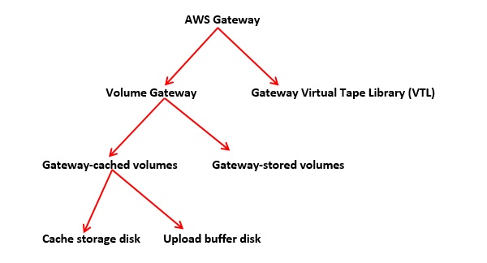

# Amazon Web Services - Cloud Computing

In 2006, Amazon Web Services (AWS) started to offer IT services to the market in the form of web services, which is nowadays known as cloud computing. With this cloud, we need not plan for servers and other IT infrastructure which takes up much of time in advance. Instead, these services can instantly spin up hundreds or thousands of servers in minutes and deliver results faster. We pay only for what we use with no up-front expenses and no long-term commitments, which makes AWS cost efficient.

Today, AWS provides a highly reliable, scalable, low-cost infrastructure platform in the cloud that powers multitude of businesses in 190 countries around the world.

# What is Cloud Computing?
Cloud computing is an internet-based computing service in which large groups of remote servers are networked to allow centralized data storage, and online access to computer services or resources.

Using cloud computing, organizations can use shared computing and storage resources rather than building, operating, and improving infrastructure on their own.

## Cloud computing is a model that enables the following features.

* Users can provision and release resources on-demand.
* Resources can be scaled up or down automatically, depending on the load.
* Resources are accessible over a network with proper security.
* Cloud service providers can enable a pay-as-you-go model, where customers are charged based on the type of resources and per usage.

# Types of Clouds
There are three types of clouds − Public, Private, and Hybrid cloud.

## Public Cloud
In public cloud, the third-party service providers make resources and services available to their customers via Internet. Customer’s data and related security is with the service providers’ owned infrastructure.

## Private Cloud
A private cloud also provides almost similar features as public cloud, but the data and services are managed by the organization or by the third party only for the customer’s organization. In this type of cloud, major control is over the infrastructure so security related issues are minimized.

## Hybrid Cloud
A hybrid cloud is the combination of both private and public cloud. The decision to run on private or public cloud usually depends on various parameters like sensitivity of data and applications, industry certifications and required standards, regulations, etc.

# Cloud Service Models
There are three types of service models in cloud − IaaS, PaaS, and SaaS.

## IaaS
IaaS stands for Infrastructure as a Service. It provides users with the capability to provision processing, storage, and network connectivity on demand. Using this service model, the customers can develop their own applications on these resources.

## PaaS
PaaS stands for Platform as a Service. Here, the service provider provides various services like databases, queues, workflow engines, e-mails, etc. to their customers. The customer can then use these components for building their own applications. The services, availability of resources and data backup are handled by the service provider that helps the customers to focus more on their application's functionality.

## SaaS
SaaS stands for Software as a Service. As the name suggests, here the third-party providers provide end-user applications to their customers with some administrative capability at the application level, such as the ability to create and manage their users. Also some level of customizability is possible such as the customers can use their own corporate logos, colors, etc.

## Advantages of Cloud Computing
Here is a list of some of the most important advantages that Cloud Computing has to offer −

* Cost-Efficient − Building our own servers and tools is time-consuming as well as expensive as we need to order, pay for, install, and configure expensive hardware, long before we need it. However, using cloud computing, we only pay for the amount we use and when we use the computing resources. In this manner, cloud computing is cost efficient.

* Reliability − A cloud computing platform provides much more managed, reliable and consistent service than an in-house IT infrastructure. It guarantees 24x7 and 365 days of service. If any of the server fails, then hosted applications and services can easily be transited to any of the available servers.

* Unlimited Storage − Cloud computing provides almost unlimited storage capacity, i.e., we need not worry about running out of storage space or increasing our current storage space availability. We can access as much or as little as we need.

* Backup & Recovery − Storing data in the cloud, backing it up and restoring the same is relatively easier than storing it on a physical device. The cloud service providers also have enough technology to recover our data, so there is the convenience of recovering our data anytime.

* Easy Access to Information − Once you register yourself in cloud, you can access your account from anywhere in the world provided there is internet connection at that point. There are various storage and security facilities that vary with the account type chosen.

# Disadvantages of Cloud Computing
Although Cloud Computing provides a wonderful set of advantages, it has some drawbacks as well that often raise questions about its efficiency.

## Security issues
Security is the major issue in cloud computing. The cloud service providers implement the best security standards and industry certifications, however, storing data and important files on external service providers always bears a risk.

AWS cloud infrastructure is designed to be the most flexible and secured cloud network. It provides scalable and highly reliable platform that enables customers to deploy applications and data quickly and securely.

## Technical issues
As cloud service providers offer services to number of clients each day, sometimes the system can have some serious issues leading to business processes temporarily being suspended. Additionally, if the internet connection is offline then we will not be able to access any of the applications, server, or data from the cloud.

## Not easy to switch service providers
Cloud service providers promises vendors that the cloud will be flexible to use and integrate, however switching cloud services is not easy. Most organizations may find it difficult to host and integrate current cloud applications on another platform. Interoperability and support issues may arise such as applications developed on Linux platform may not work properly on Microsoft Development Framework (.Net).

# Amazon Web Services - Basic Architecture
This is the basic structure of AWS EC2, where EC2 stands for Elastic Compute Cloud. EC2 allow users to use virtual machines of different configurations as per their requirement. It allows various configuration options, mapping of individual server, various pricing options, etc. We will discuss these in detail in AWS Products section. Following is the diagrammatic representation of the architecture.

`Note` − In the above diagram S3 stands for Simple Storage Service. It allows the users to store and retrieve various types of data using API calls. It doesn’t contain any computing element. We will discuss this topic in detail in AWS products section.

## Load Balancing
Load balancing simply means to hardware or software load over web servers, that improver's the efficiency of the server as well as the application. Following is the diagrammatic representation of AWS architecture with load balancing.

Hardware load balancer is a very common network appliance used in traditional web application architectures.

AWS provides the Elastic Load Balancing service, it distributes the traffic to EC2 instances across multiple available sources, and dynamic addition and removal of Amazon EC2 hosts from the load-balancing rotation.

Elastic Load Balancing can dynamically grow and shrink the load-balancing capacity to adjust to traffic demands and also support sticky sessions to address more advanced routing needs.

## Amazon Cloud-front
It is responsible for content delivery, i.e. used to deliver website. It may contain dynamic, static, and streaming content using a global network of edge locations. Requests for content at the user's end are automatically routed to the nearest edge location, which improves the performance.

Amazon Cloud-front is optimized to work with other Amazon Web Services, like Amazon S3 and Amazon EC2. It also works fine with any non-AWS origin server and stores the original files in a similar manner.

In Amazon Web Services, there are no contracts or monthly commitments. We pay only for as much or as little content as we deliver through the service.

## Elastic Load Balancer
It is used to spread the traffic to web servers, which improves performance. AWS provides the Elastic Load Balancing service, in which traffic is distributed to EC2 instances over multiple available zones, and dynamic addition and removal of Amazon EC2 hosts from the load-balancing rotation.

Elastic Load Balancing can dynamically grow and shrink the load-balancing capacity as per the traffic conditions.

## Security Management
Amazon’s Elastic Compute Cloud (EC2) provides a feature called security groups, which is similar to an inbound network firewall, in which we have to specify the protocols, ports, and source IP ranges that are allowed to reach your EC2 instances.

Each EC2 instance can be assigned one or more security groups, each of which routes the appropriate traffic to each instance. Security groups can be configured using specific subnets or IP addresses which limits access to EC2 instances.

## Elastic Caches
Amazon Elastic Cache is a web service that manages the memory cache in the cloud. In memory management, cache has a very important role and helps to reduce the load on the services, improves the performance and scalability on the database tier by caching frequently used information.

## Amazon RDS
Amazon RDS (Relational Database Service) provides a similar access as that of MySQL, Oracle, or Microsoft SQL Server database engine. The same queries, applications, and tools can be used with Amazon RDS.

It automatically patches the database software and manages backups as per the user’s instruction. It also supports point-in-time recovery. There are no up-front investments required, and we pay only for the resources we use.

## Hosting RDMS on EC2 Instances
Amazon RDS allows users to install RDBMS (Relational Database Management System) of your choice like MySQL, Oracle, SQL Server, DB2, etc. on an EC2 instance and can manage as required.

Amazon EC2 uses Amazon EBS (Elastic Block Storage) similar to network-attached storage. All data and logs running on EC2 instances should be placed on Amazon EBS volumes, which will be available even if the database host fails.

Amazon EBS volumes automatically provide redundancy within the availability zone, which increases the availability of simple disks. Further if the volume is not sufficient for our databases needs, volume can be added to increase the performance for our database.

Using Amazon RDS, the service provider manages the storage and we only focus on managing the data.

## Storage & Backups
AWS cloud provides various options for storing, accessing, and backing up web application data and assets. The Amazon S3 (Simple Storage Service) provides a simple web-services interface that can be used to store and retrieve any amount of data, at any time, from anywhere on the web.

Amazon S3 stores data as objects within resources called buckets. The user can store as many objects as per requirement within the bucket, and can read, write and delete objects from the bucket.

Amazon EBS is effective for data that needs to be accessed as block storage and requires persistence beyond the life of the running instance, such as database partitions and application logs.

Amazon EBS volumes can be maximized up to 1 TB, and these volumes can be striped for larger volumes and increased performance. Provisioned IOPS volumes are designed to meet the needs of database workloads that are sensitive to storage performance and consistency.

Amazon EBS currently supports up to 1,000 IOPS per volume. We can stripe multiple volumes together to deliver thousands of IOPS per instance to an application.

## Auto Scaling
The difference between AWS cloud architecture and the traditional hosting model is that AWS can dynamically scale the web application fleet on demand to handle changes in traffic.

In the traditional hosting model, traffic forecasting models are generally used to provision hosts ahead of projected traffic. In AWS, instances can be provisioned on the fly according to a set of triggers for scaling the fleet out and back in. Amazon Auto Scaling can create capacity groups of servers that can grow or shrink on demand.

# EC2
Amazon EC2 (Elastic Compute Cloud) is a web service interface that provides resizable compute capacity in the AWS cloud. It is designed for developers to have complete control scaling and computing resources.

EC2 instances can be resized and the number of instances scaled up or down as per our requirement. These instances can be launched in one or more geographical locations or regions, and Availability Zones (AZs). Each region comprises of several AZs at distinct locations, connected by low latency networks in the same region.

## EC2 Components
In AWS EC2, the users must be aware about the EC2 components, their operating systems support, security measures, pricing structures.

Operating System Support
Amazon EC2 supports multiple OS in which additional licensing fees may apply.
* AMI
* Machine

Security
Users have complete control over the visibility of their AWS account. In AWS EC2, the security systems allow create groups and place running instances into it as per the requirement. You can specify the groups with which other groups may communicate, as well as the groups with which IP subnets on the Internet may talk.

Pricing
AWS offers a variety of pricing options, depending on the type of resources, types of applications and database. It allows the users to configure their resources and compute the charges accordingly.

Fault tolerance
Amazon EC2 allows the users to access its resources to design fault-tolerant applications. EC2 also comprises geographic regions and isolated locations known as availability zones for fault tolerance and stability. It doesn’t share the exact locations of regional data centers for security reasons.

When the users launch an instance, they must select an AMI that's in the same region where the instance will run. Instances are distributed across multiple availability zones to provide continuous services in failures, and Elastic IP (EIPs) addresses are used to quickly map failed instance addresses to concurrent running instances in other zones to avoid delay in services.

Migration
This service allows the users to move existing applications into EC2. It costs $80.00 per storage device and $2.49 per hour for data loading. This service suits those users having large amount of data to move.

Features of EC2
Here is a list of some of the prominent features of EC2 −

* Reliable − Amazon EC2 offers a highly reliable environment where replacement of instances is rapidly possible. Service Level Agreement commitment is 99.9% availability for each Amazon EC2 region.

* Designed for Amazon Web Services − Amazon EC2 works fine with Amazon services like Amazon S3, Amazon RDS, Amazon DynamoDB, and Amazon SQS. It provides a complete solution for computing, query processing, and storage across a wide range of applications.

* Secure − Amazon EC2 works in Amazon Virtual Private Cloud to provide a secure and robust network to resources.

* Flexible Tools − Amazon EC2 provides the tools for developers and system administrators to build failure applications and isolate themselves from common failure situations.

* Inexpensive − Amazon EC2 wants us to pay only for the resources that we use. It includes multiple purchase plans such as On-Demand Instances, Reserved Instances, Spot Instances, etc. which we can choose as per our requirement.

## Auto Scaling

Auto Scaling is particularly effective for those applications that fluctuate on hourly, daily, or weekly usage. Auto Scaling is enabled by Amazon CloudWatch and is available at no extra cost. AWS CloudWatch can be used to measure CPU utilization, network traffic, etc.

# Elastic Load Balancing
Elastic Load Balancing (ELB) automatically distributes incoming request traffic across multiple Amazon EC2 instances and results in achieving higher fault tolerance. It detects unfit instances and automatically reroutes traffic to fit instances until the unfit instances have been restored in a round-robin manner. However, if we need more complex routing algorithms, then choose other services like Amazon Route53.

ELB consists of the following three components.

Load Balancer
This includes monitoring and handling the requests incoming through the Internet/intranet and distributes them to EC2 instances registered with it.

Control Service
This includes automatically scaling of handling capacity in response to incoming traffic by adding and removing load balancers as required. It also performs fitness check of instances.

SSL Termination
ELB provides SSL termination that saves precious CPU cycles, encoding and decoding SSL within your EC2 instances attached to the ELB. An X.509 certificate is required to be configured within the ELB. This SSL connection in the EC2 instance is optional, we can also terminate it.

Features of ELB
Following are the most prominent features of ELB −

ELS is designed to handle unlimited requests per second with gradually increasing load pattern.

We can configure EC2 instances and load balancers to accept traffic.

We can add/remove load balancers as per requirement without affecting the overall flow of information.

It is not designed to handle sudden increase in requests like online exams, online trading, etc.

Customers can enable Elastic Load Balancing within a single Availability Zone or across multiple zones for even more consistent application performance.

# Amazon WorkSpaces
Amazon WorkSpaces is a fully managed desktop computing service in the cloud that allows its customers to provide cloud-based desktops to their end-users. Through this the end users can access the documents, applications, and resources using devices of their choice such as laptops, iPad, Kindle Fire, or Android tablets. This service was launched to meet its customers rising demand for Cloud based 'Desktop as a Service' (DaaS).

How It Works?
Each WorkSpace is a persistent Windows Server 2008 R2 instance that looks like Windows 7, hosted on the AWS cloud. Desktops are streamed to users via PCoIP and the data backed up will be taken on every 12 hours by default.

User Requirements
An Internet connection with TCP and UDP open ports is required at the user’s end. They have to download a free Amazon WorkSpaces client application for their device.

## Benefits of Amazon WorkSpaces

* Easy to set up − Customers can choose AWS WorkSpaces plans of their choice and provide requirements such as CPU type, memory, storage and applications, and number of desktops.

* Choice of devices and applications − Customers can install Amazon WorkSpace application on their device (Laptops, iPads, Tablets) free of cost and can choose applications from the available list.

* Cost-effective − Amazon WorkSpaces require no upfront commitment and the customers pay as they customize their desktop, on a monthly basis.

# Amazon Web Services - Lambda

AWS Lambda is a responsive cloud service that inspects actions within the application and responds by deploying the user-defined codes, known as functions. It automatically manages the compute resources across multiple availability zones and scales them when new actions are triggered.

AWS Lambda supports the code written in Java, Python and Node.js, and the service can launch processes in languages supported by Amazon Linux (includes Bash, Go & Ruby).

Following are some recommended tips while using AWS Lambda.

Write your Lambda function code in a stateless style.

Never declare any function variable outside the scope of the handler.

Make sure to have a set of +rx permissions on your files in the uploaded ZIP to ensure Lambda can execute code on your behalf.

Delete old Lambda functions when no longer required
Benefits of AWS Lambda
Following are some of the benefits of using Lambda tasks −

Lambda tasks need not to be registered like Amazon SWF activity types.

We can use any existing Lambda functions that you’ve already defined in workflows.

Lambda functions are called directly by Amazon SWF; there is no need design a program to implement and execute them.

Lambda provides us the metrics and logs for tracking function executions.

## AWS Lambda Limits
Following are the three types of Lambda limits.

### Throttle Limit
The throttle limit is 100 concurrent Lambda function executions per account and is applied to the total concurrent executions across all functions within a same region.

The formula to calculate the number of concurrent executions for a function = (average duration of the function execution) X (number of requests or events processed by AWS Lambda).

When throttle limit is reached, then it returns a throttling error having an error code 429. After 15-30 minute you can start work again. The throttle limit can be increased by contacting AWS support center.

### Resources Limit
The following table shows the list of resources limits for a Lambda function.

Resource	Default Limit
Ephemeral disk capacity ("/tmp" space)	512 MB
Number of file descriptors	1,024
Number of processes and threads (combined total)	1,024
Maximum execution duration per request	300 seconds
Invoke request body payload size	6 MB
Invoke response body payload size	6 MB

### Resources Limit
The following table shows the list of resources limits for a Lambda function.

Resource	Default Limit
Ephemeral disk capacity ("/tmp" space)	512 MB
Number of file descriptors	1,024
Number of processes and threads (combined total)	1,024
Maximum execution duration per request	300 seconds
Invoke request body payload size	6 MB
Invoke response body payload size	6 MB

# Virtual Private Cloud

Amazon Virtual Private Cloud (VPC) allows the users to use AWS resources in a virtual network. The users can customize their virtual networking environment as they like, such as selecting own IP address range, creating subnets, and configuring route tables and network gateways.

The list of AWS services that can be used with Amazon VPC are −

* Amazon EC2
* Amazon Route 53
* Amazon WorkSpaces
* Auto Scaling
* Elastic Load Balancing
* AWS Data Pipeline
* Elastic Beanstalk
* Amazon Elastic Cache
* Amazon EMR
* Amazon OpsWorks
* Amazon RDS
* Amazon Redshifts

## Features of VPC
Many connectivity options − There are various connectivity options that exist in Amazon VPC.

Connect VPC directly to the Internet via public subnets.

Connect to the Internet using Network Address Translation via private subnets.

Connect securely to your corporate datacenter via encrypted IPsec hardware VPN connection.

Connect privately to other VPCs in which we can share resources across multiple virtual networks through AWS account.

Connect to Amazon S3 without using an internet gateway and have good control over S3 buckets, its user requests, groups, etc.

Combine connection of VPC and datacenter is possible by configuring Amazon VPC route tables to direct all traffic to its destination.

Easy to use − Ease of creating a VPC in very simple steps by selecting network set-ups as per requirement. Click "Start VPC Wizard", then Subnets, IP ranges, route tables, and security groups will be automatically created.

Easy to backup data − Periodically backup data from the datacenter into Amazon EC2 instances by using Amazon EBS volumes.

Easy to extend network using Cloud − Move applications, launch additional web servers and increase storage capacity by connecting it to a VPC.

# Route 53

Amazon Route 53 is a highly available and scalable Domain Name System (DNS) web service. It is designed for developers and corporates to route the end users to Internet applications by translating human readable names like www.mydomain.com, into the numeric IP addresses like 192.0.2.1 that computers use to connect to each other.

## Features of Route 53
Easy to register your domain − We can purchase all level of domains like .com, .net, .org, etc. directly from Route 53.

Highly reliable − Route 53 is built using AWS infrastructure. Its distributed nature towards DNS servers help to ensure a consistent ability to route applications of end users.

Scalable − Route 53 is designed in such a way that it automatically handles large volume queries without the user’s interaction.

Can be used with other AWS Services − Route 53 also works with other AWS services. It can be used to map domain names to our Amazon EC2 instances, Amazon S3 buckets, Amazon and other AWS resources.

Easy to use − It is easy to sign-up, easy to configure DNS settings, and provides quick response to DNS queries.

Health Check: Route 53 monitors the health of the application. If an outage is detected, then it automatically redirects the users to a healthy resource.

Cost-Effective − Pay only for the domain service and the number of queries that the service answers for each domain.

Secure − By integrating Route 53 with AWS (IAM), there is complete control over every user within the AWS account, such as deciding which user can access which part of Route 53.

# Direct Connect

AWS Direct Connect permits to create a private network connection from our network to AWS location. It uses 802.1q VLANs, which can be partitioned into multiple virtual interfaces to access public resources using the same connection. This results in reduced network cost and increased bandwidth. Virtual interfaces can be reconfigured at any time as per the requirement.

Requirements to Use AWS Direct Connect
Our network must meet one of the following conditions to use AWS Direct Connect −

Our network should be in the AWS Direct Connect location. Visit this link to know about the available AWS Direct Connect locations https://aws.amazon.com/directconnect/.

We should be working with an AWS Direct Connect partner who is a member of the AWS Partner Network (APN). Visit this link to know the list of AWS Direct Connect partners − https://aws.amazon.com/directconnect/

Our service provider must be portable to connect to AWS Direct Connect.

Additionally, our network must meet the following necessary conditions −

Connections to AWS Direct Connect requires single mode fiber, 1000BASE-LX (1310nm) for 1 gigabit Ethernet, or 10GBASE-LR (1310nm) for 10 gigabit Ethernet. Auto Negotiation for the port must be disabled. Support for 802.1Q VLANs across these connections should be available.

Network must support Border Gateway Protocol (BGP) and BGP MD5 authentication. Optionally, we may configure Bidirectional Forwarding Detection (BFD).

## Features of Direct Connect
Reduces bandwidth costs − The cost gets reduced in both ways, i.e. it transfers the data to and from AWS directly. The data transferred over your dedicated connection is charged at reduced AWS Direct Connect data transfer rate rather than Internet data transfer rates.

Compatible with all AWS services − AWS Direct Connect is a network service, supports all the AWS services that are accessible over the Internet, like Amazon S3, Amazon EC2, Amazon VPC, etc.

Private connectivity to Amazon VPC − AWS Direct Connect can be used to establish a private virtual interface from our home-network to Amazon VPC directly with high bandwidth.

Elastic − AWS Direct Connect provides 1 Gbps and 10 Gbps connections, having provision to make multiple connections as per requirement.

Easy and simple − Easy to sign up on AWS Direct Connect using the AWS Management Console. Using this console, all the connections and virtual interfaces can be managed.

# Amazon S3

Amazon S3 (Simple Storage Service) is a scalable, high-speed, low-cost web-based service designed for online backup and archiving of data and application programs. It allows to upload, store, and download any type of files up to 5 TB in size. This service allows the subscribers to access the same systems that Amazon uses to run its own web sites. The subscriber has control over the accessibility of data, i.e. privately/publicly accessible.

## Amazon S3 Features
Low cost and Easy to Use − Using Amazon S3, the user can store a large amount of data at very low charges.

Secure − Amazon S3 supports data transfer over SSL and the data gets encrypted automatically once it is uploaded. The user has complete control over their data by configuring bucket policies using AWS IAM.

Scalable − Using Amazon S3, there need not be any worry about storage concerns. We can store as much data as we have and access it anytime.

Higher performance − Amazon S3 is integrated with Amazon CloudFront, that distributes content to the end users with low latency and provides high data transfer speeds without any minimum usage commitments.

Integrated with AWS services − Amazon S3 integrated with AWS services include Amazon CloudFront, Amazon CLoudWatch, Amazon Kinesis, Amazon RDS, Amazon Route 53, Amazon VPC, AWS Lambda, Amazon EBS, Amazon Dynamo DB, etc.

# Elastic Block Store

Amazon Elastic Block Store (EBS) is a block storage system used to store persistent data. Amazon EBS is suitable for EC2 instances by providing highly available block level storage volumes. It has three types of volume, i.e. General Purpose (SSD), Provisioned IOPS (SSD), and Magnetic. These three volume types differ in performance, characteristics, and cost.

## EBS Volume Types
Following are the three types.

### EBS General Purpose (SSD)
This volume type is suitable for small and medium workloads like Root disk EC2 volumes, small and medium database workloads, frequently logs accessing workloads, etc. By default, SSD supports 3 IOPS (Input Output Operations per Second)/GB means 1 GB volume will give 3 IOPS, and 10 GB volume will give 30 IOPS. Its storage capacity of one volume ranges from 1 GB to 1 TB. The cost of one volume is $0.10 per GB for one month.

## Provisioned IOPS (SSD)
This volume type is suitable for the most demanding I/O intensive, transactional workloads and large relational, EMR and Hadoop workloads, etc. By default, IOPS SSD supports 30 IOPS/GB means 10GB volume will give 300 IOPS. Its storage capacity of one volume ranges from 10GB to 1TB. The cost of one volume is $0.125 per GB for one month for provisioned storage and $0.10 per provisioned IOPS for one month.

## EBS Magnetic Volumes
It was formerly known as standard volumes. This volume type is suitable for ideal workloads like infrequently accessing data, i.e. data backups for recovery, logs storage, etc. Its storage capacity of one volume ranges from 10GB to 1TB. The cost of one volume is $0.05 per GB for one month for provisioned storage and $0. 05 per million I/O requests.

## Volumes Attached to One Instance
Each account will be limited to 20 EBS volumes. For a requirement of more than 20 EBS volumes, contact Amazon’s Support team. We can attach up to 20 volumes on a single instance and each volume ranges from 1GB to 1TB in size.

In EC2 instances, we store data in local storage which is available till the instance is running. However, when we shut down the instance, the data gets los

## Amazon EBS Benefits
Reliable and secure storage − Each of the EBS volume will automatically respond to its Availability Zone to protect from component failure.

Secure − Amazon’s flexible access control policies allows to specify who can access which EBS volumes. Access control plus encryption offers a strong defense-in-depth security strategy for data.

Higher performance − Amazon EBS uses SSD technology to deliver data results with consistent I/O performance of application.

Easy data backup − Data backup can be saved by taking point-in-time snapshots of Amazon EBS volumes.

## Storage Gateway

AWS Storage Gateway provides integration between the on-premises IT environment and the AWS storage infrastructure. The user can store data in the AWS cloud for scalable, data security features and cost-efficient storage.

AWS Gateway offers two types of storage, i.e. volume based and tape based.

Volume Gateways
This storage type provides cloud-backed storage volumes which can be mount as Internet Small Computer System Interface (iSCSI) devices from on-premises application servers.

Gateway-cached Volumes
AWS Storage Gateway stores all the on-premises application data in a storage volume in Amazon S3. Its storage volume ranges from 1GB to 32 TB and up to 20 volumes with a total storage of 150TB. We can attach these volumes with iSCSI devices from on-premises application servers. It is of two categories −

Cache Storage Disk
Every application requires storage volumes to store their data. This storage type is used to initially store data when it is to be written to the storage volumes in AWS. The data from the cache storage disk is waiting to be uploaded to Amazon S3 from the upload buffer. The cache storage disk keeps the most recently accessed data for low-latency access. When the application needs data, the cache storage disk is first checked before checking Amazon S3.

There are few guidelines to determine the amount of disk space to be allocated for cache storage. We should allocate at least 20% of the existing file store size as cache storage. It should be more than the upload buffer.

Upload buffer disk − This type of storage disk is used to store the data before it is uploaded to Amazon S3 over SSL connection. The storage gateway uploads the data from the upload buffer over an SSL connection to AWS.

Snapshots − Sometimes we need to back up storage volumes in Amazon S3. These backups are incremental and are known as snapshots. The snapshots are stored in Amazon S3 as Amazon EBS snapshots. Incremental backup means that a new snapshot is backing up only the data that has changed since the last snapshot. We can take snapshots either at a scheduled interval or as per the requirement.

Gateway-stored Volumes
When the Virtual Machine (VM) is activated, gateway volumes are created and mapped to the on-premises direct-attached storage disks. Hence, when the applications write/read the data from the gateway storage volumes, it reads and writes the data from the mapped on-premises disk.

A gateway-stored volume allows to store primary data locally and provides on-premises applications with low-latency access to entire datasets. We can mount them as iSCSI devices to the on-premises application servers. It ranges from 1 GB to 16 TB in size and supports up to 12 volumes per gateway with a maximum storage of 192 TB.

Gateway-Virtual Tape Library (VTL)
This storage type provides a virtual tape infrastructure that scales seamlessly with your business needs and eliminates the operational burden of provisioning, scaling, and maintaining a physical tape infrastructure. Each gateway-VTL is preconfigured with media changer and tape drives, that are available with the existing client backup applications as iSCSI devices. Tape cartridges can be added later as required to archive the data.

Few terms used in Architecture are explained below.

Virtual Tape − Virtual tape is similar to a physical tape cartridge. It is stored in the AWS cloud. We can create virtual tapes in two ways: by using AWS Storage Gateway console or by using AWS Storage Gateway API. The size of each virtual tape is from 100 GB to 2.5 TB. The size of one gateway is up to 150 TB and can have maximum 1500 tapes at a time.

Virtual Tape Library (VTL) − Each gateway-VTL comes with one VTL. VTL is similar to a physical tape library available on-premises with tape drives. The gateway first stores data locally, then asynchronously uploads it to virtual tapes of VTL.

Tape Drive − A VTL tape drive is similar to a physical tape drive that can perform I/O operations on tape. Each VTL consists of 10 tape drives that are used for backup applications as iSCSI devices.

Media Changer − A VTL media changer is similar to a robot that moves tapes around in a physical tape library's storage slots and tape drives. Each VTL comes with one media changer that is used for backup applications as iSCSI device.

Virtual Tape Shelf (VTS) − A VTS is used to archive tapes from gateway VTL to VTS and vice-a-versa.

Archiving Tapes − When the backup software ejects a tape, the gateway moves the tape to the VTS for storage. It is used data archiving and backups.

Retrieving Tapes − Tapes archived to the VTS cannot be read directly so to read an archived tape, we need to retrieve the tape from gateway VTL either by using the AWS Storage Gateway console or by using the AWS Storage Gateway API.

# CloudFront

CloudFront is a CDN (Content Delivery Network). It retrieves data from Amazon S3 bucket and distributes it to multiple datacenter locations. It delivers the data through a network of data centers called edge locations. The nearest edge location is routed when the user requests for data, resulting in lowest latency, low network traffic, fast access to data, etc.

How AWS CloudFront Delivers the Content?
AWS CloudFront delivers the content in the following steps.

Step 1 − The user accesses a website and requests an object to download like an image file.

Step 2 − DNS routes your request to the nearest CloudFront edge location to serve the user request.

Step 3 − At edge location, CloudFront checks its cache for the requested files. If found, then returns it to the user otherwise does the following −

First CloudFront compares the request with the specifications and forwards it to the applicable origin server for the corresponding file type.

The origin servers send the files back to the CloudFront edge location.

As soon as the first byte arrives from the origin, CloudFront starts forwarding it to the user and adds the files to the cache in the edge location for the next time when someone again requests for the same file.

Step 4 − The object is now in an edge cache for 24 hours or for the provided duration in file headers. CloudFront does the following −

CloudFront forwards the next request for the object to the user’s origin to check the edge location version is updated or not.

If the edge location version is updated, then CloudFront delivers it to the user.

If the edge location version is not updated, then origin sends the latest version to CloudFront. CloudFront delivers the object to the user and stores the latest version in the cache at that edge location.

Features of CloudFront
Fast − The broad network of edge locations and CloudFront caches copies of content close to the end users that results in lowering latency, high data transfer rates and low network traffic. All these make CloudFront fast.

Simple − It is easy to use.

Can be used with other AWS Services − Amazon CloudFront is designed in such a way that it can be easily integrated with other AWS services, like Amazon S3, Amazon EC2.

Cost-effective − Using Amazon CloudFront, we pay only for the content that you deliver through the network, without any hidden charges and no up-front fees.

Elastic − Using Amazon CloudFront, we need not worry about maintenance. The service automatically responds if any action is needed, in case the demand increases or decreases.

Reliable − Amazon CloudFront is built on Amazon’s highly reliable infrastructure, i.e. its edge locations will automatically re-route the end users to the next nearest location, if required in some situations.

Global − Amazon CloudFront uses a global network of edge locations located in most of the regions.

# Relational Database Service

Amazon RDS (Relational Database Service) is a fully-managed SQL database cloud service that allows to create and operate relational databases. Using RDS you can access your files and database anywhere in a cost-effective and highly scalable way.

Features of Amazon RDS
Amazon RDS has the following features −

Scalable − Amazon RDS allows to scale the relational database by using AWS Management Console or RDS-specific API. We can increase or decrease your RDS requirements within minutes.

Host replacement − Sometimes these situations occur when the hardware of Amazon RDS fails. There is no need to worry, it will be automatically replaced by Amazon.

Inexpensive − Using Amazon RDS, we pay only for the resources we consume. There is no up-front and long-term commitment.

Secure − Amazon RDS provides complete control over the network to access their database and their associated services.

Automatic backups − Amazon RDS backs up everything in the database including transaction logs up to last five minutes and also manages automatic backup timings.

Software patching − Automatically gets all the latest patches for the database software. We can also specify when the software should be patched using DB Engine Versi

# DynamoDB

Amazon DynamoDB is a fully managed NoSQL database service that allows to create database tables that can store and retrieve any amount of data. It automatically manages the data traffic of tables over multiple servers and maintains performance. It also relieves the customers from the burden of operating and scaling a distributed database. Hence, hardware provisioning, setup, configuration, replication, software patching, cluster scaling, etc. is managed by Amazon.

Benefits of Amazon DynamoDB
Managed service − Amazon DynamoDB is a managed service. There is no need to hire experts to manage NoSQL installation. Developers need not worry about setting up, configuring a distributed database cluster, managing ongoing cluster operations, etc. It handles all the complexities of scaling, partitions and re-partitions data over more machine resources to meet I/O performance requirements.

Scalable − Amazon DynamoDB is designed to scale. There is no need to worry about predefined limits to the amount of data each table can store. Any amount of data can be stored and retrieved. DynamoDB will spread automatically with the amount of data stored as the table grows.

Fast − Amazon DynamoDB provides high throughput at very low latency. As datasets grow, latencies remain stable due to the distributed nature of DynamoDB's data placement and request routing algorithms.

Durable and highly available − Amazon DynamoDB replicates data over at least 3 different data centers’ results. The system operates and serves data even under various failure conditions.

Flexible: Amazon DynamoDB allows creation of dynamic tables, i.e. the table can have any number of attributes, including multi-valued attributes.

Cost-effective: Payment is for what we use without any minimum charges. Its pricing structure is simple and easy to calculate.

# Redshift

Amazon Redshift is a fully managed data warehouse service in the cloud. Its datasets range from 100s of gigabytes to a petabyte. The initial process to create a data warehouse is to launch a set of compute resources called nodes, which are organized into groups called cluster. After that you can process your queries.

Features of Amazon Redshift
Following are the features of Amazon Redshift −

Supports VPC − The users can launch Redshift within VPC and control access to the cluster through the virtual networking environment.

Encryption − Data stored in Redshift can be encrypted and configured while creating tables in Redshift.

SSL − SSL encryption is used to encrypt connections between clients and Redshift.

Scalable − With a few simple clicks, the number of nodes can be easily scaled in your Redshift data warehouse as per requirement. It also allows to scale over storage capacity without any loss in performance.

Cost-effective − Amazon Redshift is a cost-effective alternative to traditional data warehousing practices. There are no up-front costs, no long-term commitments and on-demand pricing structure.

# Kinesis

Amazon Kinesis is a managed, scalable, cloud-based service that allows real-time processing of streaming large amount of data per second. It is designed for real-time applications and allows developers to take in any amount of data from several sources, scaling up and down that can be run on EC2 instances.

It is used to capture, store, and process data from large, distributed streams such as event logs and social media feeds. After processing the data, Kinesis distributes it to multiple consumers simultaneously.

How to Use Amazon KCL?
It is used in situations where we require rapidly moving data and its continuous processing. Amazon Kinesis can be used in the following situations −

Data log and data feed intake − We need not wait to batch up the data, we can push data to an Amazon Kinesis stream as soon as the data is produced. It also protects data loss in case of data producer fails. For example: System and application logs can be continuously added to a stream and can be available in seconds when required.

Real-time graphs − We can extract graphs/metrics using Amazon Kinesis stream to create report results. We need not wait for data batches.

Real-time data analytics − We can run real-time streaming data analytics by using Amazon Kinesis.

Limits of Amazon Kinesis?
Following are certain limits that should be kept in mind while using Amazon Kinesis Streams −

Records of a stream can be accessible up to 24 hours by default and can be extended up to 7 days by enabling extended data retention.

The maximum size of a data blob (the data payload before Base64-encoding) in one record is 1 megabyte (MB).

One shard supports up to 1000 PUT records per second.

Features of Amazon Kinesis
Real-time processing − It allows to collect and analyze information in real-time like stock trade prices otherwise we need to wait for data-out report.

Easy to use − Using Amazon Kinesis, we can create a new stream, set its requirements, and start streaming data quickly.

High throughput, elastic − It allows to collect and analyze information in real-time like stock trade prices otherwise we need to wait for data-out report.

Integrate with other Amazon services − It can be integrated with Amazon Redshift, Amazon S3 and Amazon DynamoDB.

Build kinesis applications − Amazon Kinesis provides the developers with client libraries that enable the design and operation of real-time data processing applications. Add the Amazon Kinesis Client Library to Java application and it will notify when new data is available for processing.

Cost-efficient − Amazon Kinesis is cost-efficient for workloads of any scale. Pay as we go for the resources used and pay hourly for the throughput required

# Elastic MapReduce

Amazon Elastic MapReduce (EMR) is a web service that provides a managed framework to run data processing frameworks such as Apache Hadoop, Apache Spark, and Presto in an easy, cost-effective, and secure manner.

It is used for data analysis, web indexing, data warehousing, financial analysis, scientific simulation, etc.

Benefits of Amazon EMR
Following are the benefits of Amazon EMR −

Easy to use − Amazon EMR is easy to use, i.e. it is easy to set up cluster, Hadoop configuration, node provisioning, etc.

Reliable − It is reliable in the sense that it retries failed tasks and automatically replaces poorly performing instances.

Elastic − Amazon EMR allows to compute large amount of instances to process data at any scale. It easily increases or decreases the number of instances.

Secure − It automatically configures Amazon EC2 firewall settings, controls network access to instances, launch clusters in an Amazon VPC, etc.

Flexible − It allows complete control over the clusters and root access to every instance. It also allows installation of additional applications and customizes your cluster as per requirement.

Cost-efficient − Its pricing is easy to estimate. It charges hourly for every instance used.

# Data Pipeline

AWS Data Pipeline is a web service, designed to make it easier for users to integrate data spread across multiple AWS services and analyze it from a single location.

Using AWS Data Pipeline, data can be accessed from the source, processed, and then the results can be efficiently transferred to the respective AWS services.

Features of AWS Data Pipeline
Simple and cost-efficient − Its drag-and-drop features makes it easy to create a pipeline on console. Its visual pipeline creator provides a library of pipeline templates. These templates make it easier to create pipelines for tasks like processing log files, archiving data to Amazon S3, etc.

Reliable − Its infrastructure is designed for fault tolerant execution activities. If failures occur in the activity logic or data sources, then AWS Data Pipeline automatically retries the activity. If the failure continues, then it will send a failure notification. We can even configure these notification alerts for situations like successful runs, failure, delays in activities, etc.

Flexible − AWS Data Pipeline provides various features like scheduling, tracking, error handling, etc. It can be configured to take actions like run Amazon EMR jobs, execute SQL queries directly against databases, execute custom applications running on Amazon EC2, etc.

# Machine Learning

Amazon Machine Learning is a service that allows to develop predictive applications by using algorithms, mathematical models based on the user’s data.

Amazon Machine Learning reads data through Amazon S3, Redshift and RDS, then visualizes the data through the AWS Management Console and the Amazon Machine Learning API. This data can be imported or exported to other AWS services via S3 buckets.

It uses “industry-standard logistic regression” algorithm to generate models.

Types of Tasks Performed by Amazon Machine Learning
Three different types of tasks can be performed by Amazon Machine learning service −

A binary classification model can predict one of the two possible results, i.e. either yes or no.

A multi-class classification model can predict multiple conditions. For example, it can track a customer's online orders.

A regression model results in an exact value. Regression models can predict the best-selling price for a product or the number of units that will sell.

Features of Amazon Machine Learning
Easy to create machine learning models − It is easy to create ML models from data stored in Amazon S3, Amazon Redshift, Amazon RDS and query these models for predictions by using Amazon ML APIs and wizards.

High performance − Amazon ML prediction APIsThe following services fall under Application Services section −

Amazon CloudSearch
Amazon Simple Queue Services (SQS)
Amazon Simple Notification Services (SNS)
Amazon Simple Email Services (SES)
Amazon SWF
In this chapter, we will discuss Amazon SWF.

Amazon Simple Workflow Service (SWF) is a task based API that makes it easy to coordinate work across distributed application components. It provides a programming model and infrastructure for coordinating distributed components and maintaining their execution state in a reliable way. Using Amazon SWF, we can focus on building the aspects of the application that differentiates it.

A workflow is a set of activities that carry out some objective, including logic that coordinates the activities to achieve the desired output.

Workflow history consists of complete and consistent record of each event that occurred since the workflow execution started. It is maintained by SWF.

Benefits of Amazon SWF
It enables applications to be stateless, because all information about a workflow execution is stored in its workflow history.

For each workflow execution, the history provides a record of which activities were scheduled, their current statuses and results. The workflow execution uses this information to determine the next steps.

The history provides steps in detail that can be used to monitor running workflow executions and verify completed workflow executions.

# WorkMail

Amazon WorkMail is a managed email and calendaring service that runs in Cloud. It provides security controls and is designed to work with your existing PC and Mac-based Outlook clients including the prepackaged Click-to-Run versions. It also works with mobile clients that speak the Exchange ActiveSync protocol.

Its migration tool allows to move mailboxes from on-premises email servers to the service, and works with any device that supports the Microsoft Exchange ActiveSync protocol, such as Apple’s iPad and iPhone, Google Android, and Windows Phone.

Features of Amazon WorkMail
Secure − Amazon WorkMail automatically encrypts entire data with the encryption keys using the AWS Key Management Service.

Managed − Amazon WorkMail offers complete control over email and there is no need to worry about installing a software, maintaining and managing hardware. Amazon WorkMail automatically handles all these needs.

Accessibility − Amazon WorkMail supports Microsoft Outlook on both Windows and Mac OS X. Hence, users can use the existing email client without any additional requirements.

Availability − Users can synchronize emails, contacts and calendars with iOS, Android, Windows Phone, etc. using the Microsoft Exchange ActiveSync protocol anywhere.

Cost-efficient − Amazon WorkMail charges 4$ per user per month up to 50GB of storage.

#### Resources

* [AWS Definition](https://aws.amazon.com/workmail/)
