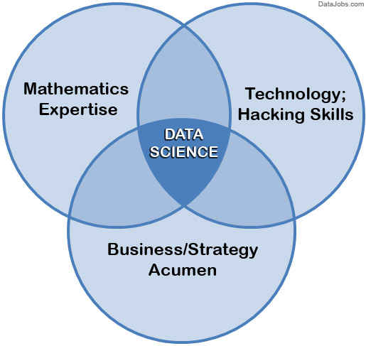

# What is Data Science?
Data science is a multidisciplinary blend of data inference, algorithmm development, and technology in order to solve analytically complex problems.

Data science continues to evolve as one of the most promising and in-demand career paths for skilled professionals. Today, successful data professionals understand that they must advance past the traditional skills of analyzing large amounts of data, data mining, and programming skills. In order to uncover useful intelligence for their organizations, data scientists must master the full spectrum of the data science life cycle and possess a level of flexibility and understanding to maximize returns at each phase of the process.

# What is data science – the requisite skill set
Data science is a blend of skills in three major areas:

## Mathematics Expertise

At the heart of mining data insight and building data product is the ability to view the data through a quantitative lens. There are textures, dimensions, and correlations in data that can be expressed mathematically. Finding solutions utilizing data becomes a brain teaser of heuristics and quantitative technique. Solutions to many business problems involve building analytic models grounded in the hard math, where being able to understand the underlying mechanics of those models is key to success in building them.

Also, a misconception is that data science all about statistics. While statistics is important, it is not the only type of math utilized. First, there are two branches of statistics – classical statistics and Bayesian statistics. When most people refer to stats they are generally referring to classical stats, but knowledge of both types is helpful. Furthermore, many inferential techniques and machine learning algorithms lean on knowledge of linear algebra. For example, a popular method to discover hidden characteristics in a data set is SVD, which is grounded in matrix math and has much less to do with classical stats. Overall, it is helpful for data scientists to have breadth and depth in their knowledge of mathematics.

## Technology and Hacking

First, let's clarify on that we are not talking about hacking as in breaking into computers. We're referring to the tech programmer subculture meaning of hacking – i.e., creativity and ingenuity in using technical skills to build things and find clever solutions to problems.

Why is hacking ability important? Because data scientists utilize technology in order to wrangle enormous data sets and work with complex algorithms, and it requires tools far more sophisticated than Excel. Data scientists need to be able to code — prototype quick solutions, as well as integrate with complex data systems. Core languages associated with data science include SQL, Python, R, and SAS. On the periphery are Java, Scala, Julia, and others. But it is not just knowing language fundamentals. A hacker is a technical ninja, able to creatively navigate their way through technical challenges in order to make their code work.

Along these lines, a data science hacker is a solid algorithmic thinker, having the ability to break down messy problems and recompose them in ways that are solvable. This is critical because data scientists operate within a lot of algorithmic complexity. They need to have a strong mental comprehension of high-dimensional data and tricky data control flows. Full clarity on how all the pieces come together to form a cohesive solution.

## Strong Business Acumen

It is important for a data scientist to be a tactical business consultant. Working so closely with data, data scientists are positioned to learn from data in ways no one else can. That creates the responsibility to translate observations to shared knowledge, and contribute to strategy on how to solve core business problems. This means a core competency of data science is using data to cogently tell a story. No data-puking – rather, present a cohesive narrative of problem and solution, using data insights as supporting pillars, that lead to guidance.

Having this business acumen is just as important as having acumen for tech and algorithms. There needs to be clear alignment between data science projects and business goals. Ultimately, the value doesn't come from data, math, and tech itself. It comes from leveraging all of the above to build valuable capabilities and have strong business influence.

# The Data Science Life Cycle

The above images illustrates the five stages of the data science life cycle:

* Capture, (data acquisition, data entry, signal reception, data extraction);
* Maintain (data warehousing, data cleansing, data staging, data processing, data architecture);
* Process (data mining, clustering/classification, data modeling, data summarization);
* Analyze (exploratory/confirmatory, predictive analysis, regression, text mining, qualitative analysis);
* Communicate (data reporting, data visualization, business intelligence, decision making).

The term `data scientist` was coined as recently as 2008 when companies realized the need for data professionals who are skilled in organizing and analyzing massive amounts of data. 1 In a 2009 McKinsey&Company article, Hal Varian, Google's chief economist and UC Berkeley professor of information sciences, business, and economics, predicted the importance of adapting to technology’s influence and reconfiguration of different industries.

Effective data scientists are able to identify relevant questions, collect data from a multitude of different data sources, organize the information, translate results into solutions, and communicate their findings in a way that positively affects business decisions. These skills are required in almost all industries, causing skilled data scientists to be increasingly valuable to companies.

# What Does a Data Scientist Do?

## The Mindset

A common personality trait of data scientists is they are deep thinkers with intense intellectual curiosity. Data science is all about being inquisitive – asking new questions, making new discoveries, and learning new things. Ask data scientists most obsessed with their work what drives them in their job, and they will not say "money". The real motivator is being able to use their creativity and ingenuity to solve hard problems and constantly indulge in their curiosity. Deriving complex reads from data is beyond just making an observation, it is about uncovering "truth" that lies hidden beneath the surface. Problem solving is not a task, but an intellectually-stimulating journey to a solution. Data scientists are passionate about what they do, and reap great satisfaction in taking on challenge.

## Training

There is a glaring misconception out there that you need a sciences or math Ph.D to become a legitimate data scientist. That view misses the point that data science is multidisciplinary. Highly-focused study in academia is certainly helpful, but doesn't guarantee that graduates have the full set of experiences and abilities to succeed. E.g. a Ph.D statistician may still need to pick up a lot of programming skills and gain business experience, to complete the trifecta.

In fact, data science is such a relatively new and rising discipline that universities have not caught up in developing comprehensive data science degree programs – meaning that no one can really claim to have "done all the schooling" to be become a data scientist. Where does much of the training come from? The unyielding intellectual curiosity of data scientists push them to be motivated autodidacts, driven to self-learn the right skills, guided by their own determination.

In the past decade, data scientists have become necessary assets and are present in almost all organizations. These professionals are well-rounded, data-driven individuals with high-level technical skills who are capable of building complex quantitative algorithms to organize and synthesize large amounts of information used to answer questions and drive strategy in their organization. This is coupled with the experience in communication and leadership needed to deliver tangible results to various stakeholders across an organization or business.

Data scientists need to be curious and result-oriented, with exceptional industry-specific knowledge and communication skills that allow them to explain highly technical results to their non-technical counterparts. They possess a strong quantitative background in statistics and linear algebra as well as programming knowledge with focuses in data warehousing, mining, and modeling to build and analyze algorithms.

The Followings are some of the toos associated with the data science;

* R
* Python
* Apache Hadoop
* MapReduce
* Apache Spark
* NoSQL databases
* Cloud computing
* D3
* Apache Pig
* Tableau
* iPython notebooks
* GitHub

# Where Do You Fit in Data Science?

Data is everywhere and expansive. A variety of terms related to mining, cleaning, analyzing, and interpreting data are often used interchangeably, but they can actually involve different skill sets and complexity of data.

## Data Scientist
Data scientists examine which questions need answering and where to find the related data. They have business acumen and analytical skills as well as the ability to mine, clean, and present data. Businesses use data scientists to source, manage, and analyze large amounts of unstructured data. Results are then synthesized and communicated to key stakeholders to drive strategic decision-making in the organization.

Skills needed: Programming skills (SAS, R, Python), statistical and mathematical skills, storytelling and data visualization, Hadoop, SQL, machine learning

## Data Analyst
Data analysts bridge the gap between data scientists and business analysts. They are provided with the questions that need answering from an organization and then organize and analyze data to find results that align with high-level business strategy. Data analysts are responsible for translating technical analysis to qualitative action items and effectively communicating their findings to diverse stakeholders.

Skills needed: Programming skills (SAS, R, Python), statistical and mathematical skills, data wrangling, data visualization

## Data Engineer
Data engineers manage exponential amounts of rapidly changing data. They focus on the development, deployment, management, and optimization of data pipelines and infrastructure to transform and transfer data to data scientists for querying.

Skills needed: Programming languages (Java, Scala), NoSQL databases (MongoDB, Cassandra DB), frameworks (Apache Hadoop)

## Learn More
* [Beginners Tutorial](https://intellipaat.com/blog/what-is-data-science/)
* [Good Tutorial](https://www.guru99.com/data-science-tutorial.html)
