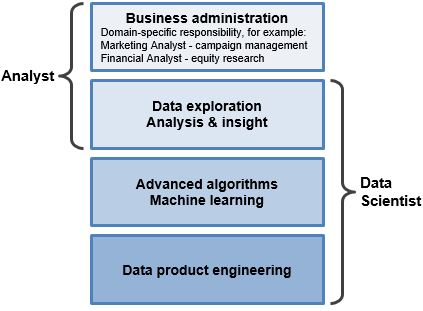

# Machine learning

## What is Analytics?
Analytics has risen quickly in popular business lingo over the past several years; the term is used loosely, but generally meant to describe critical thinking that is quantitative in nature. Technically, analytics is the "science of analysis" — put another way, the practice of analyzing information to make decisions.

Is "analytics" the same thing as data science? Depends on context. Sometimes it is synonymous with the definition of data science that we have described, and sometimes it represents something else. A data scientist using raw data to build a predictive algorithm falls into the scope of analytics. At the same time, a non-technical business user interpreting pre-built dashboard reports (e.g. GA) is also in the realm of analytics, but does not cross into the skill set needed in data science. Analytics has come to have fairly broad meaning. At the end of the day, as long as you understand beyond the buzzword level, the exact semantics don't matter much.

## What is the difference between an analyst and a data scientist?
"Analyst" is somewhat of an ambiguous job title that can represent many different types of roles (data analyst, marketing analyst, operations analyst, financial analyst, etc). What does this mean in comparison to data scientist?

Data Scientist: Specialty role with abilities in math, technology, and business acumen. Data scientists work at the raw database level to derive insights and build data product.
Analyst: This can mean a lot of things. Common thread is that analysts look at data to try to gain insights. Analysts may interact with data at both the database level or the summarized report level.
Thus, "analyst" and "data scientist" is not exactly synonymous, but also not mutually exclusive. Here is our interpretation of how these job titles map to skills and scope of responsibilities:

## What is Machine Learning?

Machine learning is a term closely associated with data science. It refers to a broad class of methods that revolve around data modeling to (1) algorithmically make predictions, and (2) algorithmically decipher patterns in data.

Machine learning for making predictions — Core concept is to use tagged data to train predictive models. Tagged data means observations where ground truth is already known. Training models means automatically characterizing tagged data in ways to predict tags for unknown data points. E.g. a credit card fraud detection model can be trained using a historical record of tagged fraud purchases. The resultant model estimates the likelihood that any new purchase is fraudulent. Common methods for training models range from basic regressions to complex neural nets. All follow the same paradigm known as supervised learning.
Machine learning for pattern discovery — Another modeling paradigm known as unsupervised learning tries to surface underlying patterns and associations in data when no existing ground truth is known (i.e. no observations are tagged). Within this broad category of methods, the most commonly used are clustering techniques, which algorithmically detect what are the natural groupings that exist in a data set. For example, clustering can be used to programmatically learn the natural customer segments in a company's user base. Other unsupervised methods for mining underlying characteristics include: principal component analysis, hidden markov models, topic models, and more.
Not all machine learning methods fit neatly into the above two categories. For example, collaborative filtering is a type of recommendations algorithm with elements related to both supervised and unsupervised learning. Contextual bandits are a twist on supervised learning where predictions get adaptively modified on-the-fly using live feedback.

This wide-ranging breadth of machine learning techniques comprise an important part of the data science toolbox. It is up to the data scientist to figure out which tool to use in different circumstances (as well as how to use the tool correctly) in order to solve analytically open-ended problems.

## What is Data Munging?
Raw data can be unstructured and messy, with information coming from disparate data sources, mismatched or missing records, and a slew of other tricky issues. Data munging is a term to describe the data wrangling to bring together data into cohesive views, as well as the janitorial work of cleaning up data so that it is polished and ready for downstream usage. This requires good pattern-recognition sense and clever hacking skills to merge and transform masses of database-level information. If not properly done, dirty data can obfuscate the 'truth' hidden in the data set and completely mislead results. Thus, any data scientist must be skillful and nimble at data munging in order to have accurate, usable data before applying more sophisticated analytical tactics.

### More informaiton

*[Supervised learning](https://en.wikipedia.org/wiki/Supervised_learning)
*[Unsupervised learning](https://en.wikipedia.org/wiki/Unsupervised_learning)
*[Artificial neural network](https://en.wikipedia.org/wiki/Artificial_neural_network)
