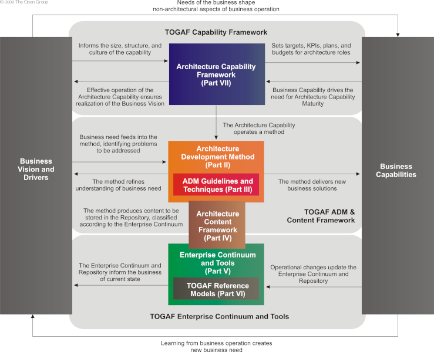
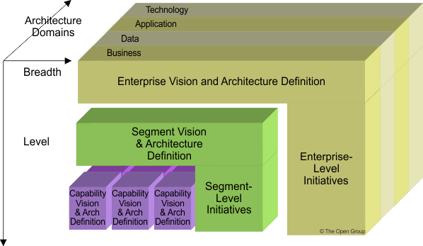
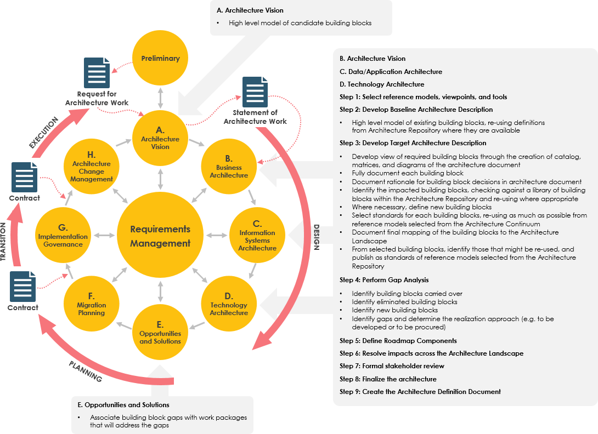
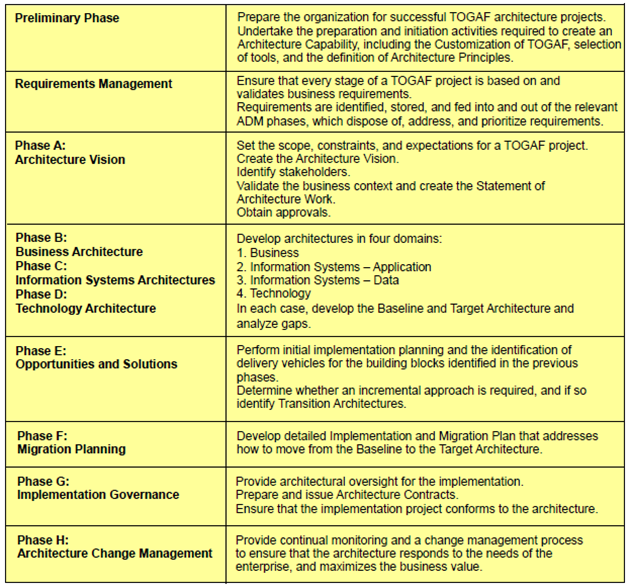
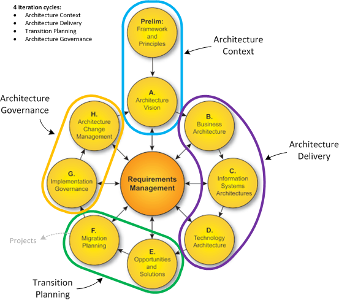
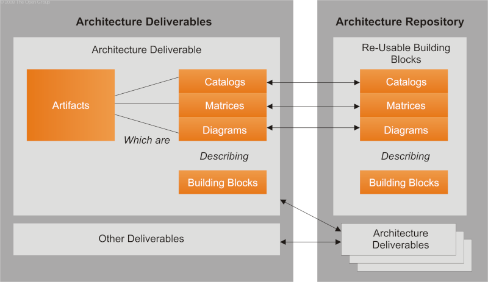
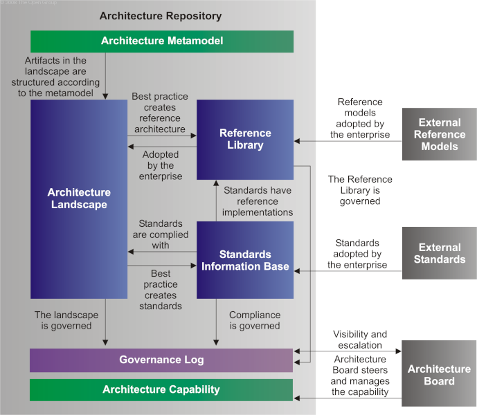

# The Open Group Architecture Framework (TOGAF)

is an enterprise architecture framework that provides a step by step approach for designing, planning, implementing, and governing an enterprise information technology architecture.

It is typically modeled at four levels:

* Business Architecture
* Application Architecture
* Data Architecture
* Technology (Infrustructure) Architecture

These levels are refered to as Basic TOGAF Architectural domains.

TOGAF relies heavily on modularization, standardization, and already existing, proven technologies and products.

This immages also provides the Architecture patritioning.

#### 1.1 What is TOGAF?

* TOGAF is a framework - a detailed method and a set of supporting tools - for developing an enterprise architecture.

* TOGAF is an architecture framework - The Open Group Architecture Framework. TOGAF provides the methods and tools for assisting in the acceptance, production, use, and maintenance of an enterprise architecture. It is based on an iterative process model supported by best practices and a re-usable set of existing architecture assets.

#### What is a framework

An Architecturre Framework is:

1. a precisely define language for describing an architecture.
2. Predefined Buildig blocks for putting it together
3. Precise steps to follow.

#### What is an enterprise?

`TOGAF defines "enterprise" as any collection of organizations that has a common set of goals. For example, an enterprise could be a government agency, a whole corporation, a division of a corporation, a single department, or a chain of geographically distant organizations linked together by common ownership.`

The term "enterprise" in the context of "enterprise architecture" can be used to denote both an entire enterprise - encompassing all of its information and technology services, processes, and infrastructure - and a specific domain within the enterprise. In both cases, the architecture crosses multiple systems, and multiple functional groups within the enterprise.

Confusion often arises from the evolving nature of the term "enterprise". An extended enterprise nowadays frequently includes partners, suppliers, and customers. If the goal is to integrate an extended enterprise, then the enterprise comprises the partners, suppliers, and customers, as well as internal business units.

The business operating model concept is useful to determine the nature and scope of the enterprise architecture within an organization. Large corporations and government agencies may comprise multiple enterprises, and may develop and maintain a number of independent enterprise architectures to address each one. However, there is often much in common about the information systems in each enterprise, and there is usually great potential for gain in the use of a common architecture framework. For example, a common framework can provide a basis for the development of an Architecture Repository for the integration and re-use of models, designs, and baseline data.

#### 1.2 What is Architecture in the Context of TOGAF?

ISO/IEC 42010:2007 defines "architecture" as:

`"The fundamental organization of a system, embodied in its components, their relationships to each other and the environment, and the principles governing its design and evolution."`

TOGAF embraces but does not strictly adhere to ISO/IEC 42010:2007 terminology. In TOGAF, "architecture" has two meanings depending upon the context:

`"A formal description of a system, or a detailed plan of the system at component level to guide its implementation
The structure of components, their inter-relationships, and the principles and guidelines governing their design and evolution over time"`

#### 1.3 TOGAF document structure

There are six parts to this document:

* `PART I (Introduction)` This part provides a high-level introduction to the key concepts of Enterprise Architecture and in particular the TOGAF approach. It contains the definitions of terms used throughout this standard.

* `PART II (Architecture Development Method)` This part is the core of the TOGAF framework. It describes the TOGAF Architecture Development Method (ADM) - a step-by-step approach to developing an Enterprise Architecture.

* `PART III (ADM Guidelines & Techniques)` This part contains a collection of guidelines and techniques available for use in applying the TOGAF approach and the TOGAF ADM. Additional guidelines and techniques are available in the TOGAF Library.

* `PART IV (Architecture Content Framework)` This part describes the TOGAF content framework, including a structured metamodel for architectural artifacts, the use of re-usable Architecture Building Blocks (ABBs), and an overview of typical architecture deliverables.

* `PART V (Enterprise Continuum & Tools)` This part discusses appropriate taxonomies and tools to categorize and store the outputs of architecture activity within an enterprise.

* `PART VI (Architecture Capability Framework)` This part discusses the organization, processes, skills, roles, and responsibilities required to establish and operate an architecture function within an enterprise.

#### 1.4 Why TOGAF Works

TOGAF provides the following benefits:

* `Proven Method` TOGAF offers a proven method that is the result of years of research and development by the world's leading enterprise architects.

* `Common Vocabulary` TOAGF guides architects in using a standard taxonomy for business, information systems, and technology modeling. This shared vocabulary means that everyone in an organization can read and understand the information.

* `Communication` Models of the enterprise architecture give visual representation to business concepts, and, when published on the corporate intranet, disseminate knowledge of the business to the workforce.
* `Command Decisions` A business-focused enterprise architecture provides knowledge about an organization and enables managers to make better-informed decisions.

* `Reduced complexity` A well developed architecture leads to a better integrated solution portfolio, fewer interfaces, increased data sharing, improved reliability of the solutions, and easier maintenance.
Business-IT alignment—The business focus of the architecture development process and the strong emphasis on the need for the implemented solution to be architecture-compliant together will help ensure that IT solutions are aligned to the needs of the business.

##### For more information see
* [Good Starting Point](https://www.youtube.com/watch?v=yGWn0qKtS7U&list=PLUDQ1dvtmiWKuB9L1QHYVDoFV5zmLSOi_&index=1)
* [Another Good Starting Point](https://www.youtube.com/watch?v=NHF1VftWTQk&list=PLLiBQRHikaGZ1wQsfLo8-bmsgbtiwIY5g)
* [TOAGF Summary](https://wiki.glitchdata.com/index.php?title=TOGAF_Summary)
* [Summary](https://www.visual-paradigm.com/guide/togaf/what-is-togaf/)
* [Overview](https://www.goodelearning.com/courses/enterprise-architecture/togaf-9-foundation/what-is-togaf)
* [Summary Overview](http://www.togaf.info/sg02)
* [Summary of TOAGF](https://www.visual-paradigm.com/guide/togaf/togaf-91-framework/)
* [Short Tutorial](https://tekslate.com/togaf-tutorials)
* [TOAGF Tutorials](https://www.edureka.co/blog/togaf-training/)
* [YouTube Tutorial](https://www.youtube.com/watch?v=UuzhmspJ9MQ&list=PL2DBS7YokxakHkMnodzwroStCf6qtU0WT)
* [Youtube training](https://www.youtube.com/watch?v=UnhC9xk9wiE)
* [Good Introduction](https://www.youtube.com/watch?v=3M4NKwoaLk4&list=PL2FF5FCBA1AF9B8FA)
* [Great Exam Practice Site](http://theopenarch.com/81-tests/72-togaf-9-exam-tests.html)
* [Mock Exam](https://www.techbolo.com/)
* [MOCK Exam](https://setandbma.wordpress.com/2011/03/30/togaf-foundation-level-certification-aid-for-preparation/)

## TOGAF Basic Concepts

The followings are TOGAF basic concepts

* Enterprise Definition
* Enterprise Architecture Domains
* Architect Development Method
* Deliverable, Artifacts, and Building Blocks
* Enterprise Continum
* Archtecture Repository
* Establishing & Maintaining Enterprise Architecture Capability

This document is broken donw into the sections based on the TOGAF basic concepts.

##### For more information see

## Section 1 Enterprise Definition
The section will deal with the followings

* what is TOGAF Stand for
* What is the Architeccture in this context
* What is Enterprise in this context

##### For more information see

## Section 2 Enterprise Architecture Domains

There are four architecture domains:

* `Business Architecture` defines the business strategy, governance, organization, and key business processes

* `Data Architecture` describes the structure of an organization's logical and physical data assets and data management resources

* `Application Architecture` provides a blueprint for the individual applications to be deployed, their interactions, and their relationships to the core business processes of the organization

* `Technology Architecture` (A.K.A. Infrustructre Architecture) describes the logical software and hardware capabilities that are required to support the deployment of business, data, and application services; this includes IT infrastructure, middleware, networks, communications, processing, standards, etc.

* `Secuirty Architecture` is a very important aspect of Architecture that mainly should be part of each of the above domains.

##### For more information see

### What are the Architecture Partitioning

There are three layers to the EA architectrue

* `Strategic Architecture`: Generally these are the `stakeholder's concerns` associated with top exuctivies.
* `Segmented Architecture`: Generally these are partial architectural models, they may be drived from the busines goals, some of the business golas may also be drived from the `stakeholders concerns` they should be fully inline with the strategic
* `Capabilites Architecture`: these are capabilities level, they may be initiated from the requirent phase (The middle circle). These should be fully inline with both Strategic and Segemented architecture.

## Section 3 Architect Development Method (ADM)

Phases within the ADM are as follows:

* `Preliminary Phase`: describes the preparation and initiation activities required to create an Architecture Capability including customization of the TOGAF framework and definition of Architecture Principles

* `Phase A`: Architecture Vision describes the initial phase of an architecture development cycle
It includes information about defining the scope of the architecture development initiative, identifying the stakeholders, creating the Architecture Vision, and obtaining approval to proceed with the architecture development.

* `Phase B`: Business Architecture describes the development of a Business Architecture to support the agreed Architecture Vision

* `Phase C`: Information Systems Architectures describes the development of Information Systems Architectures to support the agreed Architecture Vision

* `Phase D`: Technology Architecture describes the development of the Technology Architecture to support the agreed Architecture Vision

* `Phase E`: Opportunities & Solutions conducts initial implementation planning and the identification of delivery vehicles for the architecture defined in the previous phases

* `Phase F`: Migration Planning addresses how to move from the Baseline to the Target Architectures by finalizing a detailed Implementation and Migration Plan

* `Phase G`: Implementation Governance provides an architectural oversight of the implementation

* `Phase H`: Architecture Change Management establishes procedures for managing change to the new architecture

* `Requirements` Management examines the process of managing architecture requirements throughout the ADM

##### For more information see
* [ADM Tutorial](https://www.visual-paradigm.com/guide/togaf/togaf-adm-tutorial/)

## ADM Phases in detailed
This section provide more detaails on the ADM Phases.

### [Preliminary Phase](http://pubs.opengroup.org/architecture/togaf-doc/arch/chap06.html)

* Preperation and initiation activities

##### Preliminary Phase - Objectives

* Determine the architecture capability desired by the organization
* Establish an architecture capability

##### Preliminary Phase - Approach

* Defining the enterprise
	* Which lines of busines
	* Which applications
	* Which customer channels
	* Which outside partners are to be considered part of the enterprise
* Identify key drivers and elements of change
* Defining the requirements for architecture work (run it like any other project)
* Choosing frameworks
	* TOGAF for arch, ITIL for implementation and service mgmt, industry frameworks, etc.
	* Define the relationships between other frameworks in the organization
* Evaluate enterprise maturity and capability
* Define architecture principles - foundation for making decisions

##### Inputs

* TOGAF
* Other arch frameworks
* Board strategies, board business plans, IT strategy, business principles, business goals, business drivers
* Major frameworks operating within the business (scrum, etc)
* Arch capability
* Parnerships and contract agreements

##### Steps

1. Scope the enterprise organization impacted - what domain do you operate in? Businesses, applications, etc.
2. Confirm governance and support frameworks.
3. Define and establish architecture team
4. Identify and establish architecture principles
5. Tailor TOGAF and other frameworks
6. Implement architecture tools

##### Outputs

1. Organization model for enterprise architecture
2. Tailored architecture framework
3. Initial architecture repository
4. Restatement of business to business principles, goals, etc.
5. "Request for Architecture Work" (optional - for running it like a project)
6. Architecture governance framework - doc stores, log files, decisions, project plans, etc.

### [Architecture Vision - Phase A](http://pubs.opengroup.org/architecture/togaf9-doc/arch/chap07.html)

* Problems defined, solutions to be delivered
* Develop a high level vision to be delivered
* Obtain approval for the statement of architecture work
	* Scope, estimate resources required, develop a roadmap and schedule
	* Define KPIs and metrics
* Developer a communications plan

##### Architecture Vision - Objectives

* Develop a high-level vision of the capabilities and business value to be delivered as a result of the proposed enterprise architecture
* Obtain approval for a Statement of Architecture Work that defines a program of works to develop and deploy the architecture outlined in the Architecture Vision
	* Define Scope
	* Estimate Resources needed
	* Developer a roadmap and schedule
	* Define KPIs and metrics
	* Communications plan

##### Objectives

1. Developer a high level aspirational vision of the capabilities and business value to be delivered
2. Obtain approval for the statement of architecture work

##### Approach

1. Create the request for architecture work - carefully define scope - what's in, what's out
2. Creating the architecture vision
3. Go through the [ADM "business scenarios" process](http://pubs.opengroup.org/architecture/togaf9-doc/arch/chap26.html) (use cases)

##### Business Scenarios process

1. Start with a problem
2. A problem exists in an *environment*
3. That environment has *objectives*
4. There are human *actors*
5. There are computer *actors* which systems
6. There are *roles and responsibilities* for all of these.
7. You go back through the steps to *refine* things

##### Inputs

1. External reference models
2. Request for architecture work (prelim phase)
3. Business principles, goals, and drivers (prelim)
4. Org model for enterprise architecture (prelim)
5. Tailored architecture framework (prelim)
6. Populated architecture repo (prelim)

Note - all of the above are common inputs for the architecture definitions phases

##### Steps

1. Establish the architecture project (kickoff, schedule, tasks, project mgmt)
2. Identitfy stakeholders, concerns, and business requirements
3. Confirm business goals, drivers, and constraints
4. Evaluate *business* capabilities
5. Assess readiness for transformation
6. Define the scope
7. Confirm [architecure prinicples](http://pubs.opengroup.org/architecture/togaf9-doc/arch/chap23.html), including business principles
8. Developer the architecture vision
9. Define the target architecture value and KPIs
10. Identify transformation risks and mitigation strategies
11. Develop statement of architecture work, secure approval

##### Outputs (usually documents)

1. Approved statement of architecture work
2. Refined statements of business principles, goals, and drivers
3. Architecture principles
4. Capability assessment
5. Tailored architecture framework
6. Architecture vision
7. Draft architecture definition document (version 0.1 of all baseine and target BDAT documents)
8. Communications plan
9. Additional content in the architecture repository

##### Artifacts

* Matrices: stakeholder map matrix
* Diagrams: value chain diagran, solution context diagram

[Business Architeture - Phase B](http://pubs.opengroup.org/architecture/togaf9-doc/arch/chap08.html)

* The B in BDAT
* Develop a baseline business architecture v1.0 - current state, developed bottom-up
* Develop a target business architecture v1.0 - top down
* Identify gaps between baseline, target

##### Business Architecture - Objectives

* Develop the Target Business Architecture that describes how the enterprise needs to operate to achieve the business goals, and respond to the strategic drivers set out in the Architecture Vision, in a way that addresses the Request for Architecture Work and stakeholder concerns
* Identify candidate Architecture Roadmap components based upon gaps between the Baseline and Target Business Architectures

[Information System Architecture - Phase C](http://pubs.opengroup.org/architecture/togaf9-doc/arch/chap09.html)

* The D and A in BDAT
* Data and applications done separately
* Develop baseline [data architecture](http://pubs.opengroup.org/architecture/togaf9-doc/arch/chap10.html) v1.0
* Develop target data architecture v1.0
* Develop baseline [application architecture](http://pubs.opengroup.org/architecture/togaf9-doc/arch/chap11.html) 1.0
* Develop target app architecture 1.0

##### Objectives

* Develop the Target Information Systems (Data and Application) Architecture, describing how the enterprise's Information Systems Architecture will enable the Business Architecture and the Architecture Vision, in a way that addresses the Request for Architecture Work and stakeholder concerns
* Identify candidate Architecture Roadmap components based upon gaps between the Baseline and Target Information Systems (Data and Application) Architectures

[Technology Architecture - Phase D](http://pubs.opengroup.org/architecture/togaf9-doc/arch/chap12.html)

* T in BDAT
* Same story - baseline and target, gap analysis

##### Objectives:

* Develop the Target Technology Architecture that enables the logical and physical application and data components and the Architecture Vision, addressing the Request for Architecture Work and stakeholder concerns
* Identify candidate Architecture Roadmap components based upon gaps between the Baseline and Target Technology Architectures

##### Phase E - Opportunities and Solutions

* Initial complete version of the architecture roadmap, based on gap analysis of the bdat
* Consolidation of phases B, C, and D into a roadmap
* Determine if incremental approach needed
	* If you can't swap new solution for old in one step, you may need to define incremental work
	packages that represent transition architectures.
* Formulate implementation strategy
* Identify and group work packages
	* Sequencing of work
	* Grouping of work (what can be done at the same time?)

##### Phase F - Migration Planning

* Finalize the architecture roadmap and the implementation and migration plans from phase E
* Ensure the plan is coordinated with the enterprise's approach to change
	* Risk averse organizations vs risk taking organizations
* Ensure the business value of the approach is understood by the stakeholders
* Start thinking about implementation: costs, resources, timing
* Transition from developing the architecture to implementing

##### Phase G - Implementation Govenernance

* Ensure conformance with the target architecture
* Governance duties
* Handling change requests from the implementation team
* Update baseline architecture as changes are implemented
	* Done when a transition architecture goes live
* Phase G ends when the solutions are fully deployed

##### Phase H - Architecture Change Management

* Keeping the architecture alive
* Ensure architecture governance is happening
* Ensure the enterprise architecture capability is maintained
* Monitoring: changes to the business enterprise, changes to the industry, changes
to technology, formal change requests.

##### Requirements Management

* Center of the hub
* Operates continuously during the ADM process
* Requirements change all the time
	* New competitor, new legislation, disproven assumption, new company policy
* RM involves assessing the impact of these changes

[ADM Iterations](http://pubs.opengroup.org/architecture/togaf9-doc/arch/chap19.html)

* Not mandatory, can just follow A - H, normal one phase at a time approach
* Architecture development iteration
	* Example: baseline first
		* Do B - H to do the baseline
		* Go back to B - H to go light pass target arch
		* B - H again, target detail
	* Example: target first
		* Hit the target arch first, then go back lightly on baseline
* Transition planning iteration
	* Loop between E and F
* Architecture Governance
	* Loop between G and H
* Architecture capability
	* Done with H, back to A - access your capability, do some iteration on it halfway through between A and H

## Section 4 Deliverable, Artifacts, and Building Blocks

* A deliverable is a work product that is contractually specified and in turn formally reviewed, agreed, and signed off by the stakeholders.
  - Deliverables represent the output of projects and those deliverables that are in documentation form will typically be archived at completion of a project, or transitioned into an Architecture Repository as a reference model, standard, or snapshot of the Architecture Landscape at a point in time.

* An artifact is an architectural work product that describes an aspect of the architecture
  - Artifacts are generally classified as catalogs (lists of things), matrices (showing relationships between things), and diagrams (pictures of things). Examples include a requirements catalog, business interaction matrix, and a use-case diagram. An architectural deliverable may contain many artifacts and artifacts will form the content of the Architecture Repository.

* A building block represents a (potentially re-usable) component of enterprise capability that can be combined with other building blocks to deliver architectures and solutions
  - Building blocks can be defined at various levels of detail, depending on what stage of architecture development has been reached. For instance, at an early stage, a building block can simply consist of a name or an outline description. Later on, a building block may be decomposed into multiple supporting building blocks and may be accompanied by a full specification. Building blocks can relate to "architectures" or "solutions".

    - Architecture Building Blocks (ABBs) typically describe required capability and shape the specification of Solution Building Blocks (SBBs); for example, a customer services capability may be required within an enterprise, supported by many SBBs, such as processes, data, and application software

    - Solution Building Blocks (SBBs) represent components that will be used to implement the required capability; for example, a network is a building block that can be described through complementary artifacts and then put to use to realize solutions for the enterprise

##### For more information see
* [TOAGF](https://pubs.opengroup.org/architecture/togaf92-doc/arch/)

## Section 5 Enterprise Continum

Enterprise Continum is mainly is a view of Enterprise Repository or simply `virtual repostiory` that provides a design from a very generic to  very specifc architecture. It is intwnded to facilitate a better reuse of the architecture (design).

The simplest way of thinking of the Enterprise Continuum is as a `virtual repository` of all the architecture assets - models, patterns, architecture descriptions, and other artifacts - that exist both within the enterprise and in the IT industry at large, which the enterprise considers itself to have available for the development of architectures for the enterprise.

* Architertural Continum
* Solution Continum

##### For more information see
* [TRM](https://mariosergioflorian.blogspot.com/2012/11/togaf-trm-crub-notes.html)
* [Continum](https://bizzdesign.com/blog/using-the-togaf-enterprise-continuum-to-classify-architectures-descriptions/)

## Section 6 Archtecture Repository

The major components within an Architecture Repository are as follows:

* The Architecture Metamodel describes the organizationally tailored application of an architecture framework, including a metamodel for architecture content

* The Architecture Capability defines the parameters, structures, and processes that support governance of the Architecture Repository

* The Architecture Landscape is the architectural representation of assets deployed within the operating enterprise at a particular point in time - the landscape is likely to exist at multiple levels of abstraction to suit different architecture objectives

* The Standards Information Base (SIB) captures the standards with which new architectures must comply, which may include industry standards, selected products and services from suppliers, or shared services already deployed within the organization

* The Reference Library provides guidelines, templates, patterns, and other forms of reference material that can be leveraged in order to accelerate the creation of new architectures for the enterprise

* The Governance Log provides a record of governance activity across the enterprise

* The Architecture Requirements Repository provides a view of all authorized architecture requirements which have been agreed with the Architecture Board

* The Solutions Landscape presents an architectural representation of the SBBs supporting the Architecture Landscape which have been planned or deployed by the enterprise

##### For more information see

## Section 7 Establishing & Maintaining Enterprise Architecture Capability

Defines Organization Structur, roles, responsibilites, skills, and processes required for an effective Enterprise Architect praactice.

## Resources

* [TOGAF 9.2](https://pubs.opengroup.org/architecture/togaf9-doc/arch/)
* [Wiki](https://en.wikipedia.org/wiki/The_Open_Group_Architecture_Framework)
* [Simple Description](https://setandbma.wordpress.com/2011/01/25/what-is-togaf-without-jargon/)
* [Articke](https://www.developer.com/java/ent/article.php/3374171/TOGAF-Establishing-Itself-As-the-Definitive-Method-for-Building-Enterprise-Architectures-in-the-Commercial-World.htm)
* [TOGAF Summary](http://wiki.glitchdata.com/index.php?title=TOGAF_Summary)
* [Togaf](https://github.com/pankajchopra/togaf)
* [TOGAF Blog](http://togaf9certprep.blogspot.com/)
* [TOGAF](https://www.visual-paradigm.com/guide/togaf/what-is-togaf/)
* [TOGAF](https://www.visual-paradigm.com/tutorials/togaf-adm-tool-for-enterprise-architecture.jsp)
* [TOGAF](https://www.visual-paradigm.com/features/togaf-adm-tools/)
* [Summary](https://www.visual-paradigm.com/guide/togaf/togaf-91-framework/)
* [Article](https://www.ibm.com/developerworks/rational/library/jan07/temnenco/index.html)
* [Introduction](https://medium.com/@anioko/how-to-use-togaf-framework-for-requirement-gathering-part-1-b4dc5e1efca1)
* [sOME vIDEO](https://www.goodelearning.com/courses/enterprise-architecture/togaf-9-foundation/what-is-togaf)
* [Summary](https://www.archimetric.com/what-is-togaf/)
* [Exam Summary](http://www.enterprise-architecting.com/eaex/togaf.aspx)
* [Summary](http://www.togaf.com/admref/admreference.html)
* [Goof Overview](https://www.visual-paradigm.com/guide/togaf/what-is-togaf/)
* [TOGAF ADM](https://www.visual-paradigm.com/guide/togaf/togaf-adm-tutorial/)

# Youtube Resources
* [Course -1](https://www.youtube.com/watch?v=yGWn0qKtS7U&list=PLUDQ1dvtmiWKuB9L1QHYVDoFV5zmLSOi_)
