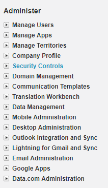
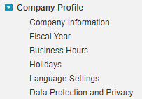
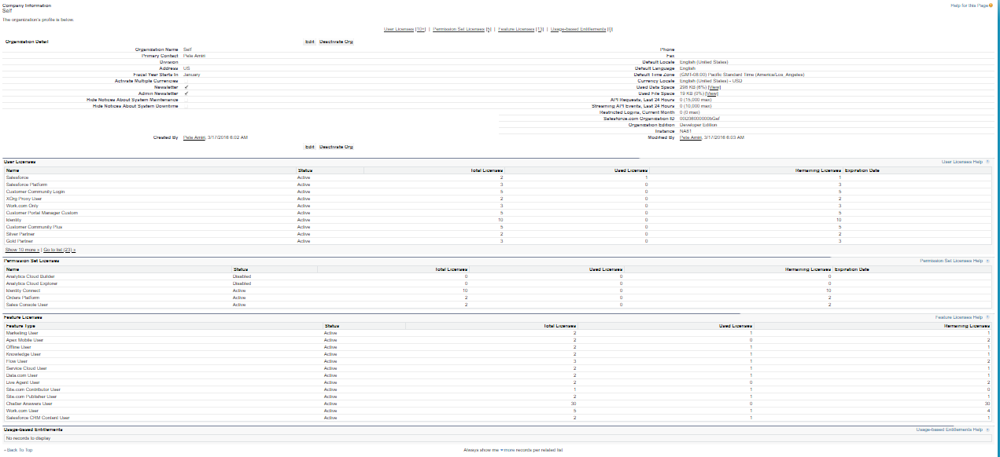
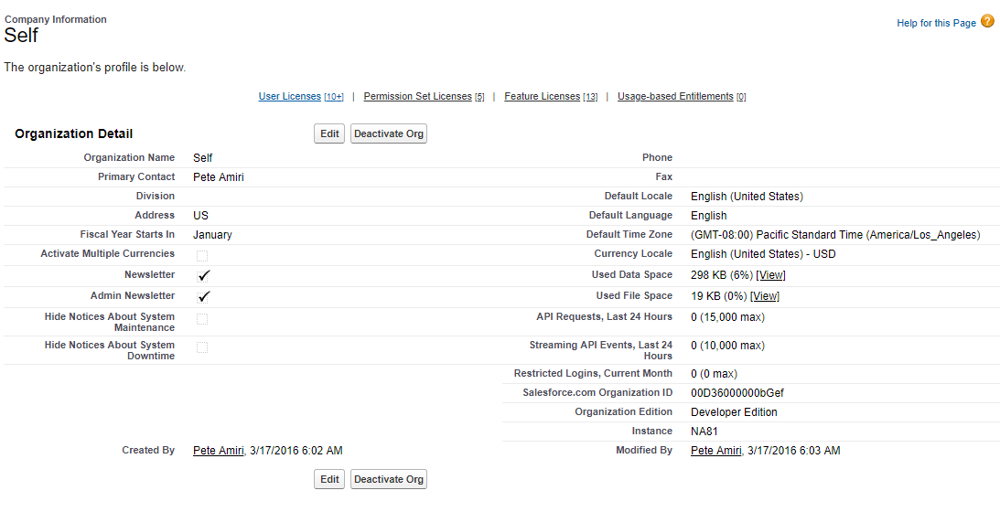
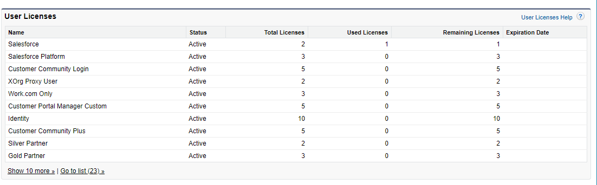
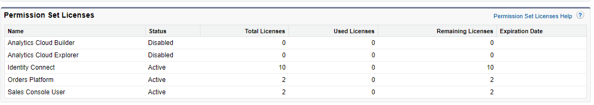
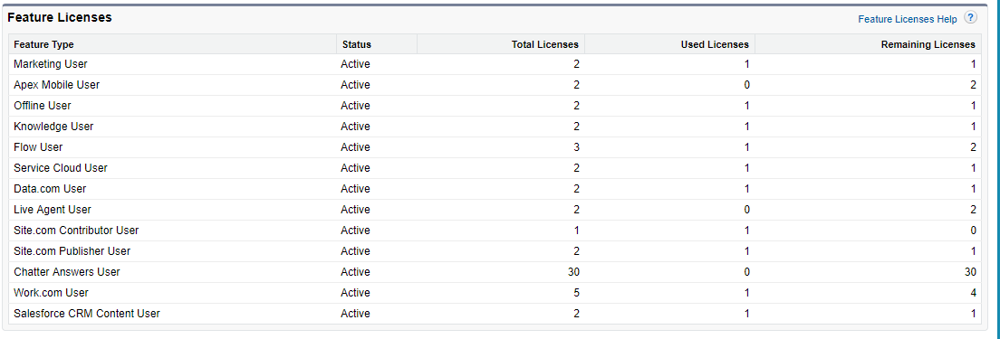
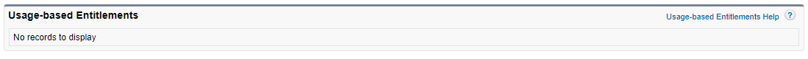
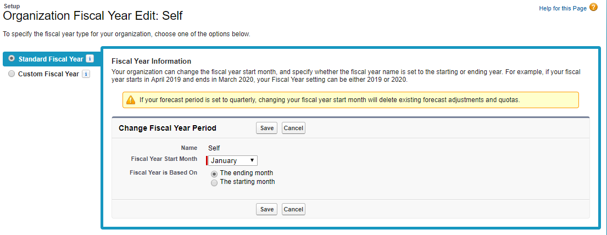

# SalesForce Certification Exam Notes

* [Reference](https://trailhead.SalesForce.com/en/credentials/administratoroverview)
* [Source](http://SalesForce-certification-notes.blogspot.com/2013/01/global-user-interface-1.html)

Generally the first step in every account is to setup the organization information

# Admin Menu

The  following image displays the Administrators menu selection under setup;

# Organization Setup - 1%

Generally the Company Profile set up is the first step. You can find the "Company Profile" Menu selection under the Administration Menu;

The first step in SalesForce setup could be setting up The Company Profile. This can be done from the menu selection.

The following sub-menu items are available under setting company profile;

1. Setup Company Profile
  1. Company information (General Company Information)
  2. Fiscal year (Company Fiscal Year setup)
  3. Business Hours (Business Hours)
  4. Holidays (Holidays)
  5. Language Settings (Company Language Information)
  6. Data Protection and Privacy (Privacy and Protection)

# 1. Describe the components of the company profile

Use the Company Information page in Setup to track what’s important about your company’s organization in SalesForce. You can also manage your licenses and entitlements. This page contains the information that was provided when your company signed up with SalesForce.

when setting the Company Information the following sections are avaiavle on the page;

## 1.1 Organization details:
The following is the organization information;

* Organization Name, 
* Primary Contact, 
* Default locale, 
* default language, 
* currency locale, 
* used data / File Space, 
* API requests, 
* SalesForce.com organization ID.

### 1.2 User licenses :

A user license determines the baseline of features that the user can access. Every user must have exactly one user license. You assign user permissions for data access through a profile and optionally one or more permission sets.

The followings are the user licenses;

* SalesForce, 
* SalesForce platform, 
* Force.com, 
* Knowledge Only, 
* Chatter Free, 
* Chatter external, 
* Chatter only/plus,  
* Customer portal, 
* Partner

### 1.3 Permission Set Licence

A permission set is a convenient way to assign users specific settings and permissions to use various tools and functions. Permission set licenses incrementally entitle users to access features that are not included in their user licenses. 

Users can be assigned any number of permission set licenses.

### 1.4 Feature licenses :

A feature license entitles a user to access an additional feature that is not included with his or her user license, such as Marketing or Work.com. Users can be assigned any number of feature licenses.

The followings are the Feature Licenses;

* Marketing user, 
* Offline user, 
* Knowledge user, 
* Force.com Flow user, 
* Service cloud user, 
* site.com contributor, 
* site.com publisher, 
* Mobile user, 
* SalesForce CRM Content user, 
* live agent user

User Licenses show status, total licenses, used licenses, remaining licenses and expiration date. **Feature licenses are same but do not show expiration date** 

(They are attached to the user licenses, to enable a feature for a user in your organization, you can assign feature licenses when adding new users or editing a user's personal information, checkboxes!)

### 1.5 Usage-based Entitlements

A usage-based entitlement is a limited resource that your organization can use on a periodic basis—such as the allowed number of monthly logins to a Partner Community or the record limit for Data.com list users.

Some entitlements are persistent. These entitlements give your SalesForce org a set number of the resource, and the amount allowed doesn’t change unless your contract changes. For example, if your company purchases monthly subscriptions for 50 members to access a Partner Community, you can assign up to 50 individuals the ability to log into the community as many times as they want.

Other entitlements are not persistent; these entitlements work like credit. Your org can use up to the amount allowed of that entitlement over the time indicated by the resource’s frequency. If the entitlement has a frequency of Once, your org must purchase more of the resource to replenish the allowance. If the entitlement has a frequency of Monthly, then your contract (not the calendar month) determines the start and end of the month.

For example:

    * Company A purchases 50 monthly logins for a Partner Community, and on January 15 that org has a pool of 50 logins. Each time someone logs in, one login is used. On February 15, no matter how many were used in the previous month, the pool is refreshed and 50 logins are available through March 14.
    
    * Company B purchases 2,000 records for Data.com list users with an end date of May 15. That org’s list users can add or export up to 2,000 records until that date. If the org reaches that limit before May 15, the Data.com list users won’t be able to add or export more records. To unblock users, Company B can purchase more records.
    
> NOTE: If your org has multiple contracts with the same Resource and the Resource ID is (tenant), you will still only see one row for that entitlement, but the data in that row will reflect your combined contracts. In this case, Start Date reflects the earliest start date among those contracts, and End Date reflects the latest end date among those contracts.Like feature licenses, usage-based entitlements don’t limit what you can do in SalesForce; they add to your functionality. If your usage exceeds the allowance, SalesForce will contact you to discuss additions to your contract.

* **View Your SalesForce Org’s Usage-Based Entitlements**; Look at your company’s usage-based entitlements to know which resources your org is entitled to.
* **Usage-based Entitlement Fields**; The Usage-based Entitlements related list displays the following information. These fields aren’t editable, and they are only visible if your SalesForce org is entitled to a resource.

## Fiscal year:

If your company follows the Gregorian calendar year but you want to change the fiscal year start month, use standard fiscal years (starting January and ends January). If your company does not observe a standard fiscal year, you can enable custom fiscal years, which define a more complex fiscal year structure.

Your organization can change the fiscal year start month, and specify whether the fiscal year name is set to the starting or ending year. For example, if your fiscal year starts in April 2019 and ends in March 2020, your Fiscal Year setting can be either 2019 or 2020.

**If your forecast period is set to quarterly, changing your fiscal year start month will delete existing forecast adjustments and quotas.**

When setting Company Fiscal Years, there are two types of Fiscal Year;

1. **Standard (default)**: Follows Gregorian calendar, starts first day of any month)
2. **Custom**: Follows custom structure you define, it can not be disabled once enabled

-Changing fiscal year start month may delete existing forecasts, forecast history, forecast overrides, reports and all quotas.  To preserve: use a month that starts a fiscal year not a random month.

## Business hours

Shows the days and hours that your support team is available. These hours, when associated with escalation rules, determine the times at which cases can escalate. Blank business hrs. mean, org doesn’t operate that day. There are no organization login hours, just business hours

** If the user has a session and the hours just passed, the next page the user goes, the session is validated and user loses the session**

## Holidays

Holidays are dates and times at which business is closed. Enter the dates and times at which to suspend business hours and escalation rules associated with business hours

## Language Setting

where you set end user (help and admin setup are not translated) and platform only languages. 

Languages that appear in gray are currently used by your company, users, or both. They cannot be deactivated

## Data Protection and Privacy

----

**My Domain**: Once the new domain name deployed to users, you cant reverse it.
Domain name can be up to 40 characters.

SalesForce domain name is as follow: mydomainname.my.SalesForce.com
You have the option of redirecting the users (deploy) or block login from old domain (Prevent login from login.SalesForce.com to provide better security) – check login history to see.

* [See](https://pmi-sfbac-dev-ed.my.SalesForce.com)

# User Licenses:

The followings are various licenses provided by Saleforce;

(Changing a user license of a user also removes the permission sets assigned to that user)

* **SalesForce**: Full access, can access any standard and custom app.
* **SalesForce Platform**: Users can access custom apps (incl. AppExchange) but not standard CRM functionality (forecasts, opportunities). In addition can use core platform functionality (Accounts, contacts, reports, dashboards, documents and custom tabs) Users with this license can only view dashboards if the running user also has the same license.
* **Force.com**: Users can access one custom app but not standard CRM functionality. Read only on Accounts and Contacts objects. Users with this license can only view dashboards if the running user also has the same license.
Chatter Free: Users can access standard Chatter people, profiles, groups, and files. They can't access any SalesForce objects or data. You can upgrade a Chatter Free license to a standard SalesForce license at any time, however, you can't convert a standard SalesForce or Chatter Only license to a Chatter Free license.
* **Chatter External**: Designed to allow customers in Chatter groups. Customers are users outside of a company’s email domain.
Customer portal user license: Allows contacts to log into your Customer Portal to manage customer support
Authenticated Website license: is designed to be used with Force.com Sites. It gives named sites users unlimited logins to your Platform Portal to access customer support information.
Data.com: Add, export data.com reports per month. Default is 300.
Knowledge only: Designed for users who only need access to the SalesForce Knowledge app. Access to the following tabs: Articles, Article Management, Chatter, Chatter Files, Home, Profiles, Reports, custom objects, and custom tabs. The Knowledge Only User license includes a Knowledge Only profile that grants access to the Articles tab.

## Feature Licenses:

**You may have more than one type of feature license available to assign to the users in your organization. A feature license entitles a user to an additional SalesForce feature, such as Marketing or Connect Offline.**

Marketing user, Offline user, Knowledge user, force.com flow, Service cloud user, site.com contributor, site.com publisher user, Mobile user, SalesForce CRM Content user, live agent, data.com

* **Storage**: There are two kinds of storage
	* **Data storage**
	* **File storage**

Each license provides additional storage: Minimum 1gb, normally 20MB X the user. 20 users – 1GB, 200 users – 4GB

## Language, Locale, and Currency

* **Currency** - User in a multiple currency organization - User’s default currency for quotas, forecasts, and reports. Shown only in organizations using multiple currencies. This must be one of the active currencies for the organization

* **Corporate Currency** – Administrator - The currency in which the organization's corporate headquarters reports revenue. Serves as the basis for all currency conversion rates. Only for organizations that use multiple currencies. Multiple currencies once enabled can’t be disabled by the organization.

* **Information Currency** – Not editable - The default currency for all currency amount fields in the user record. Available only for organizations that use multiple currencies.

* **Currency Locale** – Administrator - The country or geographic region in which the organization is located. The setting affects the format of currency amounts. For single currency organizations only.

* **Locale** – User - Country or geographic region in which user is located.
The Locale setting affects the format of date, date/time, and number fields, and the calendar. The Locale setting also affects the first and last name order on Name fields for users, leads, and contacts. Personal locale, overrides the organization setting.
Default Currency ISO Code - Not editable - User's default currency setting for new records. Available only for organizations that use multiple currencies.

* **Default Language – Administrator** - This setting also determines the language in which all customizations—such as custom fields, tabs, and user interface options—are stored. For customizations, individual users' language settings do not override this setting. Also set language for new users in the organization.

* **Language – User** - The primary language for the user. A user’s individual Language setting overrides the organization’s Default Language.

* **Default Locale – Administrator** - The default country or geographic region that is selected for new users in the organization. This setting determines the format of dates, times, and names in SalesForce. Individual users can set their personal locale, which overrides the organization setting.

* **Default Time Zone – Administrator** - Primary time zone in which the organization is located. A user's individual Time Zone setting overrides the organization's Default Time Zone setting.

* **Time Zone – User** - Primary time zone in which user works.

You can opt to use dated exchange rates by using advanced currency management to track historical exchange rates. When enabled, advanced currency management allows maintaining a list of exchange rates by date range, and converted currency amounts on opportunities display based on the specified Close Date, regardless of the opportunity stage. Changing the Close Date impacts converted amounts if it changes to a different exchange rate period. If your organization uses advanced currency management, the opportunity close date determines which conversion rate to use when displaying currency amounts. (Close date is set to the last day of the quarter)

Multiple currencies can be used in opportunities, forecasts, reports, quotes, and other currency fields.

Custom formula fields are not tied to any particular currency. If the result of a formula field is a currency amount, it displays in the currency of the associated record. This is also true for cross-object formulas that reference merge fields with different currencies, and formulas in workflow rules and approval processes. However, note that workflow rules and approval processes that use filters instead of formulas convert all currency values to the corporate currency.

You cannot track revenue gain or loss based on currency fluctuations.

Changing conversion rates causes a mass recalculation of roll-up summary fields, which may take up to 30 minutes, depending on the number of records affected and other factors.

Company information page limits:

* Street address – 255
* City, country, division, fax, phone – 40 State, zip - 20
* Organization name, primary contact,  - 80

**If your organization has enabled Shared Activities, you can relate as many as 10 contacts to non-recurring and non-group tasks, and non-recurring events. You assign one primary contact; all others are secondary contacts. The primary contact appears in two reports: Tasks and Events, and Activities with Cases. If you delete the primary contact, the next contact on the activity’s related list becomes the new primary one. If that’s not the primary contact you want, you can
edit the activity to select another.**

The followings are the list of Standard Apps;

* Sales, 
* Call Center, 
* Marketing, 
* Community, 
* Site.com, 
* SalesForce Chatter

# User Setup - 9%

Under "Manage Users" menu selection the following menu itemms are avaiblable

1. Users
1. Mass Email Users
1. Roles
1. Permission Sets
1. User Management Settings
1. Profiles
1. Public Groups
1. Queues
1. Login History
1. Identity Verification History

2. **Identify the steps to set up and maintain a user** (required fields: Last name, email/username, user license, profile) (req: Last name, Alias, Email, Username, Community Nickname, Role, User Licence, Profile) (Email becomes username, community nickname and Alias are derived from email and names, role is not compulsory)
In SalesForce, every user is identified by a username, password, and a single profile. The profile determines what tasks users can perform, what data they see, and what they can do with the data.
A user can be assigned to one or more of feature licenses. You can also set up accounts for users outside your organization who need to access a limited set of fields and objects. These user licenses can grant access to Customer Portal and partner portal. Using SalesForce to SalesForce, you can create connections to share records with other SalesForce users outside of your organization.
Profile settings control access to applications and objects. Sharing features control access to specific records

Maximum SalesForce users per edition:

* Contact Manager(5), 
* Group(5), 
* Professional(unlt), 
* Enterprise(unlt), 
* Unlimited(unlt), 
* Developer(2)

3. Given a scenario, troubleshoot common user access and visibility issues
	1. Check login history (to see what the problem is? Usually a password lockout after invalid password, if password is the problem, reset password to send a new password and then unlock/ lockout could be temporary or admin reset)) (if no incorrect attempt then the user was using an invalid email/username to login)

	2. If access problems are one of the below then identity must be confirmed:
		a. Does user profile has any login restriction?
		b. Does user IP address in organization’s trusted IP range? (Only user with an activated IP address can login)
			* IP address considered activated if IP address falls within trusted IP ranges
			* IP address previously activated by user
			* Browser can be identified by a cookie
		c. Has user been activated from this IP before?
		d. Does user’s web browser have valid cookies from SalesForce?

User profile login restrictions:
1.     Login hours (outside of the hrs. login is denied) (Set login access for specific profiles (login hours under profile)) (For example: customer support specialist profile can login from 7am until 5pm, Mon to Fri)
2.     IP Address (unknown IP, denied) (Set login IP ranges for specific profiles (login IP ranges under profile)) (For example: customer support specialist profile can login from work but not at home or hotel)

Setup | Security Controls | Network Access | Trusted IP Ranges
            |Security Controls | Session Settings | Session Timeout Value (1hr, 2hrs)
            | Security Controls | Password Policies
            | Security Controls | View Set up Audit Trail | (To check the security changes made to the organization by the administrator
            Manage users | Profiles | Login IP Ranges
            Manage users | Profiles | Login Hours (Set start and end same values so they can not login)
            Manage users | Login History (To track user login, first to do when there is a user login problem)

Organization based login hours do not exist, but there is Company profile | Business Hours

What happens when a profile is logged in and login hr passes?
Nothing will happen until your session expires and you will not be able to re-login after the session. If your admin hasn't set a session setting the user will be able to stay in the system till he closes the browser. That login restriction is for user who will try logging in after 5:00 pm, applicable only when the users are trying to log in and will not end the current session
User will continue to use the system until attempts to save or upload?????? (DML)

Grant login Access: only users themselves can grant login access to the administrator
* If you change a user’s email address and generate new password and notify user immediately is deselected, a confirmation message will be sent to the new email address that you entered. The user must click the link provided in that message for the new email address to take effect. This process ensures system security. When generating a new password for a user, the new password is automatically sent to the user’s email address and email verification is not enforced.
* If you change a user's username, a confirmation email with a login link is sent to the email address associated with that user account. Problems might occur because an organization could have multiple login servers. The link in the email connects directly to the server where the actual username change was made. This ensures that users can always log in, even if server replication is slow
* Click Grant Checkout Access to give a user access to Checkout. Using Checkout, the user can purchase SalesForce licenses, AppExchange app licenses, and other related products. Additionally, within Checkout, the user can view the organization's quotes, installed products, orders, invoices, payments, and contracts.

# Global User Interface - 1%

4. Distinguish between and identify the implications of the various user interface features that an administrator controls

User Interface (Customize | User Interface)

* Enable Collapsible Sections:(call center users won’t see incoming calls if they collapse sidebar
* Show Quick Create: The Quick Create area on a tab home page allows users to create a new record quickly with minimal information. This setting also affects whether or not users can create new records from within the lookup dialog. For example, with the setting enabled, users can create a new account within the account lookup dialog while creating or editing a contact
* Enable Hover Details: Display an interactive overlay containing detailed information about a record
* Enable Related List Hover Links
* Enable Separate Loading of Related Lists: Primary record details load first, followed by related list data. Separate loading can improve performance on record detail pages for organizations with large numbers of related lists.
* Enable Inline Editing: This doesn't enable inline editing for profiles. Inline editing isn't available for accessibility mode, system fields, formula fields, case assignments, case email notifications, lead assignments, setup pages, on records for which you have read-only access, dashboards, documents, pricebooks, on records for which you have read-only access, All fields in Tasks except for Subject and Comment, All fields in Events except for Subject, Description, and Location, Full name fields of Person Accounts, Contacts, and Leads. However, their component fields are editable, for example, First Name and Last Name.
* Enable Enhanced Lists: When enabled with the Enable Inline Editing setting, users can also edit records directly from the list, without navigating away from the page
* Enable New User Interface Theme: Some SalesForce features like Chatter need the new user interface theme. Disabling the new user theme disables Chatter
* Enable Tab Bar Organizer
* Enable Printable List Views
* Enable Spell Checker
* Enable Spell Checker on Tasks and Events
Sidebar
8   Enable Collapsible Sidebar
*   Show Custom Sidebar Components on All Pages
Calendar
*   Enable Home Page Hover Links for Events
*   Enable Drag-and-Drop Editing on Calendar Views
*   Enable Click-and-Create Events on Calendar Views
*   Enable Drag-and-Drop Scheduling on List Views
*   Enable Hover Links for My Tasks list
Setup
*   Enable Enhanced Page Layout Editor: Enables WYSIWYG editor
*   Enable Enhanced Profile List Views
*   Enable Enhanced Profile User Interface
*   Enable Streaming API: to activate Streaming API, which allows you to receive notifications for changes to data that match a SOQL query that you define
*   Enable Custom Object Truncate: permanently removes all of the records from a custom object while keeping the object and its metadata intact for future use.

Accessibility Mode is an alternate user interface mode intended for use by visually impaired users utilizing a screen reader such as JAWS or Window-Eyes. Accessibility Mode will disable some user interface features, such as displaying details on hover, inline editing, new user interface theme and should not be enabled by users not using screen readers.

# Security and Access - 15%

Under the "Security Controls" you can manage the following functionality;

* Manage your named credentials
* View audit trail of changes to your setup
* Define the default sharing model for your company
* Force all of your users to reset passwords
* View users' access to fields
* Delegate administration of users and custom objects
* Define password policies for your company
* Administer Remote Proxies
* Control session settings for your users
* Administer CSP Trusted Sites
* Limit IP ranges of users
* File Handling Options
* Control the companies your users can grant login access
* Manage whitelisted CORS origins
* Create and manage certificates and keys for your organization
* Activated IP Address And Client Browsers
* Configure single-sign on for your organization
* Manage Sessions
* Manage authentication providers
* Platform Encryption
* Configure your Identity Provider
* * # 1. Identity Connect
1. Event Monitoring
  1. Event Montoring Setting
1. Platform Encryption
  1. Key Management
  2. Advanced Setting

5. Explain the various organization security options (Object is a category of information {position, candidate}, record is a single instance of an object {SW Engineer})
profile>OWD>Role>Sharing rules>Group queues>Criteria based, manual sharing
-----------à increased data exposure -----------à

Sharing rules can never be stricter than the OWD settings.
Sharing Access Diagram:

1. SalesForce checks whether user’s profile has object level permission to access that object
2. SalesForce checks whether user’s profile has any administrative permissions (view all data, modify all data)
3. SalesForce checks the ownership of the record (Organization wide defaults, role-level access, any sharing rules will be checked)

Controlling a user's access to data in several ways:
1. To control access to applications and objects, including fields and record types within objects: Use profiles and permission sets. (Create record types for a custom object to display different picklist values and page layouts to different users based on their profiles.)
2. To control access to specific records: Use sharing settings and rules.

You cannot delegate administrative duties related to your organization to partner portal or Customer Portal users. However, you can delegate some portal administrative duties to portal users.

1. Object level security: (What objects can a user see?) (It is set in user Profiles and Permission sets) to prevent user from viewing, creating, editing or deleting any instance of a particular type of object. It allows us to hide whole tabs & objects from particular users. User wouldn’t even know the object exists. (Tab settings, Standard / Custom object permissions) On the platform, we set object-level access with object permissions in user profiles and permission sets

2. Field level security: (What fields on those objects can a user see?) (In user Profiles and permission sets) (Field level access with field permissions) a variation of object level security. User is prevented from a particular field without having to hide the whole object, such as “max salary” or “SS”. Page layouts only control the visibility of field on detail and edit pages whereas field level security controls the visibility of fields in any part of the app (related lists, list views, reports and search results)(in order to be absolutely sure that a user does not have access to a particular field) (visible/ read only boxes checked – read only | only visible box checked – editable | no box – hidden) In the platform, we control access to individual fields with field-level security. Field-level security controls whether a user can see, edit, and delete the value for a particular field on an object.

3. Record level security: (Org. wide defaults (Which records should be hidden by default?), Role hierarchy / Sharing model / Manual sharing (What exceptions should we make?))

Organization-wide defaults allow us to specify the baseline level of access that a user has in your organization. For example, we can make it so that any user can see any record of a particular object to which their object permissions give them access, but so that they'll need extra permissions to actually edit one.
Role hierarchies allow us to make sure that a manager will always have access to the same records as his or her subordinates.
Sharing rules allow us to make automatic exceptions to organization-wide defaults for particular groups of users.
Manual sharing allows record owners to give read and edit permissions to folks who might not have access to the record any other way.

**Profiles**: (compulsory when setting up the user, user must be associated with a profile)
A collection of settings (what user can see) and Permissions (what user can do)
A profile contains user permissions and access settings that control what users can do within their organization. Profiles are typically defined by a user's job function (for example, system administrator or sales representative), but you can have profiles for anything that makes sense for your organization. A profile can be assigned to many users, but a user can be assigned to only one profile at a time, where all of the members of the group have the same folder permissions and access to the same software. Profile never override organization’s sharing model or role hierarchy. (Exp: A profile set to allow a user access to create, edit, delete leads but a user with above profile cannot edit, delete other users leads if organizations lead sharing model is read only)

Profiles control:

* Which standard and custom apps users can view?
* Which tabs users can view?
* Which record types are available to users?
* Which page layouts users see?
* Object permissions that allow users to create, read, edit, and delete records
* Which fields within objects users can view and edit
* Admin Permissions that allow users to manage the system and apps within it
* Which Apex classes and Visualforce pages users can access
* Which desktop clients users can access
* The hours during which and IP addresses from which users can log in (profile login hours, Profile IP addresses)
* Which service provider’s users can access (if SalesForce is enabled as an identity provider)

You can use standard profiles, or create, edit, and delete custom profiles. For standard profiles, only certain settings can be changed. You can never edit object permissions on a standard profile. So you must first clone the standard profile to create a customd profiles (6 Types): Marketing user, Contract manager, Read only (executive team), Solution manager, Standard user, System#  Admin.

**Permission Sets:** (Administrative and General) (Standard object permissions, custom object permissions) is a collection of settings and permissions that determine what a user can do.  If the custom box is not checked it is a standard profile and we cannot edit standard profiles permission set. But we can choose which tabs should appear at top of user’s / profile’s page and also select which apps to display in Force.com. (Default on (displayed on top of user’s page), Default off (hidden from user’s page but available when all Tabs is clicked), Tab hidden (completely hidden)

Hiding a tab is not sufficient to prevent a user from accessing records of that tab

You can only assign permission sets that have the same user licenses as the user or permission sets with no associated license. You cannot change the license later. Select the type of users who will use this permission set:
Who will use this permission set? If you plan to assign this permission set to multiple users with different licenses, choose '--None--'. If only users with one type of license will use this permission set, choose the same license that’s associated with them.

1. Grant access to custom object or App:

	Example: Many users in an organization are doing the same job. Assign them all one profile that grants them access to do their job and then assign permission sets to user if they are assigned to a special project. PMISFBAC board profile, PMISFBAC operations profile (DB permission set, Volunteer app review permission set, certifications app permission set) & take away when it is not needed.

2. Temporary/long term permission set:

	Example: A user goes to vacation. Create a permission set to grant access to a custom object or app to another user. After main man returns remove it.

Difference between profiles and permission sets?

* Users can have only one profile, but they can have many permission sets
* Therefore profiles are used to grand the minimum permissions and settings that every type of user needs. (Assigned before permission sets)
* Then use permission sets to grant additional permissions without changing anyone’s profiles. (Also, permission sets can be temporary or long term)

Example: (Recruiting App)

Recruiter: Own profile

Hiring Manager: Permission sets

Standard Employees: Start with low profile + permission sets

Interviewers: Any employee can be an interviewer (grant and revoke access as needed) so permission set.
Although there is permission to create, read or edit on an object does not necessarily mean users will be allowed to read every object’s record because:

1. Permissions on a record always evaluated according to a combination of object, field and record level permissions

2. When object vs. record level permissions conflict, the most restrictive setting wins. (If a record level is more restrictive, although object level allows it, still the record level wins because it is more restrictive)

6. Describe the features and capabilities of the sharing model
Record Access (Record level security)
Changing your sharing model deletes any manual shares your users have created.
Ownership: Record owners can view/edit, transfer, delete records. They can also view but not edit the Accounts their records are associated to.

Org wide defaults: The administrator can define the default-sharing model for your organization by setting organization-wide defaults. Organization-wide defaults specify the default level of access to records. Allow us to specify a baseline level of access that any user has in the org. Exp: Any user can see any record of an object but they will need extra permission to edit a record/object.
a. Private: This setting for a given object allows users to access only the data they own. No one will be able to view records owned by others.
b. Public Read only: This setting allows users to see, but not change, records in their organization, regardless of who owns those items. Items can also be added by anyone onto related lists with this permission level. (Providing objects have a Look up relationship)
c. Public Read/Write: This setting allows all users the ability to view and edit records owned by others. But ownership itself cannot be changed except by the owner.
d. Public Read/Write/Transfer: This setting on an object allows all users the ability to view, edit, and even change ownership of records owned by other

You can't change the organization-wide sharing default setting for some objects:

* Solutions are always Public Read/Write.
* Service contracts are always Private.
* The ability to view or edit a document, report, or dashboard is based on a user's access to the folder in which it's stored.
* Users can only view the forecasts of other users who are placed below them in the role hierarchy, unless forecast sharing is enabled. For more information, see Manually Sharing a Forecast.
* When a custom object is on the detail side of a master-detail relationship with a standard object, its organization-wide default is set to Controlled by Parent and it is not editable.
* You can't change the organization-wide default settings from private to public for a custom object if Apex code uses the sharing entries associated with that object. For example, if Apex code retrieves the users and groups who have sharing access on a custom object Invoice__c (represented as Invoice__share in the code), you can't change the object's organization-wide sharing setting from private to public.

1) Roles Hierarchy: Open up access (vertical) Create role hierarchy to give access to the managers of the account owners (managers inherit the privileges of user below them) (Allows to make sure that a manager will always have access to the same records as his subordinates) users who need access to same records can be grouped together} Sharing rules.

Exceptions to Role Hierarchy-based Sharing

* Users can always view and edit all data owned by or shared with users below them in the role hierarchy. Exceptions to this include:
* An option (Grant Access Using Hierarchies) on your organization-wide default allows you to ignore the hierarchies when determining access to data. Grant using hierarchies cannot be disabled for standard objects.
* Contacts that are not linked to an account are always private. Only the owner of the contact and administrators can view it. Contact sharing rules do not apply to private contacts.
* Notes and attachments marked as private via the Private checkbox are accessible only to the person who attached them and administrators.
* Events marked as private via the Private checkbox are accessible only by the event owner. Other users cannot see the event details when viewing the event owner’s calendar. However, users with the “View All Data” or “Modify All Data” permission can see private event details in reports and searches, or when viewing other users’ calendars.
* Users above a record owner in the role hierarchy can only view or edit the record owner’s records if they have the “Read” or “Edit” object permission for the type of record

2) Sharing rules:  (based on record owner or criteria) open up access (horizontal/lateral), used by the admin it is a way to automatically grant users access to objects when OWD or Role hierarchy doesn’t allow it. (Allows making automatic exceptions to organization wide defaults for a particular group of users) (Sharing rules works best if used on a predicted group of users {Roles}. Exp: Recruiters all belong to either recruiting manager or recruiter roles, sharing rules works best but for interviewers, a new set of interviewer will be assigned for each job. Hiring manager will be using a different set of interviewees depending on the position they are hiring for. Team of interviewees is hard to predict. )(Manage Users | Public Groups){use public groups when defining a sharing rule for more than 1 person or group or role}
* Sharing rules allow you to selectively grant data access to defined sets of users.
* Y
# hen you change the access levels for a sharing rule, all existing records are automatically updated to reflect the new access levels.

* When you delete a sharing rule, the sharing access created by that rule is automatically removed.
* When you transfer records from one user to another, the sharing rules are reevaluated to add or remove access to the transferred records as necessary.
* When you modify which users are in a group, role, or territory, the sharing rules are reevaluated to add or remove access as necessary.
* Sharing rules automatically grant additional access to related records. For example, opportunity sharing rules give role or group members access to the account associated with the shared opportunity if they do not already have it. Likewise, contact and case sharing rules provide the role or group members with access to the associated account as well.
* If multiple sharing rules give a user different levels of access to a record, the user gets the most permissive access level.
* Users in the role hierarchy are automatically granted the same access that users below them in the hierarchy have from a sharing rule, provided that the object is a standard object or the Grant Access Using Hierarchies option is selected.
* Regardless of sharing rules, users can, at a minimum, view the accounts in their territories. Also, users can be granted access to view and edit the contacts, opportunities, and cases associated with their territories' accounts.
* Making changes to sharing rules may require changing a large number of records at once. To process these changes efficiently, you request may be queued and you may receive an email notification when the process has completed.
* You can create rules to share records between most types of Customer Portal users and SalesForce users. Similarly, you can create sharing rules between Customer Portal users from different accounts as long as they have the Customer Portal Manager user license. However, you can't include high-volume portal users in sharing rules because they don't have roles and can't be in public groups.
* You can easily convert sharing rules that include Roles, Internal and Portal Subordinates to include Roles and Internal Subordinates instead by using the Convert Portal User Access wizard. Furthermore, you can use this wizard to convert any publicly accessible report, dashboard, and document folders to folders that are accessible by all users except for portal users.
* Lead sharing rules do not automatically grant access to lead information after leads are converted into account, contact, and opportunity records.
* In a master detail object relationship, you cannot create a sharing rule for a detail object, it is inherited.

Sharing rules based on Record owner or based on Criteria:
Criteria-based sharing rules determine whom to share records with based on field values in records. For example, let's say you use a custom object for job applications, with a custom picklist field named “Department.” You can create a criteria-based sharing rule that shares all job applications in which the Department field is set to “IT” with all IT managers in your organization.

Although criteria-based sharing rules are based on values in the records and not the record owners, a role or territory hierarchy still allows users higher in the hierarchy to access the records.

You can create criteria-based sharing rules for accounts, opportunities, cases, contacts, leads, campaigns, and custom objects. You can create up to 50 criteria-based sharing rules per object.

3) Manual sharing: open up access (flexible), for owners or users with full access to give users read/write access to another user or group who might not have access to the record any other way.

4) Implicit access (Accounts and associated child records)
an only be used to grant additional access—they cannot be used to restrict access to records beyond what was originally # specified with the sharing model through organization-wide defaults.

**Roles**: (principal element in sharing rules, users can be grouped into roles based on their need to access data. Each role in hierarchy should represent a level of data access required by users)

Depending on your sharing settings, roles can control the level of visibility that users have into your organization’s data.  If the Grant Access Using Hierarchies option is disabled for a custom object, only the record owner and users granted access by the organization-wide defaults receive access to the object's records. You can create up to 500 roles for your organization.
Every user must be assigned to a role, or their data will not display in opportunity reports, forecast roll-ups, and other displays based on roles. If your organization uses territory management, forecasts are based on the territory hierarchy rather than the role hierarchy.

**Role Name**: The unique name used by the API and managed packages. The name must begin with a letter and use only alphanumeric characters and underscores. The name cannot end with an underscore or have two consecutive underscores.
Sharing Groups: These groups are automatically created and maintained. The Role group contains all users in this role plus all users in roles above this role. The Role and Subordinates group contains all users in this role plus all users in roles above and below this role in the hierarchy. The Role and Internal Subordinates group (available if Customer Portals or partner portals are enabled for your organization) contains all users in this role plus all users in roles above and below this role, excluding Customer Portal and partner portal users.
Users that gain access to data due to their position in hierarchies do so based on a setting in your organization-wide defaults (Grant Access Using Hierarchies)

Roles control Records: Roles primarily control a user’s record level access permissions through role hierarchy and sharing rules. Roles is the easiest way to define record level access permissions.
Profiles and Permission Sets control a user’s object & field level access permissions: A user can’t be defined without being assigned to a particular profile, since the profile specifies the most basic access for users. Each role in the hierarchy should just represent a level of data access that a user or group of users needs.

7. Given a scenario, apply the appropriate security controls
1. Who is the most restricted user of this object?
(Standard employee)
2. Is there ever going to be an instance of this object that this user shouldn’t be allowed to see?
(Yes – Sharing model is Private)
(No) 3. Is there ever going to be an instance of this object that this user shouldn’t be allowed to edit?
(Yes – Sharing model is Public Read Only)(No – Sharing model is Public Read/Write)
8. Describe the various profiles controls
Standard profiles:
System Admin: Has access to all functionality that does not require an additional license. For example, administrators cannot manage campaigns unless they also have a Marketing User license.
Standard platform user: Can use custom apps and the apps from Appexchange + can use core platform functionality such as accounts, contacts, reports, dashboards, and custom tabs
Solution manager: Can review and publish solutions. Also has access to the same functionality as the Standard User
Marketing user: Can manage campaigns, import leads, create letterheads, create HTML email templates, manage public documents, and update campaign history via the import wizards. Also has access to the same functionality as the Standard User.
Partner user: Can only log in via a partner portal.
Customer portal user/manager: Can only log in via a Customer Portal. Can view and edit data they directly own or data owned by or shared with users below them in the Customer Portal role hierarchy; and they can view and edit cases where they are listed in the Contact Name field.
Contract manager: Can create, edit, activate, and approve contracts. This profile can also delete contracts as long as they are not activated. Can edit personal quota and override forecasts.
Read only: (executive team) Can view the organization's setup, run and export reports, and view, but not edit, other records.
Chatter user/moderator: Can only log in to Chatter. Can access all standard Chatter people, profiles, groups, and files.
Site.com user: Can only log in to the Site.com app. Each Site.com Only user also needs a Site.com Publisher feature license to create and publish sites, or a Site.com Contributor feature license to edit the site's content

9. Given a scenario, determine the appropriate use of a custom profile
A profile is a collection of permissions and other settings associated with a user or a group of users. Your organization has a number of standard profiles already defined. If you create a custom object, the permissions to access that object (“Read,” “Create,” “Edit,” and “Delete”) are disabled for most profiles. This security setting ensures that access to custom objects and their data is only explicitly granted to users. You can change these permissions in custom profiles, but not standard profiles.

Overview of User Permissions and Access:
User permissions and access settings specify what users can do within an organization. For example, permissions determine a user's ability to edit an object record, view the Setup menu, empty the organizational recycle bin, or reset a user's password. Access settings determine other functions, such as access to Apex classes, app visibility, and the hours when users can log in.
Permissions and access settings are specified in user profiles and permission sets. Every user is assigned only one profile, but can also have multiple permission sets. Permission sets are the best way to apply system access to users without affecting all other users that have the same profile. (exp: permission 1 + permission 2 + permission 3 (up to 1000) grouped into a permission set to create a profile like permission without creating complete profiles.
When determining access for your users, it's a good idea to use profiles to assign the minimum permissions and access settings for specific groups of users, then use permission sets to grant additional permissions.
Because you can assign many permission sets to users and permission sets are reusable, you can distribute access among more logical groupings of users, regardless of their primary job function. For example, you can create a permission set that gives read access to a custom object and assign it to a large group of users, and create another permission set that gives edit access to the object and assign it to only a few users. You can assign these permission sets to various types of users, regardless of their profiles.
The following table shows the types of permissions and access settings that are specified in profiles and permission sets

Delegating Data Administration: (Overriding the security and sharing configurations and who has such powers and how powers are granted) Creating a profile with “manage Users” permission is not recommended because of security risks {can expire all passwords, edit login hours, edit/delete profiles, etc.} so we use delegated administration. Limited admin privileges such as create/edit users, reset passwords, assign users to specific profiles, login as a user who granted login access)
Global Administrative permissions: “View all data”, “Modify all data” (including mass transfer / update records and Undelete what others delete) “Customize Application”—Customize just about anything in SalesForce, from page layouts to the data model
“Manage Users”—Add and remove users, reset passwords, grant permissions, and more
(Global permissions apply to records of every object in organization permissions, if global is too permissive then use object permissions) there are two ways to delegate restricted data administrative access (overriding sharing)

1. Object level permissions: (View all, modify all) Object permissions apply to records of a specific object. Or create a permission set with “modify all” and assign to roles.

2. Delegated Administration groups: is a group of non-admin users with limited admin privileges. Security controls | Delegated Administration
	a. Delegated Administrators: Users
	b. User Administration (Roles): lets us kinds of users this group can manage
	c. Assignable profiles: lets us specify the profiles this group can assign to users they manage.
	d. Custom Object Administration: specify custom objects delegated admins can administer.

Profiles and permission sets – Objects and fields level access permissions
Roles – Record level access permissions through role hierarchy and sharing rules
Sharing rules and role hierarchies can never be stricter than our org-wide default settings.

A public group is a collection of individual users, other groups, individual roles, and/or roles with their subordinates that all have a function in common. Using a public group when defining a sharing rule makes the rule easier to create and, more important, easier to understand later, especially if it's one of many sharing rules that you're trying to maintain in a large organization. You'll need to create a public group if you ever want to define a sharing rule that encompasses more than one or two groups or roles, or any individual.

Profile controls access to objects and records using roles
One Account can have many Opportunities, many opportunities can belong to one account.

Public Read Only
All users can view and report on records but not edit them. Only the owner, and users above that role in the hierarchy, can edit those records. - "How to be successful with SalesForce" page 360

Reply

Mayi2/27/2014 5:44 PM
Hi Jay,
Thank you for the ADM Notes.
I would like to ask you about the 'Table that shows the types of permissions and access settings' mentioned in 'Overview of User Permissions and Access'. I cannot see any table in this page.
Can you please share the table?
Once again for the notes. It's Great!

Reply

waqar hussain7/16/2014 12:29 AM
Thanks Green Jay for sharing such a notes that makes me easy to understand the ADM-201 training schedule.
Thanks a lot.

Reply

zombie9873/25/2016 4:11 PM
thanks

Reply

Unknown5/17/2016 7:56 AM
The sharing settings for the Organization-wide defaults do get overrided by the profile settings.

For example: Lead Object set to Public Ready Only. User profile object settings allows the user to read, create and edit Lead Object records. User with profile settings will be able to read, create and edit Lead Object records.

The Organization-wide default restricts access, while profile settings are in place to grant access

Reply
Replies

Michael Horvath6/02/2016 11:51 AM
Yeah I was thinking this myself...

Unknown7/29/2016 6:53 PM
What if, in case OWD is public read only and Profile do not gives permission to the object?

Enrik Hysko2/27/2017 9:25 AM
then the Profile restriction will win, which means that the user with that profile will not have any access to the object.

Abdul Khan4/01/2017 3:22 PM
I thought when it comes down to this the rule that is more secure will win it may not be a big deal to prevent access to someone but could be a big problem when you give access to someone that should not have it and they do something they weren't supposed to. Other wise it shouldn't have been restricted in the OWD.

Reply

Hussain Shaikh3/18/2018 9:30 AM
Thank you so much for posting all these notes!

Reply

sujatha yarlagadda6/04/2018 4:46 AM
Hai,
Thanks for sharing nice information. Hope this blog https://mindmajix.com/SalesForce-roles-and-certifications may also helpful for you, Please go through it.

Reply

akhilapriya4049/21/2018 4:25 AM
Nice information thank you,if you want more information please visit our link SalesForce Online Training

# Standard and Custom Objects - 18%

Standard APPs: Sales, Call Center, Marketing, Community, Site.com
10. Describe the standard object architecture and relationship model
Overview of Relationships:
Use relationships to associate an object with other objects in SalesForce. (Custom fields and relationships) You can define different types of relationships by creating custom relationship fields on an object.
There are different types of relationships between objects in SalesForce. Their differences include how they handle data deletion, sharing, and required fields in page layouts.

Master-detail
This type of relationship closely links objects together such that the master record controls certain behaviors of the detail and subdetail record. For example, you can define a two-object master-detail relationship, such as Account—Expense Report, that extends the relationship to subdetail records, such as Account—ExpenseReport—Expense Line Item. You can then perform operations across the master—detail—subdetail relationship. (Exp: Job application – Review - Detail)

Behaviors of master-detail relationships include:
* When a master record is deleted, the related detail and subdetail records are also deleted. (Because review is useless without job application object)
* By default, records can’t be reparented in master-detail relationships. Administrators can, however, allow child records in master-detail relationships on custom objects to be reparented to different parent records by selecting the Allow reparenting option in the master-detail relationship definition.
* The Owner field on the detail and subdetail records is not available and is automatically set to the owner of the master record. Custom objects on the “detail” side of a master-detail relationship can't have sharing rules, manual sharing, or queues, as these require the Owner field.
* The security settings for the master record control the detail and subdetail records.
* The master-detail relationship field (which is the field linking the objects) is required on the page layout of the detail and subdetail records.
* The master object can be a standard object, such as Account or Opportunity, or a custom object.
* As a best practice, don't exceed 10,000 child records for a master-detail relationship.
* In a many-to-many relationship, a user can’t delete a parent record if more than 200 junction object records are associated with it and if the junction object has a roll-up summary field that rolls up to the other parent
* Custom object: Maximum Number of Master – Detail Relationships = 23
* A master detail relationship on an object can only be created before the object contains record data

Lookup
This type of relationship links two objects together. Simple relationship between 2 objects. Lookup relationships are similar to master-detail relationships, except they do not support sharing or roll-up summary fields.
Exp: job application object – (lookup field that references) – Position records (Then many job applications can be related to a single position record)
With a lookup relationship, you can:
o   Link two different objects. (new position field on job application record, job application related list on position object)
o   Link an object with itself (with the exception of the user object {Hierarchical} user can not be added to related lists because it is a unique standard object). For example, you might want to link a custom object called “Job Application” with itself to show two applications are related to the same job.
When you define a lookup relationship, you have the option to include a lookup field on the page layouts for that object as well as create a related list on the related object's page layouts.
You can't delete an object or record in a lookup relationship if the combined number of records between the two linked objects is more than 100,000. To delete an object or record in a lookup relationship, first delete an appropriate number of its child records.

Hierarchical
This type of relationship is a special lookup relationship available only for the user object. It allows users to use a lookup field to associate one user with another that does not directly or indirectly refer to itself. For example, you can create a custom hierarchical relationship field to store each user's direct manager.

Many to Many
A many-to-many relationship allows each record of one object to be linked to multiple records from another object and vice versa. Use a junction object to connect the two objects you want to relate to each other.
A Junction object is a custom object with two master detail relationships with a sole purpose of simply relating two objects.
Creating the many-to-many relationship consists of:
1.     Creating the junction object: (Job Application)
2.     Creating the two master-detail relationships: (A look up field on job Applications that references Position records {Lookup(position)}, A look up field on job applications that points to Candidate records {Lookup(candidate)}.
3.     Customizing the related lists on the page layouts of the two master objects: Job Application under Position Page Layout and Job Applications under Candidate page Layout.
4.     Customizing reports to maximize the effectiveness of the many-to-many relationship: Under custom app reports

Exp: Many Websites vs. Many Open positions (One website can host many open positions and one open position can be posted to many websites)
Create a junction object called Job Postings. Now one Website can have many Job Postings and one open position can have many Job Postings. Job posting always represents a posting about a single position on a single website. In related lists instead of relating open positions to job postings, we relate it to websites.
Exp: Many Positions vs. many Candidates (multiple candidates can apply to one position or one candidate can apply to many positions)
Create a junction object called Job Application. Now one candidate can have many job applications and one position can have many job applications. A candidate applies to a position via job application. So each time a candidate wants to apply for a position, recruiter can create a job application.

In a 2 master detail relationship, 2nd Master detail relationship has no effect on the look and feel of the junction object. But sharing is done through the master object.

11. Explain how to create, delete, and customize fields, page layouts, and list views for custom and standard objects
To add a custom field:

1. Navigate to the fields area of the appropriate object:
For standard objects, click Your Name > Setup > Customize, select the appropriate object from the Customize menu, and click Fields.
For custom task and event fields, click Your Name > Setup > Customize > Activities > Activity Custom Fields.
For custom objects, click Your Name > Setup > Create > Objects, and select one of the custom objects in the list.
For custom settings, click Your Name > Setup > Develop > Custom Settings, and click the name of the custom setting. (Allowed limit = 2 MB.) (Custom settings are similar to custom objects. Use custom settings to create and manage custom data at the organization, profile, and user levels. Custom settings data is stored in the application cache. This means you can access it efficiently, without the cost of repeated queries. Custom settings data can be used by formula fields, Visualforce, Apex, and the Force.com Web Services API.)
2. Click New in the Custom Fields & Relationships section of the page.
Tip: From this section, you can also set field dependencies and field history tracking on custom objects.
3. Choose the type of field to create, and click Next.
Note:
Some data types are only available for certain configurations. For example, the Master-Detail Relationship option is available only for custom objects when the custom object does not already have a master-detail relationship. Also, custom settings only allow a subset of the available data types.
Relationship fields count towards custom field limits.
Field types not listed in custom field types may appear if your organization installed a package from the AppExchange that uses those custom field types.
The Roll-Up Summary option is only available on certain objects.
Field types correspond to API data types. For more information, see “API Data Types and API Field Types” in the Web Services API Developer's Guide.
4. For relationship fields, choose the object that you want to associate with it.
5. Enter a field label.
The Field Name is automatically populated based on the field label you enter. This name can contain only underscores and alphanumeric characters, and must be unique in your organization. It must begin with a letter, not include spaces, not end with an underscore, and not contain two consecutive underscores. Use the field name for merge fields in custom links, custom s-controls, and when referencing the field from the API.
Tip: Ensure that both the custom field name and label are not identical to the name and label of any existing standard or custom field for that object. Identical values may result in unexpected behavior when you reference that name in a merge field.
If a standard field and custom field have matching names or labels, the merge field displays the value of the custom field.
If two custom fields have matching names or labels, the merge field may not display the value of the field you expect. For example, if you create a field label called Email, the field name automatically populates as Email__c. If you also have a standard field with the label Email, the merge field may not be able to distinguish between the standard and custom field names. Make both the custom field name and label unique by adding a character to each, such as Email2 and Email2__c, respectively.
6. Enter any field attributes.
7. For relationship fields, optionally create a lookup filter to limit the valid values and lookup dialog results for the field.
8. Click Next to continue.
9. In Enterprise, Unlimited, and Developer Editions, specify the field's access settings for each profile, and click Next.
Note:
When you create a custom field, by default the field isn't visible or editable for portal profiles, unless the field is universally required.
Profiles with “View Encrypted Data” permission are indicated with an asterisk.
10. Choose the page layouts that should display the field as an editable field.
The field is added as the last field in the first two-column section on the page layout. For long text area fields, the field is added to the end of the first one-column section on the page layout. For user custom fields, the field is automatically added to the bottom of the user detail page. For universally required fields, you cannot remove the field from page layouts or make it read only.
11. For relationship fields, choose whether to create a related list that displays information about the associated records. You can choose to put the related list on any page layouts for that object.
To change the label of the custom related list as it will appear on the page layouts of the associated object, edit the Related List Label. To add the new related list to page layouts that users have already customized, check Append related list to users’ existing personal customizations.
12. Click Save to finish or Save & New to create more custom fields.
Note: Creating fields may require changing a large number of records at once. To process these changes efficiently,you request may be queued and you may receive an email notification when the process has completed.

Creating Page Layouts
Available in: Enterprise, Unlimited, and Developer Editions, User Permissions Needed
To create page layouts: “Customize Application”

To create a new page layout:
1. Click Your Name > Setup > Customize, select an object or record type, and click Page Layouts.
For opportunities, click Your Name > Setup > Customize > Opportunities > Opportunity Products > Page Layouts to create or edit the additional page layouts for products on opportunities. For person accounts, click Your Name > Setup > Customize > Accounts > Person Accounts > Page Layouts to create
or edit the additional page layouts for person accounts. For campaign members, click Your Name > Setup > Customize > Campaigns > Campaign Member > Page Layouts.
2. Click New.
Tip: To create a new page layout by cloning an existing one:
In the enhanced page layout editor, click Edit next to a layout, and then click Save As on the layout page.
In the original page layout editor, select a layout, and then click Clone on the layout page.
If you clone a page layout using this method, skip the following step.
3. Optionally, choose an existing page layout to clone.
4. Type a name for the new layout.
5. Click Save.

12. Given a scenario, determine the appropriate fields and page layouts for custom and standard objects
13. Explain how to create, delete, and customize record types for custom and standard objects
14. Given a scenario, determine the appropriate record types and business processes for custom and standard objects
For custom objects: Create | Objects |---Object | Record Types
For standard objects: Customize |---Object | Record Types

Record types allow you to specify categories of records that display different picklist values and page layouts. You can also associate record types with profiles, so you can specify the picklist values and page layouts. You can also associate record types with profiles, so you can specify the picklist values and page layouts that different types of users can see in record detail pages.
Exp: Record types – IT positions, Non-IT positions (these are record types) (need a separate page layout for each record type)
Both usability and data integrity are adversely affected by irrelevant data. So take away unnecessary choices by utilizing record types.

15. Explain the implications of deleting fields
o   Before deleting a custom field, consider where it is referenced. You can’t delete a custom field that is referenced elsewhere. For example, you cannot delete a custom field that is referenced by a field update or Apex.
o   When you delete a custom field, all of the field history data is deleted and changes are no longer tracked.
o   A background process periodically runs that cleans up metadata associated with deleted custom fields. This process will affect the Last Modified Date and Last Modified By fields on page layouts, record types, and custom objects.
Deleted custom fields and their data are stored until your organization permanently deletes them or 45 days has elapsed, whichever happens first. Until that time, you can restore the field and its data. However, the field still counts against the maximum number of custom fields allowed in your organization.

16. Describe when to use and how to create formula fields
1. Begin building a formula field the same way you create a custom field.
2. Select the data type for the formula. Choose the appropriate data type for your formula based on the output of your calculation.
3. Choose the number of decimal places for currency, number, or percent data types. This setting is ignored for currency fields in multicurrency organizations. Instead, the Decimal Places for your currency setting apply.
Note: SalesForce uses the round half up tie-breaking rule for numbers in formula fields. For example, 12.345 becomes 12.35 and −12.345 becomes −12.34.
4. Click Next.
5. Build your formula:
a. If you are building a formula in the Advanced Formula tab or for approvals or rules, such as workflow, validation, assignment, auto-response, or escalation, click Insert Field, choose a field, and click Insert.

To create a basic formula that passes specific SalesForce data, select the Simple Formula tab, choose the field type in the Select Field Type drop-down list, and choose one of the fields listed in the Insert Field drop-down list.
Tip: Build cross-object formulas to span to related objects and reference merge fields on those objects.

Note: Because formula fields are automatically calculated, they are read-only on record detail pages and do not update last modified date fields. Formula fields are not visible on edit pages.
In account formulas, all business account fields are available as merge fields. However, account fields exclusive to person accounts such as Birthdate and Email are not available.  Formulas on Activities that use standard fields shouldn't be placed on both the Task and Event pages. This is because both Tasks and Events are considered Activities. For instance, if a formula is used on a standard field only available for Tasks, it will also mistakenly be pulled into Events.

o   Default value formulas for a type of record can only reference fields for that type of record. However, formula fields and formulas for approvals or rules, such as workflow, validation, assignment, auto-response, or escalation, for a type of record can reference fields for that type of record as well as any records that are related through a lookup or master-detail relationship. For example, a formula for a validation rule on opportunities can reference merge fields for accounts and campaigns as well as opportunities, and a formula field on accounts can reference fields for cases.
o   Formula fields that a user can see may reference fields that are hidden or read only using field-level security. If the formula field contains sensitive information, use field-level security to hide it
o   You can add activity formula fields to task and event page layouts. Note that a task-related formula field on an event page layout may not be useful. Likewise, event-related formula fields on task page layouts may not be useful. To determine if a record is a task or event, use the IsTask merge field. For example: IF(IsTask, "This is a task", "This is an event")
o   Character limit—Formula fields can contain up to 3,900 characters, including spaces, return characters, and comments. If your formula requires more characters, create separate formula fields and reference them in another formula field. The maximum number of displayed characters after an evaluation of a formula expression is 1,300 characters.
o   Save size limit—Formula fields cannot exceed 4,000 bytes (4MB) when saved. The save size differs from the number of characters if you use multi-byte characters in your formula.
o   Compile size limit—Formula fields cannot exceed 5,000 bytes (5MB) when compiled. The compile size is the size of the formula (in bytes) including all of the fields, values, and formulas it references.
o   Long text area, encrypted, and Description fields are not available for use in formulas.
o   The value of a field cannot depend on another formula that references it.
o   Fields referenced in formulas cannot be deleted. Remove the field from the formula before deleting it.
o   Task Due Date is not available for use in formulas.
o   Campaign statistic fields cannot be referenced in formulas for field updates, approval processes, workflow rules, or validation rules, but can be referenced in custom formula fields
o   Dates and times are always calculated using the user’s time zone.
o   The Created Date and Last Modified Date fields display only the date, not the date and time.
o   {!CreatedDate} + 5 calculates the date and time five days after a record’s created date. Note that the expression returns the same data type as the one given; a date field plus or minus a number returns a date, and a date/time field plus or minus a number returns a date/time.
o   When calculating dates using fractions, SalesForce ignores any numbers beyond the decimal. For example:
TODAY() + 0.7 is the same as TODAY() + 0, which is today’s date
TODAY() + 1.7 is the same as TODAY() + 1, which is tomorrow’s date
TODAY() + (-1.8) is the same as TODAY() + (-1), which is yesterday’s date
o   To calculate the value of two fractions first, group them within parentheses. For example:
TODAY() + 0.5 + 0.5 is the same as TODAY() + 0 + 0, which is today’s date
TODAY() + (0.5+0.5) is the same as TODAY() + 1, which is tomorrow’s date
o   Hyperlink formula fields are just like other custom fields that you can display in list views and reports.
o   Custom links display on detail pages in a predefined section; hyperlink formula fields can display on a detail page wherever you specify.
o   Using custom links, you can specify display properties such as window position and opening in a separate popup position; hyperlink formula fields open in a new browser window by default or you can specify a different target window or frame.
o   Your formulas can reference custom links. Before deleting a custom link, make sure it is not referenced in a formula field.
o   Hyperlink formula fields that contain relative URLs to SalesForce pages, such as /rpt/reportwizard.jsp, can be added to list views, reports, and related lists. However, use a complete URL, including the server name and https://, in your hyperlink formula before adding it to a search layout. Note that formula fields are not available in search result layouts.
o   The output of your formula must be less than 19 digits

Cross Object formulas: Are formulas that span two or more objects by referencing merge fields from related records. This means formulas on Review object can access fields on Job Application object and formulas on the Job Application object can access fields on both Position and Candidate objects.
o   Cross-object formulas that reference currency fields convert the value to the currency of the record that contains the formula.
o   SalesForce allows a maximum of ten (10) unique relationships per object in cross-object formulas. The limit is cumulative across all formula fields, rules, and lookup filters. For example, if two different formulas on opportunities reference two different fields of an associated account, only one unique relationship exists (from opportunities to accounts).
o   You cannot reference cross-object formulas in roll-up summary fields.
o   In cross-object formulas, you cannot reference merge fields for objects related to activities. For example, merge fields for contacts and accounts are not available in task and event formulas.
o   In cross-object formulas, you cannot reference record owner merge fields for any object. For example, the opportunity owner's Role merge field is not available in opportunity formulas.
Reference record types in formulas if you want different workflow rules, validation rules, and lookup filters to apply to different record types. For example, you can:
o   Create a workflow rule on accounts that emails different teams depending on the account record type the user selects when creating the account.
o   Create a validation rule on opportunities that allows only members of the North American sales team to save opportunities with the Domestic record type.
When referencing a record type in a formula, use RecordType.Id instead of RecordType.Name. If you use RecordType.Name and the record type name changes, your formula will break. The record type ID never changes.

Using RecordType.Id can make your formula less readable, so use inline comments to make your formula readable.
Do not use the $RecordType global variable in cross-object formulas. The $RecordType variable only resolves to the record containing the formula, not the record to which the formula spans.

Posted 6th January 2013 by Green Jay

 View comments
JAN
6
Sales Cloud Applications - 9%

Leads: Not a customer yet but person / org / company that is interested in working with your company
1.     First search SalesForce to see if lead has already been created
2.     Add lead manually to create new lead
3.     Import wizard for leads (under lead tab) or data management | Import leads (<= 50,000)
4.     Web to lead
Leads are converted into an account or an opportunity in order to be a part of org’s sales pipeline
Lead status:
Open – not converted
Working – contacted
Closed – Converted
Closed – Not converted

Once converted lead creates (1. Account, 2. Contact record, 3. Associated opportunity) and also assign an activity to do for the record owner

Accounts & Contacts: is an org/individual/company involved with your organization as a customer, competitor and partner. (Already established relationship)
Create account manually using the sidebar or account tab | New
Import my Accounts & Contacts (≤ 500 records) (importing can also be done via outlook, Act!, .csv, data.com)

Contact: Any point of contact/individual/influencer associated with an account. Any contact can be related to multiple opportunities.
For multiple users: Setup | Data Management | Import Accounts | Contacts to import accounts and contacts (ONLY AVAILABLE TO THE SYSTEM ADMINISTRATOR)
For self user: personal setup | Import| Import my accounts and contacts

Opportunity:  potential revenue generating deal / event that you want to track in SalesForce (won deals, lost deals)
Tracking a deal in Sales pipeline: (opportunity) Create Opp à Update Opp à Close Opportunity
Create opportunity – when converting lead to account
Create opportunity – Create new (sidebar)
Create opportunity –from opportunity tab | New
Create opportunity –from related lists
Enterprise and unlimited editions can assign sales teams to opportunities

An opportunity alert: sends a notification the first time an opportunity reaches the threshold. So, an opportunity that reaches the threshold with 90% probability will not trigger additional alerts if the probability subsequently goes higher. However, an opportunity that already triggered an alert and then fell below the threshold can trigger a second alert if it crosses that threshold again.

Big Deal Alert: Your organization can use alerts that automatically send an email notification for opportunities with large amounts (to any email and opportunity owner). Customize this alert to send an email when an opportunity reaches a threshold. Your threshold consists of an opportunity amount and probability. For example, you may want to send an email to your team that an opportunity of $500,000 has reached a probability of 90%. Setup | Customize | Opportunities | Big Deal Alert
A Sales Process contains the Stages an Opportunity follows through its sales cycle.

Similar Opportunities: This feature allows a user to search for opportunities that share common fields with the user's opportunity. Once enabled, a Similar Opportunities related list appears on the opportunity record. After creating a new Sales Process, associate it with one or more Opportunity Record Type to apply it to new opportunities.

Predicting and Planning Sales Cycles:
1.     Forecast sales revenue
2.     Plan and predict your pipeline
3.     Meet or exceed your quotas
Forecasts: is a revenue projection that aggregates individual opportunities into a total or summary, expressed in a dollar amount and/or units of product (Roll up)

17. Given a scenario, identify the capabilities and implications of the sales process
SalesForce CRM Record Lifecycle
The capabilities of SalesForce CRM provides for the processing of campaigns through to customer acquisition and beyond as shown in the following diagram:

1. Marketing Administration: At the start of the process, it is the responsibility of the Marketing team to develop suitable campaigns in order to generate leads.
2. Campaigns: Campaign management is carried out using the Marketing Administration tools and has links to the lead and also any opportunities that have been influenced by the campaign.
3. Marketing/Sales: When validated, leads are converted to accounts, contacts, and opportunities. This can be the responsibility of either the marketing or sales teams and requires a suitable sales process to have been agreed upon

Customer Acquisition
4. Leads: A lead object is a person or a company that might be interested in your product or service. If the rep qualifies a lead and decides to pursue it, the lead is “converted,” which automatically transforms it into three objects: an account, a contact, and an opportunity.
5. Accounts: The account object represents a company. You can create account records for prospects, customers, competitors, partners, or any other entities that makes sense for your business. An account record contains—or connects to—all information about your interactions with the company, such as in-progress and completed deals, your points of contact, and records of past interactions.
6. Contacts: The contact object stores information about people who work at the companies represented by the account object. A contact record contains all relevant information about the person, such as phone numbers, title, role in a deal. When a rep converts a lead, the information in the lead is automatically transferred to the contact. As your engagement with a company widens and your reps meet more people, they can keep creating additional contacts associated with the corresponding account record
7. Opportunities: The opportunity object contains the information for every deal you’re tracking, such as deal size and expected close date. The opportunity object is at the core of your sales process. To gain visibility into your pipeline, you need to make sure that your reps (usually opportunity owners) diligently track their deals and update the opportunity fields with accurate information. Opportunities can either be generated from lead conversion or may be entered directly by the sales team. As described earlier in this book, the structure of SalesForce requires account ownership to be established which sees inherited ownership of the opportunity. Account ownership is usually the responsibility of the sales team. Opportunities are worked through a sales process using sales stages where the stage is advanced to the point where they are set as won/closed and become sales. Unless you use the product and pricebook objects, we recommend that your opportunity name contains account name, product, and price—for example, “Acme Inc.-Blue Series Router XT6800-$25,000.” If you do use the product object, put all products into a single opportunity.
SalesForce Automation
8. Activities: Activities consist of the tasks, events, calls, and emails that make it possible to track every customer interaction. Did you just have a phone conversation in which the customer agreed to certain terms and conditions of an in-progress deal? Click Log a Call on the opportunity record to document any agreements. Did a customer ask you to send some collateral? Log a task so that you won’t forget.
9. Sales (Won Deals): Opportunity information should be logged in the organization’s financial system. Upon financial completion and acceptance of the deal (and perhaps delivery of the goods or service) the post-customer acquisition process is then enabled where the account and contact can be recognized as a customer.
Customer Service and Support Automation
10. Cases: the customer relationships concerning incidents and requests are managed by escalating cases within the customer services and support automation suite.

18. Given a scenario, identify when to apply the appropriate sales productivity features
19. Describe the capabilities of products and price books

Products, Price Books, and Schedules
Products
Products are the individual items that you sell on your opportunities and quotes. You can create a product and associate it with a price in a price book. Each product can exist in many different price books with many different prices. A product that is listed in a price book with an associated price is called a price book entry. The Products related list of an opportunity detail page and the Quote Line Items related list of a quote detail page list the products for that record. Use this related list to associate a price book with the opportunity or quote, add or edit products, and, for opportunities, establish or edit product schedules.

Price Books
A price book contains products and their associated prices. Each product with its associated price is referred to as a price book entry. You can use the standard price book or create custom price books. The standard price book is automatically generated to contain a master list of all products and standard prices regardless of the custom price books that also contain them.

Schedules
You can establish default schedules on a product, as well as schedules for individual line items (opportunity products) on an opportunity
Your administrator determines which types of schedules your organization can use: quantity schedules, revenue schedules, or both. Your administrator also specifies which types of schedules can be established for each separate product.
Quantity Schedule–Outlines the dates, number of units, and number of installments for payments, shipping, or other use as determined by your organization.
Revenue Schedule–Outlines the dates, revenue amounts, and number of installments for payments, recognizing revenue, or other use.

20. Describe the capabilities of lead management
Using an Assignment Rule when Creating or Editing a Lead

Your administrator can create a lead assignment rule to automatically assign leads to different users or queues. Without a lead assignment rule, the system assigns all new web-generated leads to the Default Lead Owner defined on the Lead Settings page.
Your administrator can assign new web-generated leads using the Web-to-Lead setup, or when creating or editing a lead, you can check a box to assign the lead automatically using your active lead assignment rule. An email is automatically sent to the new owner if your administrator specified an email template in the matching rule entry. If you want this checkbox to be selected by default, your administrator can modify the appropriate page layout.

Importing Leads
When importing new leads, your administrator can apply a lead assignment rule to automatically assign leads to users or queues based on values in certain lead fields. Alternatively, your administrator can add a Record Owner field to the import file to assign lead ownership. Without a lead assignment rule or Record Owner field, imported leads are automatically assigned to the user doing the import.

Creating a Lead Manually (default assignment)
When you manually create a lead from the Leads tab, you are automatically listed as the owner of the lead.

Taking Leads from a Queue
To take ownership of leads in a queue, go to the queue list view, check the box next to one or more leads, and click Accept.

Changing Ownership of One Lead
To change the ownership of a lead you own or have read/write sharing access to, click the Change link next to the Lead Owner field, and then specify the name of a user or queue. The Change link only displays on the lead detail page, not the edit page. Select the Send Notification Email box to send an automated email to the new lead owner. If the new owner is a queue, SalesForce sends the email to all of the queue members.

Changing Ownership of Multiple Leads
You can transfer ownership of multiple leads if you have the “Transfer Leads” or “Transfer Record” permission, the “Edit” object permission on leads, and sharing access to view the leads. To transfer ownership of multiple leads, use either of the following methods:
From a list view or queue, select one or more leads and click Change Owner.
Use the mass transfer tool at Your Name > Setup > Data Management > Mass Transfer Records.
All leads that are assigned to you, either manually, via import, or from the web, are automatically marked as “Unread;” that is, they have a check mark in the Unread column on leads list views. So to view your new leads, select the My Unread leads list view. Leads are automatically marked as “Read” only after you view or edit them. If your organization uses divisions, leads that are assigned via assignment rules are automatically set to the default division of the new owner.

The organization-wide sharing model for an object determines the access users have to that object's records in queues:
Public Read/Write/Transfer
Users can view and take ownership of records from any queue.
Public Read/Write or Public Read Only
Users can view any queue but only take ownership of records from queues of which they are a member or, depending on sharing settings, if they are higher in the role or territory hierarchy than a queue member.
Private
Users can only view and accept records from queues of which they are a member or, depending on sharing settings, if they are higher in the role or territory hierarchy than a queue member.

Regardless of sharing model, users must have the “Edit” permission to take ownership of records in queues of which they are a member. Administrators, users with the “Modify All” object-level permission for Cases, and users with the “Modify All Data” permission, can view and take records from any queue regardless of the sharing model or their membership in the queue.

User Permissions Needed
To change the status of leads: “Manage Leads”

To change the ownership of leads:  “Transfer Leads” OR “Transfer Record” AND “Edit” on leads

To add leads to campaigns from a list view: Marketing User checked in your user record AND    “Read” on leads AND “Edit” on campaigns

From any lead list page, administrators can “mass update” multiple leads. From any queue list view, users can take ownership of leads if:
o   They are a member of that queue
o   They are higher in the role hierarchy than a queue member
o   The organization's default sharing for leads is Public Read/Write/Transfer

Select the checkboxes next to the desired leads and click one of the following buttons:
Accept: Assigns you as the owner of the selected leads and transfers open activities to you.
In organizations that are not Public Read/Write/Transfer for leads, you can take leads only from queues of which you are a member or if you are higher in the role hierarchy than a queue member.
Change Status: Changes the Status of the leads to the value you set. You must have the “Manage Leads” permission and read/write access to the leads to use this feature. If you change the status of a lead you own using the Change Status button, the Unread By Owner checkbox is still selected.
Change Owner: Assigns leads to a user or queue you specify. If the new owner is a user—not a queue—associated notes, attachments, and open activities are also transferred.
To use this feature, you must have the “Transfer Leads“ or “Transfer Record” permission, the “Edit” object permission on leads, and access to view the leads you are updating.
Add to Campaign: Adds leads to an existing campaign.
You must have the Marketing User box checked in your user information, the “Read” permission on leads, and the “Edit” permission on campaigns to use this feature.

Creating Leads
You can create new leads in various ways. Your administrator can set up Web-to-Lead to automatically capture leads from your website; your administrator can import new leads using the Import My Organization’s Leads wizard; or you can create new leads manually in the Leads tab. You can also find Data.com contacts and add them as leads.
With Web-to-Lead, you can gather information from your company’s website and automatically generate up to 500 new leads a day.
To manually create a new lead, select Lead from the Create New drop-down list in the sidebar, or click New next to Recent Leads on the leads home page. Enter the lead information. Select the checkbox below the lead information to assign the lead automatically using the active lead assignment rule.  If you do not check the box, you are assigned as the owner. Click Save when you are finished, or click Save & New to save the current lead and add another.

When you create a new lead manually:
You are automatically assigned as the owner.
The Lead Status is initially set to the default status specified by your administrator.
If you select the assignment rule checkbox, the record type of the lead might change, depending on what behavior your administrator specified for assignment rules.
The lead is marked as “Read” and will not display in the My Unread Leads list view. However, if you save the lead using the Save & New button, the lead is marked as “Unread.”
The Lead Activity History related list of a lead detail page tracks the changes to the lead. Any time a user modifies any of the standard or custom fields whose history is set to be tracked on the lead, a new entry is added to the Lead History related list. All entries include the date, time, nature of the change, and who made the change. Modifications to the related lists on the lead are not tracked in the lead history. For information about setting up which fields are tracked.

For automated lead changes that result from Web-to-Lead, the user listed in the history is the Default Lead Creator chosen in the Web-to-Lead Settings.

To convert leads:

When you convert a lead, SalesForce creates a new account, contact, and, optionally, an opportunity using the information from the lead. Any campaign members are moved to the new contact and the lead becomes read only. If an existing account and contact have the same names as those specified on the lead, you can choose to update the existing account and contact. Information from the lead is inserted only into blank fields; SalesForce does not overwrite existing account and contact data.

All open and closed activities from the lead are attached to the account, contact, and opportunity. You can assign the owner of the records, and schedule a follow-up task. When you assign a new owner, only the open activities are assigned to the new owner. If you have custom lead fields, that information can be inserted into custom account, contact, or opportunity fields. Converted leads can't be viewed, although they appear in lead reports. SalesForce updates the Last Modified Date and Last Modified By system fields on converted leads when picklist values included on converted leads are changed.
Notes on Converting Leads
Conversion impact on workflow:
* You cannot convert a lead that is associated with an active approval process or has pending workflow actions.
* Converting a lead to a person account cannot trigger workflow rules.
* If validation and triggers for lead convert are enabled in your organization, then converting a lead can trigger a workflow action on a lead. For example, if there is an active workflow rule that updates a lead field or transfers the owner of a lead, that rule can trigger when the lead is converted, even if the lead is no longer visible on the Leads tab as a result of the conversion. Note that if a workflow rule creates a new task as a result of a lead conversion, the task is assigned to the newly created contact and related to the associated account or opportunity.
* When a lead is converted by someone who isn't the lead owner, all workflow tasks associated with the lead that are assigned to that user, except email alerts, are reassigned to the lead owner. Workflow tasks assigned to users other than the lead owner and lead converter aren't changed.
Conversion impact on campaigns:
* If the lead matches an existing contact and both records are linked to the same campaign, the campaign member status is determined by whichever is further along in the lifecycle of the campaign. For example, if the lead member status is “sent” and the contact member status is “responded,” the responded value is applied to the contact.
* Related campaign information is always associated with the new contact record regardless of the user's sharing access to the campaign.
* When more than one campaign is associated with a lead, the most recently associated campaign is applied to the Primary Campaign Source field on the opportunity regardless of the user's sharing access to the campaign.
When a lead is converted, Chatter feed posts associated with the lead aren’t migrated. The lead posts are no longer available in the Chatter feed.

SalesForce ignores lookup filters when converting leads if the Enforce Validation and Triggers from Lead Convert checkbox on the Lead Settings page is deselected.

If the lead has a record type, the default record type of the user converting the lead is assigned to records created during lead conversion.

The default record type of the user converting the lead determines the lead source values available during conversion.

Typically, you will want to convert a lead as soon as it becomes a real opportunity that you want to forecast.

If your organization uses territory management, the new account is evaluated by account assignment rules and may be assigned to one or more territories. If the rules assign the account to exactly one territory, then the opportunity will also be assigned to that territory. If the rules assign the account to multiple territories, then the opportunity is not assigned to any territory.

If your organization uses person accounts, you can convert leads to either person accounts or business accounts. Leads with a blank Company field are converted to person accounts. The default person account record type for your profile is applied to the new person account. Note that you can only create leads with a blank Company field using the Force.com API. In particular, remove the Company field from the page layouts of leads that will be converted to person accounts, and make the Company field required on the page layouts of leads that will be converted to business accounts.

When you convert a lead into a existing account, you don’t automatically follow that account. However, when you convert the lead into a new account, you automatically follow the new account, unless you disabled feed tracking for accounts in your Chatter settings.

21. Given a scenario, identify how to automate lead management
With Web-to-Lead, you can gather information from your company’s website and automatically generate up to 500 new leads a day.
Your company may already have a registration or other type of page where users enter their contact information. You may also want to create a jump page where prospects respond to a campaign. With a little extra HTML code, you can redirect that information to SalesForce to create new leads.
22. Describe the capabilities of campaign management
5 steps to make it more effective:
1. Create the campaign: After determining your marketing strategy, create a campaign to track your efforts.
2. Create your target list: Next define who you want to target with your campaign. The method used to create a target list depends on who you are targeting:
Rented or Purchased Lists - Simply use the list of names as your target list. We recommend that you do not import the names into the system yet.
Existing Contacts, Leads, or Person Account - Run a contact, lead, or person account report in SalesForce and use the Add to Campaign button to associate those records with your campaign. Alternatively, go to a list view of contacts or leads and use the Add to Campaign button to associate those records with your campaign. Note that person accounts are included in contact list views and can be added to campaigns from them.
3. Execute the campaign: All campaign execution occurs outside of SalesForce. It can be online or offline, for example:
* Online - Send email using an email execution vendor.
* Offline - Plan and host a conference; run print or radio advertisements; send direct mail pieces; or host a Web seminar.
4. Track responses: The possible types of campaign responses can be divided into the following groups based on the response tracking mechanism:
Website Response - Prospects respond by filling in a form on your website. Use Web-to-Lead to set up a jump page or microsite for the campaign. All responses are created as leads, and if the Web form includes the Campaign field value, the leads are directly associated to the campaign. You can also include the Member Status field in the form to automatically mark all submissions with a particular member status.
Manual Update - Customers and prospects respond via phone or mail. A sales or marketing team member can manually update the Campaign History for the lead, contact, or person account.
Mass Update/Offline Response - The third type of response is any response that you track in an offline list, for example, trade show attendance or email responses from your email vendor. In SalesForce, use the Manage Members page to update the member status of leads, contacts, or person accounts that have been associated with your campaign.
5. Analyze campaign effectiveness: The final step is to analyze the effectiveness of the campaign using reports and campaign statistics.

A campaign hierarchy allows you to group campaigns together within a specific marketing program or initiative, which enables you to analyze related marketing efforts more efficiently.
To view the hierarchy for a campaign, click View Hierarchy next to the Campaign Name field on the campaign detail page. If a campaign is not part of a hierarchy, its corresponding Campaign Hierarchy page shows only the campaign you selected.
A campaign hierarchy shows campaigns that are associated with one another via the Parent Campaign field. A hierarchy illustrates *
* # hierarchy statistic field values.
Note: To ensure accurate reporting, all campaigns in a hierarchy must use the same currency.

SalesForce Sales Cloud-Campaign and ROI
Campaign contains name, start/end date, expected revenue, budget cost, actual cost. Can have different page layouts for each campaign type.

Campaign members can be lead, contact, person account, with status. Can have different page layouts for each campaign type. Status can be set up through advanced setup.

How to add campaign members to a campaign
1.Add members by search
2.Add members by importing files
3.Add members by creating a report

Campaign Hierarchy allows grouping campaigns together.
-Standard fields in Campaign Hierarchy includes summary level fields, for example, Total actual cost in Hierarchy.

Campaign Influence tracks multiple campaigns on a single opportunity, also tracks which campaign has the primary influence.  Can be configured “enabled” and “automatically” by rules and timeframe.

How Marketer measures the campaign effectiveness?
1.Which campaign drives more business? (pipeline report in Sales)
2.Which campaign drives more revenue?(closed won opportunities for Sales)
3. Which campaign have the best ROI? (ROI)
Posted 6th January 2013 by Green Jay

4  View comments
JAN
6
Service Cloud Applications - 6%

23. Describe the capabilities of case management
SalesForce.com's industry-leading case management solution helps companies develop long-lasting relationships with their customers by streamlining case capture, resolution, and visibility across every customer communication channel
Key features and benefits:
1. Case management provides a single repository for all customer support interactions.
2. Solution integration enables faster case handling by seamlessly integrating case information with existing knowledge bases.
3. Case escalation and workflow ensure your business process meets guaranteed service level commitments.
4. Case analytics enable you to measure team and rep productivity and view all key metrics in a dashboard.

24. Given a scenario, identify how to automate case management
A case is a description of a customer’s feedback, problem, or question. Use cases to track and solve your customers’ issues. You can quickly create, edit, locate, and view cases from the Cases tab. To gather customer feedback from your company’s website and customer emails, set up:
o   Web-to-Case: With Web-to-Case, you can gather customer support requests directly from your company’s website and automatically generate up to 5000 new cases a day. This can help your organization respond to customers faster, thus improving the productivity of your support team.
o   Email-to-Case or On-Demand Email-to-Case: Email-to-Case helps your company efficiently resolve and correspond with customer inquiries via email. It automatically creates a case in SalesForce when an email is sent to your company’s customer support email address(es) and auto-populates case fields from the content of the message. Email-to-Case requires downloading the Email-to-Case agent. This allows you to keep all email traffic within your network’s firewall and accept emails larger than 10 MB. Unlike Email-to-Case, On-Demand Email-to-Case uses Apex email services to convert email to cases, without requiring you to download and install an agent behind your network's firewall. On-Demand Email-to-Case allows you to process customer emails up to 10 MB in size.
Your customers can also create cases on your Customer Portal, Self-Service portal (not available for new org.), or Chatter Answers.
If the Service Cloud console is set up, you can find, view, and edit cases and their related records on one screen.

If your organization uses cases and solutions, you can set up various automated support features. Click Your Name | Setup | Customize | Cases.
* Click Business Hours to set your organization’s support hours. (Done from Company profile | Business Hours)
* Click Assignment Rules to create rules for automatically routing cases: Case Assignment Rules allow you to automatically route cases to the appropriate users or queues. You can create multiple rules (for example, a Standard rule and a Holiday rule), but only one rule can be "active" at a time.
* Click Escalation Rules to create rules for automatically escalating cases: Escalation rules allow you to define automated actions when cases with specific criteria are open after a specified period of time. They can help you identify when cases have fallen outside of an intended service level. When escalating a case, you can choose to automatically notify a user, reassign the case to another user or queue, or both.
* Click Support Settings to customize email templates and defaults used by automated support features. This part is for how the org deals with the cases. (Case creation template, case assignment notification, notify case owner when case ownership changes, …)
* Click Auto-Response Set up rules that determine which email template to send to customers when cases are captured from emain On-Demand Email-to-Case message#
* A Customer Portal
* A Self-Service portal (no more)
* Click Email-to-Case to set up the ability to capture customer emails as cases, automatically. The setup specifies how the content of each customer email automatically populates case fields.

25. Describe the capabilities of solution management
For support features related to solutions, click Your Name | Setup | Customize | Solutions.
* Click Solution Categories to set up categories so your users can categorize the solutions they create.
* Click Solution Settings to enable specific options for solutions.
* Click Public Solutions to set up public solutions for your customers to use when searching for solutions.
* Click Web-to-Case to set up the ability to capture cases from your website.
* Click Self-Service Portal to set up your organization’s web portal for your customers to log cases and search for solutions.
26. Describe the basic capabilities of portals
For support features related to a SalesForce Customer Portal, click Your Name | Setup | Customize | Customer Portal.
o   Click Settings to set up your organization's Customer Portal so that your customers can log cases, search for solutions, and access any custom objects you may have created for them.

A SalesForce Customer Portal provides an online support channel for your customers—allowing them to resolve their inquiries without contacting a customer service representative. With a Customer Portal, you can customize and deliver a visually stunning user interface to your customers, and use the following SalesForce features to help you and your customers succeed:

·      Determine which pages and fields customers see with page layouts and field-level security
·      Manage customers with profiles, permission sets, roles, and sharing rules
·      Provide and organize documents via SalesForce CRM Content or the Documents tab
·      Create a knowledge base for your customers using SalesForce Knowledge
·      Allow customers to participate in Ideas communities.
·      Display and collect data that is unique to your organization with custom objects
·      Display custom s-controls and content from other websites via Web tabs
·      Provide customized reports via the Reports tab

The Service Cloud Portal is the Customer Portal intended for many thousands to millions of users. Service Cloud portal users are also referred to as high-volume portal users. See About High-Volume Portal Users (Service Cloud Portal Users).
27. Describe the capabilities of the Community application, such as Ideas and Answers
Community Application: It is under both answers and ideas, customize. One community serves answers, ideas and Chatter Answers. This page allows you to create and edit communities for ideas, answers, and Chatter Answers. Each community has its own unique ideas, questions and replies. You can also set data categories under customize|data categories. But  An administrator defines separate categories for their ideas and answers communities. Answers|Data category Assignments
New: Idea Themes: lets you invite community members to submit ideas that focus on a specific topic so that members can solve problems or propose innovations for your company. For example, to engage with your community and create excitement around the launch of a new product, you can ask community members to work together to create the product’s name. Community members collaborate and add ideas to the idea theme, while you monitor their activities as they vote and comment on each other’s ideas until they find a winner.

1) Create contests or ask for opinions
2) Encourage community collaboration
3) Select a winner

When you create an idea theme, you can add pictures, videos, and other multimedia content to showcase or explain the idea that you’re presenting to the community.
Ideas:

SalesForce CRM Ideas is a community of users who post, vote for, and comment on ideas. Consider it an online suggestion box that includes discussions and popularity rankings for any subject.

28. Describe the capabilities of SalesForce Knowledge
SalesForce Knowledge is a knowledge base where users can easily create and manage content, known as articles, and quickly find and view the articles they need. After you set up SalesForce Knowledge in your organization, users can write, edit, publish, and archive articles using the Articles Management tab or find and view published articles using the Articles tab. Customers and partners can access articles if SalesForce Knowledge is enabled in the Customer Portal or partner portal. You can also create a public knowledge base so website visitors can view articles.

SalesForce Knowledge provides the following features and tasks to help you efficiently manage your knowledge base and its users:

1.     Using Article Types: Article types are custom containers for your articles. Every article belongs to a type that determines its content and structure. Administrators define article types by creating custom fields to capture article data, grouping or reorganizing the fields as needed on the layout, and choosing an article-type template. The article-type template determines how the layout appears to viewers of the published article, and administrators can choose unique templates for different audiences and article types. SalesForce provides two standard article-type templates, Tab and Table of Contents, and you can use Visualforce to create custom templates.

2.     Categorizing Articles: When end users are searching for published articles in any channel—the internal app, Customer Portal, partner portal, or public knowledge base—they can use the categories to help locate information. If your organization uses a role hierarchy, access to data categories is determined by the user's role.

3.     Managing Articles: On the Article Management tab, article managers can create new articles as well as find and manage existing articles in any phase of the knowledge life cycle: Create and save a new article. Reassign the article to an editor, translator, reviewer, or any other collaborator as needed. Publish the completed draft to one or more channels, depending on the audiences you've configured: the Articles tab in your SalesForce organization, a customer portal, a partner portal, or a public knowledge base. You can schedule the article to be published on a future date. Update the article as needed. When modifying a published article, you can either remove it from publication so that the original is no longer visible to users, or leave the original published and work on a copy until you're ready to replace the original with your update. Archive the article when it is obsolete to remove it from publication. As with publishing an article, you can archive immediately or on a future date. Delete the article as needed, or turn it into a draft and begin a new publishing cycle.

4.     Creating Articles: Authors create articles by selecting an article type, writing content, assigning categories, and choosing one or more channels.

5.     Using Articles to Solve Cases: To search the knowledge base directly from a case and attach related articles to the case for convenient reference, add the Articles related list to case page layouts. When closing a case, support agents can easily create a new article to capture important information and help solve future cases more quickly.

6.     Searching for Articles:

7.     Rating Articles: Internal app, Customer Portal, and partner portal users can rate articles on a scale of 1 to 5 stars and view the average rating for an article. Average ratings are not static. Every 15 days, if an article has not received a new vote, its average moves up or down according to a half-life calculation. This change ensures that over time, older or outdated articles don't maintain artificially high or low ratings compared to newer, more frequently used articles. Articles without recent votes trend towards an average rating of 3 stars.

Knowledge Implementation Tips:

o   If you want to make articles visible on your website, install the Sample Public Knowledge Base for SalesForce Knowledge app from the AppExchange.
o   Public knowledge base users cannot rate articles.
o   The File custom field type allows users to attach documents to articles. The maximum attachment size is 5 MB. You can add up to 5 File fields to each article type
o   The SalesForce Knowledge search engine supports stemming, which is the process of reducing a word to its root form. With stemming, a search can match expanded forms of a search term. For example, a search for run matches items that contain run, running, and create up to three category groups with a maximum of five hierarchy levels in each group. Each category group can contain a total of 100 categories. For example: “Locations” category group will have ‘North America’ – US and Canada, ‘Europe’ – UK, France, Italy, ‘Asia’ – Japan, China, Korea categories (Use Tab to indent and Shift+Tab to de-indent)
o   Deleting a category group: Moves it to the Deleted Category Groups section, which is a recycle bin. You can view items in this section but not edit them. It holds category groups for 15 days before they are permanently erased and cannot be recovered. During the 15–day holding period, you can either restore a category group, or permanently erase it immediately.

Data Category Assignments: After creating category groups, use this page to select which groups should be used by SalesForce Knowledge.
Case to Data Category Mapping (beta): Define which case fields map to which data category groups and set a default data category for cases that have no value for the mapped fields. For example, you can map a products custom case field with a products data category group to filter the articles for the customer's products.

For support features related to SalesForce CRM Call Center, click Your Name | Setup | Customize | Call Center.
o   Click Call Centers to set up new call centers and manage the users who are assigned to them.
o   Click Directory Numbers to set up additional phone numbers that can be searched in a call center user's phone directory.
o   Click SoftPhone Layouts to set up the layouts that are used to display call information in a call center user's SoftPhone.
Posted 6th January 2013 by Green Jay

# Activity Management - 3%

29. Describe the capabilities of activity management 

There are two types of activities; 

* Events; Events show up on your calendar have specific time associated with the. 
* Tasks; Task does not have specific time but they have a date. This is the difference. 
 
Reminder pop ups only come up only when the user is logged in

1. Calendar (two person button, to see all users calendar and great tool to find meeting time)
2. Schedule calls, meetings, tasks
3. Link activities to Contacts, Accounts and Opportunities
4. Schedule calls
5. Recurring activities
6. Complete activities
Once the scheduled time for an event passed, event automatically moved to the activity history.

# Chatter
30. Describe the features of Chatter (Engage, participate, Build relationships)

Chatter is a collaboration application that helps you connect with coworkers inside your Salesforce

organization and share business information securely and in real time. Additionally, you can invite

coworkers without Salesforce licenses to join Chatter. Invited users can view profiles, post on their feed, and join groups, but can't see your Salesforce data or records.
Web 2.0 - Sharing info moves multiple ways, social network for business that provides real-time visibility, locate expertise, post question / problem, improve communication, transparent communication, inform and motivate employees)
#Topic Tag (also acts as super search, returns all posts) (Exp:#groupstartegy)
@mentions (@cenkozer) (for post they should be aware of or include them to a conversation)

Chatter is not supported:
o   Using Microsoft® Internet Explorer version 6.0
o   For portal users
o   In the Console tab

Chatter, Profile, People, Groups, and Files tabs are available by default in the Chatter app. Select the Chatter app from the app menu in the top right corner of any page. If your administrator has added these tabs to other apps, you see the tabs in those apps unless you previously customized your display. In that case, add the tabs to those apps.
Is Chatter the same as instant messaging?
No, Chatter is a collaboration application that helps you connect with coworkers inside your SalesForce organization and share business information securely and in real time. Additionally, you can invite coworkers without SalesForce licenses to join Chatter. Invited users can view profiles, post on their feed, and join groups, but can't see your SalesForce data or records. (Chatter Free License – 5000) You can invite users from the People tab or when adding members to a group. Additionally, you can add customers to groups you own or manage. Customers are users outside of your company's email domains. They have very limited Chatter access and can only see groups they're invited to and interact with members of those groups.
Can I see updates if I'm not logged into SalesForce?
To see updates when you're not logged into SalesForce, you can configure email notifications and use Chatter for your iPhone or BlackBerry device.
What limits exist in Chatter?
Chatter includes limits on:
People and records you can follow 500
Groups you can join 100
Groups in your organization 10,000
Mentions in a single post or comment 25
Favorites 50
File attachment size: 2GB
Additionally we reserve the right to enforce limits on:
o   The length of time that posts, comments, and tracked field changes are stored on the SalesForce servers.
o   The number of posts, comments, and tracked field changes available in the Chatter feed. Currently tracked fields without likes or comments are removed from the feed after 45 days.
o   The number of email notifications that can be sent per organization per hour.
What are Chatter profiles?
Chatter profiles are personal pages for each person in a SalesForce organization. Profiles include contact information, a photo, an About Me section, a Chatter feed, a list of followers, and a list of people and records being followed. Customers have limited profiles and can only see limited profiles of people in common groups.
How do I change Chatter email notification settings?
Go to Your Name | Setup | My Chatter Settings | My Chatter Emails and select the desired options. Chatter can email you every time someone follows you, posts to your profile or groups, and more. You can also receive daily or weekly user and group email digests. User digests include the updates you see in your own Chatter feed, such as updates about the people, records, and files you follow and your groups. Group digests include the updates you see in a particular group’s Chatter feed, and are configurable on a group-by-group basis.
Currently, you can't change the location of Chatter feeds. However, you can click the “Hide Feed” link in a Chatter feed to hide the feed, and the “Show Feed” link to show the feed.
New: Influence – Activity Thresholds
Do you want to control how much activity users must have before they're included in the influence level calculations? Users who don’t meet all three minimums are considered observers and aren’t counted when calculating the relative rank of people in your organization. Use caution when setting new thresholds because users' influence levels can change immediately. (Customize | Chatter | Influence Activity Thresholds )
Posts & Comments:   0
Comments Received:            0
Likes Received:          0

Feed Tracking: You can configure feed tracking for users, Chatter groups, custom objects, and most standard objects:
The following standard field types can't be tracked:
o   Auto-number, formula, and roll-up summary fields
o   Encrypted and read-only system fields
o   The Expected Revenue field on opportunities
o   The Solution Title and Solution Details fields on solutions; these fields display only for translated solutions in organizations with multilingual solutions enabled
Do posts that I make on a group appear on my profile where others can see them?
Yes, but who can see the posts depends on the type of group. If you post to a group that is:
o   Public, anyone except customers can see the post on your profile.
o   Private, only other group members can see the post on your profile.
o   Private and allows customers, all members can see the post in the group, but only non-customer members can see the post on your profile.
Can I prevent people from seeing my posts?
Anyone except customers can see your posts on your profile, and people following you can see your posts in their Chatter feed. However, if you change a record, only people who have permission to see the record can see the record update a feed
What happens to posts if we disable Chatter? Are the posts removed completely?
Disabling Chatter does not delete any of the data. Re-enabling Chatter restores all of the posts.
What happens to Chatter posts when I convert a lead?
When a lead is converted, Chatter feed posts associated with the lead aren’t migrated. The lead posts are no longer available in the Chatter feed.
Users can receive approval requests as posts if admin enables it

How do I remove or delete a file or link?
o   To remove a file from a Chatter feed, you must delete its post. When you delete a post that includes a file, you're not deleting the file, just the reference to the file; the file remains in its original location. If the file was attached to a post and not shared in other locations, deleting the post also removes the reference to the file and the file goes back to being private, but can be shared again later.
o   To delete a link on a Chatter feed, you must delete its post.
o   Click Delete on a file's detail page to delete the file and remove it from all locations where it's been shared. If the file is shared via link, anyone with the link will no longer have access to the file. To restore the deleted file, click on the Recycle Bin link on the Home page. Select the file and click Undelete. The file is restored as well as all of the shares that were associated with it.

Do Chatter posts and files count toward my storage use?
Chatter feed posts, tracked changes, and comments don’t count toward your data storage. However, any files and photos you upload are counted against file storage. Files uploaded on the Files tab are also counted against file storage.
Posted 6th January 2013 by Green Jay

# Data Management - 11%

(To upload an image to use in an App. Go to Documents and upload the image to “My Personal Documents” folder, first. Then you can pull the image creating the app.) (Service Cloud logo must be smaller then 20KB and “Externally Available” is checked) Any data that can be converted to .csv can be imported to SalesForce)
31. Describe the considerations when importing, updating, transferring, and mass deleting data
3 steps to prepare for import:
1.     Clean your data: Clean data is accurate, usable, credibility, which effects adoption. Duplicates confuse analytics, get rid of the duplicates. Dirty data ruins the efficiency of sorting and filtering. When new contacts or opportunities are entered it is impossible to choose between the duplicates (two accounts). Correct spelling and punctuation errors. Enforce naming conventions. Fill in incomplete records.
2.     Prepare your import file:
a. Match the field names of columns to match SalesForce for easy mapping.
b. Add columns for the Owner record. If using import wizard it can be the SalesForce username. If using import tools that use API this must be the SalesForce user id. If importing contacts, opportunities or other objects that have parent records, need to add a column for the parent account id. If contacts, this could be the account name, if using programs that uses API for contacts, must be SalesForce record id. Use vlookup to match parent records with ids: Vlookup: Match SalesForce user ids to record owners. Match SalesForce usernames to regular names. Match account ids to contacts and opportunities.
3.     Prepare SalesForce:
a.     Compare your import data to each SalesForce object. If you are tracking data that is not yet captured, you need to create custom fields for data to go when it is imported.
b.     Add values to picklists. New values will be imported but will not be available for future records unless you add them to the list of all available values for the field. External id’s would be the unique identifiers that are used in old system that you integrate with. Need to create a field prior to import (Association member id)
4.     Keep Data Clean in SalesForce: By automating the data entry process.
a.     Data Validation Rules: to prevent users from entering in values outside a certain range. (Returns an error message if expression returns “true”)
b.     Picklists: To limit choices and so users don’t misspell. Help make data more accurate and consistent by applying filters
c.      Lookup fields: Custom lookup fields prevent users from creating duplicate records.
d.     Workflow field updates and Formula fields:  Can populate data automatically, removing potential for manual error.
e.     Record types and page layouts: can ensure that users see the values they need and the ones they don’t.
Cleaning and preparing your data using excel (PMI-SFBAC)

In SalesForce with English as default, phone numbers are automatically formatted with () and – so do not need it in my import file. Concatenate (A2, “ “, B2) or use text to columns to separate. All formatting will be gone by saving .csv. Also .csv do not support formulas and only saves one sheet, current one.

Different import tools for different purposes:
1) Import Wizards: Admin Setup | Data Management| (Imports up to 50,000 accounts and contacts at a time) (can prevent duplicate records) (Has an option to turn off workflow)(But do not allow the import of opportunities) (Do not allow for export of data)
a.     Import Accounts/Contacts
b.     Import Leads
c.      Import Solutions
d.     Import Custom Objects
e.     Import Articles

2) Data Loader: More robust tool than the wizard and lets u import and export data including opportunities and record ids. (Can import more than 50,000 records at a time) (Creates success and Error files (also tells you why it failed)) (Professional edition does not have access to the API, and therefore cannot use Data Loader) (Data Loader between 5000 to 5 Million)
Other tools: Workbench, Jitterbit (Over 5 Million records)
o   Data Loader recognizes only one field for the street address (Concatenate address 1 and 2 before begin import)
o   Data Loader, matched on record ids only (cenk ozer twice will be two unique records)
o   Workflow will fire on any records that meet the rule criteria (if finance is getting email every time an account is created, if you are importing 50 accounts, finance will get 50 email, turn workflow rules off if don’t want the to execute)

3) Mass Transfer records: Accounts, Leads, Custom Objects

4) Mass Delete records: Accounts, Leads, Activities, Contacts, Cases, Solutions, Products

Order to import data:
1.     SalesForce record ID (Unique): every record is assigned a unique id. Can be found (1. End of URL (15 digit upper and lower case) 2. Report that contains ID field 3. Via the API (export file from data loader, 18 digit upper case) If using excel use upper 18 digit cause excel does not differentiate between upper and lower)
2.     Owner of record owner: (if left blank importer becomes default record owner) (Wizards recognize SalesForce username) (Other tools use API therefore only recognize SalesForce user id)
3.     All contacts and opportunities have owners and since they are child records they are related to a parent account therefore import files need to have both Account id and Owner ids. (if using an import wizard this info can be the account name and the user name,  if using a API tool then this info must be account id & owner id {aka SalesForce record id})
(order to import: 1. Users (owner ids), 2. Accounts, 3. Contacts) {Once user is in, export their user ids and then match user ids to account owners, then after importing accounts you will have account ids (SalesForce ids) then account ids are matched to companies the contacts belong to and user ids to users who own the contacts, then you can import your contacts) Data Loader uses only the id to match records so it will not notice if you have duplicate names or emails.  Username in SalesForce is the email of the user.
Summary of Import order:
1. Add Users: Enter all your users to SalesForce (Setup | Manage users | Add Multiple Users)
o   Export to get Used ids
o   Match User ids to account owners (in account import file)
2. Import Accounts
o   Save import success file to get account ids (use this to match account ids to account names in your contacts import file)
o   Match account ids to company names
o   Match user id’s to contacts (owners in the same file)
3. Import Contacts/opportunities (if opportunities, you would have owner id and the account id needed to import)

32. Given a scenario, identify tools and use cases for managing data
Before and import use a sample data, 5 records to check, first!!
Mass delete button (Setup | Data management | Mass delete records) to undo a bad Import. This button allows you to delete up to 250 records at a time. (You can use created date (today) to search for the imports)

o   Remember to turn off any workflow that you don’t want to fire as a result of any newly created records (exp. Email to finance when a new account is created, 50 record imports will fire 50 emails)
o   Validation rules are in effect during a data import (Exp. If you have a validation rule that requires a state name to be entered as a two letter code, any addresses that don’t follow this rule will fail on import) {This does not apply to Leads import?} (yes it does)
o   If importing sensitive data; check your data visibility settings (roles, profiles, sharing, rules) and set up correct ownership before import

33. Describe the capabilities and implications of the data validation tools
Improve the quality of your data using validation rules. Validation rules verify that the data a user enters in a record meets the standards you specify before the user can save the record. A validation rule can contain a formula or expression that evaluates the data in one or more fields and returns a value of “True” or “False.” Validation rules also include an error message to display to the user when the rule returns a value of “True” due to an invalid value.

After you have defined validation rules:
1. The user chooses to create a new record or edit an existing record.
2. The user clicks Save.
3. SalesForce executes all validation rules.
If all data is valid, SalesForce saves the record.
If any data is invalid, SalesForce displays the associated error message without saving the record.
4. The user makes the necessary changes and clicks Save again.

You can specify the error message to display when a record fails validation and where to display it. For example, your error message can be “The close date must occur after today's date.” You can choose to display it near a field or at the top of the page. Like all other SalesForce error messages, validation rule errors display in red text and are preceded by the word “Error.”

Important: Validation rules apply to all new and updated records for an object, even if the fields referenced in the validation rule are not included in a page layout or an API call. If your organization has multiple page layouts for the object on which you create a validation rule, verify that the validation rule functions as intended on each layout. If your organization has any integrations that use this object, verify that the validation rule functions as intended for each integration.

Examples of Validation Rules

Account Validation Rules
Contact Validation Rules
Opportunity Management Validation Rules
Quote Validation Rules
Call Center Validation Rules
User, Role, and Profile Validation Rules
Account Address Validation Rules
Date Validation Rules

Customize Managing Validation Rules
Number Validation Rules
Cross Object Validation Rules
Community Validation Rules (Answers and Ideas)
Other Validation Rules
Tip: SalesForce processes any rules in the following order:
1. Validation rules
2. Assignment rules
3. Auto-response rules
4. Workflow rules (with immediate actions)
5. Escalation rules

Workflow field updates that run based on an approval process or time-dependent action do not trigger any rules.

Lookup Filters vs. Validation Rules

Validation rules and lookup filters achieve similar ends, but offer different advantages. Use a lookup filter if:
o   You want to improve user efficiency by limiting the number of available options in a lookup search dialog.
o   You want to improve user efficiency by automating filters on lookup search dialogs that your users manually set.
Use a validation rule if:
o   You're close to the maximum number of lookup filters allowed.
o   You must implement a complex business rule that requires you to use a formula. Formulas can reference fields that basic filter criteria can't reference, such as fields on the parent of the source object. Formulas can also use functions. For example, use ISNEW if the rule should only apply on record creation, or ISCHANGED if the rule should apply when a field changes.

Best Practices

* When creating validation rules, consider all the settings in your organization that can make a record fail validation such as assignment rules, field updates, field-level security, or fields hidden on a page layout.
* Be careful not to create two contradicting validation rules for the same field; otherwise, users won't be able to save the record.
* A poorly designed validation rule can prevent users from saving valid data. Make sure you thoroughly test a validation rule before activating it. Users will never be able to save a record if your formula always returns a “True” value.
* Consider what fields are visible and editable for users on their page layouts due to field-level security. Fields that aren't visible or editable for the user are still available in the formula for a validation rule and can cause a validation error. If the error message is designed to display next to a hidden field, it will display at the top of the page. For such fields, consider adding a default value to automatically populate the field with a valid value since users won't be able to edit the field to correct any validation errors.
* Use the record type ID merge field in your formula to apply different validation for different record types.
* If person accounts are enabled for your organization:
To define a validation rule that applies only to person accounts, use the IsPersonAccount merge field.
You must handle person account names and business account names separately in account validation rules. For business accounts, use the Name merge field. For person accounts, use the FirstName and LastName merge fields.
Birthdate, Email, and other fields that are only supported for person accounts are available as merge fields in account validation rules. When you use one of those merge fields, note that business account records will be processed as if those fields have blank values.
* When using a validation rule to ensure that a number field contains a specific value, use the ISNULL function to include fields that do not contain any value. For example, to validate that a custom field contains a value of '1,' use the following *
* # If your organization uses person accounts and you are exporting accounts, all account fields are included in the account data.
If your organization uses person accounts and you are exporting contacts, person account records are included in the contact * *
# presentations to audio files, video files, Web pages, and Google docs.

Rather than keep files in folders that make content difficult to find, SalesForce CRM Content stores files in fully searchable file repositories known as libraries. Administrators can create multiple libraries based on any classification, such as department name, job function, or team, and then configure user permissions within the library to balance content access with security.
The powerful SalesForce CRM Content search engine scans the entire body of the document as well as content properties such as the title, description, tags, categorization data, and author name. If Chatter is enabled for your organization, you can also filter your search results by Chatter files. The “smart bar” graphic for downloads, comments, ratings, and subscribers allow you to compare documents within a search result set.

Each user must have a SalesForce CRM Content user license and certain user permissions. Users are given access to content based on their library permissions. Note that every user has one personal library where he or she can store private or in-progress content. Customer Portal and partner portal users can have view-only access to your organization without a SalesForce CRM Content feature license (can also download, rate, commend on and subscribe content). Portal users with a SalesForce CRM Content feature license can access all SalesForce CRM Content features granted by their library permission(s), including contributing content, moving and sharing content among libraries, and deleting content. They can also view SalesForce CRM Content reports. The content delivery feature is not available to portal users.

Content types are the containers for custom fields; they determine which fields are available during the publishing process and how the fields display on the content details page. All content types contain three default fields: Description, Tags, and Title.
You can enable SalesForce CRM Content functionality for leads, accounts, contacts, opportunities, cases, products, or custom objects by adding the Related Content related list to the appropriate page layout. From the Related Content related list, users can search for and attach content that is relevant to the record.

While setting up the user: Select SalesForce CRM Content User checkbox. Users need license to use content. If Receive SalesForce CRM Content Emails as Alerts is selected, the user receives email notifications if activity occurs on his or her subscribed content, libraries, tags, or authors. To receive real-time email alerts, select this checkbox and do not select the Receive SalesForce CRM Content Alerts as Daily Digest checkbox. If Receive SalesForce CRM Content Alerts as Daily Digest is selected, the user receives a once-daily email summary if activity occurs on his or her subscribed content, libraries, tags, or authors.

When this setting is enabled, the Create New > Content Pack option displays on the Libraries tab. Also, from the content details page, users can clone and customize these documents or create new versions.

Content packs are powerful tools that help users efficiently share, customize, and reuse content. A content pack is a collection of related documents or files that are stored as a group in SalesForce CRM Content. Any file in SalesForce CRM Content can be added to a content pack.

The Related Content related list allows users to search for content in SalesForce CRM Content and attach it to leads, accounts, contacts, opportunities, products, cases, and custom objects. To use the related list, each user must add it to his or her page layouts for these objects.
On a custom object, clicking Find Content returns search results that contain the full custom object name in the document's text or attributes. If no content meets this criterion, the search results will be empty and a Search All search should be used instead.
In SalesForce CRM Content, tags are descriptive labels that help classify and organize content. Contributors can assign tags to their files, content packs, Google docs, or Web links, thus enabling all library members to browse for content by tag. The tagging rule in a library determines how contributors can tag content
Tagging rules:
1.     Open tagging (Allow authors and editors to enter their own tags)
2.     Guided tagging (Allow authors and editors to enter their own tags or choose from suggested tags)
3.     Restricted tagging (Allow authors and editors to choose suggested tags only)

Content Deliveries (Setup | Customize | Content deliveries)
A content delivery allows you to easily convert documents such as Microsoft PowerPoint and Word files into an optimized web-based version for easy online viewing. Once you create your delivery, you can send its encrypted URL to any recipient, such as leads, customers, partners, and colleagues, and then track how often the content is viewed or downloaded. In addition to tracking, content deliveries provide several benefits over sending files as attachments, such as giving you control over how long the delivery is available to viewers and whether a viewer can download a file or see it online only.

To ensure quality of service, the total number of content-delivery views allowed within a 24-hour period is limited to 20,000. Also, the amount of bandwidth allocated to content deliveries is limited to 1 GB within a 24-hour period. If a recipient tries to view a delivery when a rate limit has been exceeded, a notification displays that asks the viewer to try again later. Any document over 25 MB is not supported for online views. Content deliveries require Adobe Flash version 9.0.115. If a recipient does not have Flash installed, a download option displays. Customer Portal and partner portal users cannot create content deliveries. Only the creator of a content delivery can delete the delivery record or edit details such as the expiration date

36. Describe how folders can be used to organize and secure communication templates, dashboards, reports, and documents
A folder is a place where you can store reports, dashboards, documents, or email templates. Folders can be public, hidden, or shar To access email template folders, click Your Name | Setup | Communication Templates | Email Templates.
o   # To access report folders, click the Reports tab, or to manage all of your organization’s report folders, click Your Name | Setup | Customize | Reports.
o   To access dashboard folders, click the Dashboards tab.

You can modify the contents of a folder only if the folder access level is set to Read/Write. Only users with the “Manage Public Documents” or “Manage Public Templates” can delete or change a Read Only folder. Regardless of permissions or folder settings, users can't edit any unfiled or personal folders.

Controlling Access to Report Folders
Folder access is controlled by permissions. The following tables show the permissions that users must have to access the three different types of report folders: public, hidden, and shared folders.
Public Folders
Controlling Access to Dashboard Folders
Folder access is controlled by permissions. The following tables show the permissions that users must have to access the three different types of dashboard folders: public, hidden, and shared folders.
The following settings apply to folders with either of the following visibility settings:
o   This folder is accessible by all users, including portal users
o   This folder is accessible by all users, except for portal users

# Analytics - Reports and Dashboards - 13%

37. Describe the options available when creating or customizing a report  (Only : User permission: Manage public reports: are able to delete reports from the report folders even if user has read/write access and has created the report themselves)
If you can see it on SalesForce, you can report in it.
Reports are available under standard object tabs: Leads, Accounts, Contacts, Opportunities, Reports, Cases, Contracts, Solutions. (Under the record tab or under reports tab)
You can use a standard report as the basis for a new report but you must save it first as a custom report to a new folder under a new name.

Report builder is a visual editor for reports. It is used to change report format, add custom formulas, add/remove or reorder columns, add charts. The report builder interface consists of three panes: Fields, Filters, and Preview

Fields Pane: The Fields pane lists all accessible fields in the selected report type, organized by folder. Find the fields you want using the Quick Find search box and field type filters, then drag them into the Preview pane to add them to the report.
Create, view, edit, and delete your custom summary formulas in the Fields pane as well.

Filters Pane: Set the view, time frame, and custom filters to limit the data shown in the report. To drill down.

Preview Pane: The dynamic preview makes it easy for you to customize your report. Add, reorder, and remove columns, summary fields, formulas, and groupings. Change the report format and display options, or add a chart.

The preview shows only a limited number of records. Run the report to see all your results.

4 types of report formats:

Tabular: (Contact mailing list, list of all accounts with a grand total, activity reports) (Simplest and fastest listing of data without any subtotals) (can not be used to create groups of data or graphs) Can not be used in dashboards.

Summary: (A listing of data with groupings and subtotal) (all opportunities for your team subtotaled by sales stage and owner) (similar to tabular + graph data of raw + Graphs (can be used in dashboards))

Matrix: (A comparison of related totals, with totals by both row and column, Group data by row and column) (Large amount of data and comparison with totals of both row and column, exp: opportunity by month vertically vs account horizontally) (most detailed, most time consuming + graphs (dashboards)) Use matrix reports when you want to see data by two different dimensions that aren't related, such as date and product.

Joined reports: (Different views of data from multiple report types and create a graph) In a joined report, data is organized in blocks. Each block acts like a “sub-report,” with its own fields, columns, sorting, and filtering. You can add a chart to a joined report. Enables you to add up to 5 different report blocks.

You can add and reorder groupings on summary, matrix, and joined reports.
You can add custom summary formulas to summary and matrix reports.
Unified public reports – Standard folder for all users can access.
Personal custom reports / personal dashboards = private to each user, can not be made public

Under create new Report | Report type: Defines the set of records and fields available to a report based on the relationships between a primary object and its related objects. Reports display only records that meet the criteria defined in the report type.
The Other Reports category contains all reports based on custom objects. If you've built a custom object that's related to a standard object, such as Account or Contact, you'll also be able to report on your custom object in the standard object's category.
Chart values correlate to a report’s summary fields and pie chart wedges correlate to a reports groupings. A combination chart plots multiple sets of data on a single chart. (Each set of data is based on a different field)

Conditional Highlighting only applies to the first summary field column in the table - True

38. Describe the impact of the sharing model on reports
No matter what type of report you use, your visibility and security settings will always be active.
Administrators control access to dashboards by storing them in folders with certain visibility settings. Dashboard folders can be public, hidden, or restricted to groups, roles, or territories. If you have access to a folder, you can view its dashboards. To view a dashboard component, users need access to the folder for the underlying source report.  Follow a dashboard to get updates about the dashboard posted to your feed.

Following components isn't supported for dynamic dashboards. You can't save dynamic dashboards to personal folders.

Folders control access to the dashboard, but the running user determines access to data. The running user options are:
Run as specified user: The dashboard runs using the security settings of that single, specific user. All users with access to the dashboard according to his or her own access level. This approach helps administrators share one common set of dashboard components to users with different levels of access.

Previously, to control data visibility, administrators would create a dashboard, then clone it for each level of data access. They'd have to assign a different running user for each level, and store the dashboards in different folders. With dynamic dashboards, administrators can accomplish the same thing without having to create and maintain all those extra dashboards and folders. A single dynamic dashboard can display a standard set of metrics across all levels of your organization.

39. Describe the options available when creating and modifying dashboards
A dashboard shows data from source reports as visual components, which can be charts, gauges, tables, metrics, or Visualforce pages. The components provide a snapshot of key metrics and performance indicators for your organization. Each dashboard can have up to 20 components on a single page and save up to 3 columns.

Charts, Metrics, Table, Gauges, Visualforce pages: All created from existing custom reports

Dashboards show data from source reports as visual components. Snapshot of key metrics and performance indicators from your organization.
Each Dashboard has a running user, whose security settings determine which data to display in a dashboard. All users with access to the folder see the same data, regardless of their personal security setting.
Running user’s security settings only apply to the dashboard view. Once a user drills down into a source report or detail page of the dashboard, the user will view the data based on his normal security settings.
Running user: means that the named user’s security setting determine which data to display.
Example: Running user = System administrator
Ø  Standard employee can see all summaries but when he drills down to source reports, standard employee would just see the records he has access to.

Dynamic dashboards: Shows users data according to their own settings. (Same dashboard but can display a standard set of metrics across all levels of the organization) (limit – 5 dynamic for enterprise and 10 dynamic for unlimited)
Administrators can create up to 3 filters for each dynamic dashboard. Filtering dynamic dashboards gives administrators additional flexibility in creating dashboards. For example, an administrator can create an organization-wide sales scorecard that contains sales rep and product filters. This allows individual sales managers to view their reps’ performance collectively as well as individually. It also lets them view sales by product to understand which products specific reps are or aren’t selling.

Managers with the “View My Team's Dashboards” or “View All Data” permission can set an option to preview the dashboard from the point of view of users under them in the role hierarchy.

Note: Your organization can have up to 5 dynamic dashboards for Enterprise Edition, 10 for Unlimited Edition, and 3 for Developer Edition. You can't schedule refreshes for dynamic dashboards. They must be refreshed manually. Additional dynamic dashboards may be available for purchaserows of data can be exported from a report)  Up to 5 formulas per report!!!
Some users still need info that is more # granular and unique to their job function so they need to create their own reports. Custom report types allow you to build a framework in the report wizard, from which users can create and customize reports. You build custom report types off of the relationships (master-detail and lookup) between objects so that you can:
o   Choose which standard and custom objects to display to users creating and customizing reports
o   Define the relationships between objects displayed to users creating and customizing reports
o   Select which objects' fields can be used as columns in reports

Setup | create | Report Types
After you create a custom report type, you can customize, edit, and delete it. Click Your Name > Setup > Create > Report Types to display the All Custom Report Types page, which shows the list of custom report types defined for your organization.

From the All Custom Report Types page, you can:

Select a list view from the View drop-down list to go directly to that list page, or click Create New View to define your own custom view.
Define a new custom report type by clicking New Custom Report Type.
Update a custom report type's name, description, report type category, and deployment status by clicking Edit next to a custom report type's name.
Delete a custom report type by clicking Del next to the custom report type's name. All the data stored in the custom report type will be deleted and cannot be restored from the Recycle Bin.

Important: When you delete a custom report type, any reports based off it will also be deleted. Furthermore, any dashboard components created from a report based off of a deleted custom report type display an error message when viewed.
*Display detailed information about a custom report type and customize it further by clicking a custom report type's name. After you click a custom report type name you can:
Update which object relationships a report can display when run from the custom report type.
Edit the layout to specify which standard and custom fields a report can display when created or run from the custom report type.
Preview how the fields display to users in reports run from the custom report type by clicking Preview Layout on the Fields Exposed for Reporting section.
Create a new custom report type with the same object relationships and fields as the selected custom report type by clicking Clone.
Rename fields in the report.
Set which fields are selected by default.

Note: If the Translation Workbench is enabled for your organization, you can translate custom report types for international users.  When a customized component is translated, changes to that component are tracked and the “Out of Date” indicator is set when the translations need updating.

Using this filter of Status equals New Position, Pending Approval, Open - Approved means that our report will include only those position records with one of these three statuses. Note that the comma between the three Status values is treated as an OR function, so this one filter is the same as using these three filters:
Status equals New Position, OR
Status equals Pending Approval, OR
Status equals Open - Approved

# Workflow Automation - 7%

 (Implementing Business processes in SFDC to streamline the key business processes and automate)

41. Describe when workflow rules are evaluated
1. Only when a record is created: Evaluate the rule criteria each time a record is created. If the rule criteria is met, run the rule. Ignore all updates to existing records. With this option, the rule never runs more than once per record.
2. Every time a record is created or edited Evaluate the rule criteria each time a record is created or updated. If the rule criteria is met, run the rule. With this option, the rule repeatedly runs every time a record is edited, as long as the record meets the rule criteria. {You cannot add time-dependent workflow actions with this option} Only immediate!!
3. When a record is created, or when a record is edited and did not previously meet the rule criteria
For a new record, run the rule if the rule criteria is met.
For an updated record, run the rule only if the record is changed from not meeting the rule criteria to meeting the rule criteria.
With this option, the rule can run multiple times per record, but it won’t run when the record edits are unrelated to the rule criteria.
Email alerts: 1000 limit per day for workflow and approvals, 2,000,000 limit on total email a day
42. Describe the capabilities of workflow rules and actions
Workflow rule: main container for a set of workflow instructions. Every workflow rule must be based on a single object you choose when you define the rule.
When a workflow rule is triggered one of the following actions occur or multiple actions occur simultaneously. (Workflow tasks, Workflow field updates, Workflow email alerts)
One workflow rule can trigger execution of another workflow rule. Workflow rules on custom objects will be deleted if custom object is deleted. If rule has pending actions, SalesForce completes those actions as long as rule is not updated. For custom objects you can create a workflow action where a change to a detail record updates a field on the related master record!! Cross object actions for standard objects need Apex triggers instead of workflow rules.

1. Workflow tasks: Assigns a task to a user according to a particular template. (Generates reminder message (pop up) when user logs in) (Set of fields: Assignee, Subject, Status, Priority, Due Date) (Task can only be assigned to the users of the app.) (Exp: Extend offer email or reject email)
2. Workflow field updates: Changes the value of a particular field on record that initially triggered the workflow rule. (exp: reassign ownership position)
3. Workflow email alerts: Sends an email according to a template. (Unlike tasks email can be send to anybody.) (Exp: email all new positions) (Use merge fields to incorporate values from records that are stored in the system.
Dear {!Contact.FirstName} – Brings the first name of the contact to whom the email is addressed

Setup | Communication templates | Email templates à (Text, Custom {w/o letterhead}, HTML {w letterhead}, Visualforce)

Workflow tasks should only be assigned to a role if you are confident that only one user will ever be assigned to that role at a time. If role contains multiple users, the owner of the workflow rule is assigned to the task.

Default Workflow user: Is the user who should be assigned as the owner of the workflow action if the user who originally triggered the rule is no longer active. If org. is using time dependent actions in workflow rules, you must designate a default workflow user. Must be activated before you can save a time dependent workflow action.

Queues: To divvy up the orphaned position records fairly we place the record in a queue of other position records without owners, and then let individual recruiters claim the position records without owners, and then let individual recruiters claim the Positions they want. (Collection of records that do not have an owner) users who have access to queue can examine every record and claim ownership of the ones they want. Manage Users | Queues (traditionally used in sales and support to distribute new leads and support cases to employees with the most availability) (A single queue can handle multiple objects so you do not have to define multiple queues for the same group of users) Because the platform natively supports queues for Leads, Cases, and any custom object, we can create a queue for the Recruiting app's Position object.

43. Given a scenario, identify the appropriate workflow solution
Evaluation Criteria {create workflow rules} + Trigger Criteria {Exp: Account meets revenue criteria or account meets employee’s criteria} = Actions (Immediate or time dependent) {Tasks, Email Alerts, Filed update, Outbound messages}
You can track workflow tasks in “Activity History”

Exp: Automatically assigning a task to a recruiter using workflow:
Review candidate à recommend candidate to hire
àYes à Assign task to recruiter to extend offer to candidate à Notify candidate
àNO àAssign task to recruiter to send letter of rejection to candidate           à Notify candidate
44. Describe capabilities and use cases for the approval process
You can get approval notifications in Chatter instead of email.
Approval process: Allows specifying a sequence of steps that are required to approve a new record, can also specify actions. There are two different wizards that we can use to create a new approval process: a Jump Start Wizard and the Standard Setup Wizard. The Jump Start Wizard sets several default values for us and only requires input for the most crucial fields: the approval assignment email template, filter criteria to enter the approval process, and the designated approvers. The Standard Setup Wizard, on the other hand, allows us to configure every possible option for our approval process.
Position record submitted for approval à Initial submission action occurs à Approval step#1, Approver: Direct Mgr à Rejected à Final rejection actions occur
à Approved à Approval step#2, Approver:CEOà Approved à Final Approval Action occurs
           à Rejected à Final rejection actions occur

# Desktop and Mobile Administration – 2%

45.Describe the capabilities of Mobile Lite

Mobile Lite is a free, restricted version of SalesForce Mobile that is available to any SalesForce user who doesn't have a mobile license. Mobile Lite users can view, create, edit, and delete accounts, assets, contacts, leads, opportunities, events, tasks, cases, and solutions. They also have access to their dashboards.
You can enable Mobile Lite for your organization by editing your mobile settings. The mobile settings also let you control whether Mobile Lite users have access to all available CRM tabs, or just to dashboards.

Administrators can't view or edit the default mobile configuration. Mobile lite users are automatically assigned to the default mobile configuration when they activate their SalesForce account from a supported mobile device. Mobile configurations determine the data sent to each mobile user.
Mobile Lite is not supported for partner portal users.

Mobile Lite doesn't include all of the functionality offered in SalesForce Mobile.

o   Supports fewer standard objects
o   Doesn't provide support for custom objects
o   Doesn't allow administrators to customize or create mobile configurations

SalesForce mobile:

SalesForce Mobile is a client application that allows access to SalesForce.com data from BlackBerry, iPhone and Android devices.  A subset of the user's SalesForce information is stored locally on the device, providing access to the user's most critical information even in the absence of a wireless signal.  In addition, the mobile application periodically (and automatically) polls SalesForce.com for new and updated records, ensuring that device data is always kept up to date.  SalesForce Mobile provides the user with the ability to view and edit data, track activity history, log calls and emails and view dashboards.
SalesForce Mobile is highly configurable and a custom mobile configuration dictates the overall mobile experience and what objects / tabs, records and fields are available on the mobile device.  SalesForce Mobile supports all custom objects and the following standard objects:

Accounts, Assets, Cases, Contacts, Content, Events, Leads, Notes, Opportunities, Price Books, Products, Solutions, Tasks, Users

46. Describe the installation and synchronization options of SalesForce for Outlook
To install SalesForce for Outlook:
To change sync folders: Your Outlook profile set as the default in your Mail Settings
Note: We recommend that you activate your computer before using SalesForce for Outlook for the first time.
1. Close Outlook.
2. If you're upgrading SalesForce for Outlook, make sure you close it now. To do so, right-click the SalesForce for Outlook icon ( ) in your system tray, then click Exit.
3. In SalesForce, click Your Name > Setup > Desktop Integration > SalesForce for Outlook.
4. If you want to see the email and sync settings your administrator has defined for you before you install, click View My Configuration.
5. Click Download. Then click Save, open the saved file, and complete the installation wizard.

Note: If you don't yet have .NET 4 installed, the installation wizard installs it for you. Keep in mind, the installation wizard prompts you to restart your machine after it installs .NET 4. You then need to run the installation wizard again to complete the installation process.

6. Open Outlook. The setup wizard opens, and the SalesForce for Outlook icon ( ) appears in your system tray. To manually open the wizard, right-click this icon and click Settings.

7. To log in to a SalesForce site other than the default, click Change URL and pick the correct server. If the server you want isn't listed, select Other... and enter the URL, such as a pre-release URL or a custom domain used by your organization.

8. Enter your SalesForce username and password.

9. Click Approve. This creates a secure connection between Outlook and SalesForce. You won't have to log in again unless you encounter an error. If you click Deny, you'll return to the previous step.

Note: If your organization restricts IP addresses, logins from untrusted IPs are blocked until they're activated.
SalesForce automatically sends you an activation email that you can use to log in. This lets you connect without IP restrictions from anywhere.

10. Click Next, and choose the folders you want to sync. You can use your default folders or click Change Folder and select or create a folder that's within your default folders or the main Mailbox folder.
Important: All data in these folders will sync with SalesForce. If you're syncing from SalesForce to Outlook or syncing both ways and delete a record in SalesForce, that record is automatically deleted in Outlook. Click the configuration link to see more details about how you're configured to sync.

11. Click Next, and then choose options for private items you want to sync. Keep in mind, private items in both Microsoft Outlook and SalesForce on page 3460 differ in ways you may not expect. Private items in SalesForce may be viewable to others in your organization.

12. Click Save. A welcome message appears at the system tray icon ( ), which is now active. If you're configured to sync Outlook items, all data in your selected folders syncs automatically. The icon spins to let you know when data is syncing. During active use, all updates sync automatically every ten minutes. If we detect no keyboard or mouse activity for 30 minutes, we change the sync frequency to 30 minutes. After two hours of inactivity, we sync hourly, and after four hours.

Syncing with SalesForce for Outlook
To sync data Sync enabled for contacts or events
SalesForce for Outlook syncs data automatically without interrupting your work. To achieve this, SalesForce for Outlook uses Microsoft® Outlook® folders to limit which records sync with SalesForce. Before you complete the SalesForce for Outlook setup wizard, make sure the folders you want to sync contain the right records. If you're syncing both ways or syncing Outlook to SalesForce, moving a record out of a synced Outlook folder deletes that record in SalesForce. If you're syncing both ways or syncing SalesForce to Outlook, removing a record from SalesForce deletes that record in Outlook.
This topic includes additional details you should know about the sync process, so that you understand your options for not only excluding certain records from syncing, but also syncing your data automatically and manually.
Excluding Certain Records from Syncing
o   You have a couple of options for excluding certain items from syncing with SalesForce for Outlook.
o   You can choose whether to sync items you mark as Private in Microsoft® Outlook®. If you don’t want to sync private items, open SalesForce for Outlook Settings, and select the types of private items you don’t want to sync.
o   If you don't want certain Outlook items to sync, regardless of whether they’re marked as Private, assign them to the category Don't Sync with SalesForce in Outlook. For details on using categories in Outlook, refer to your Outlook documentation.
Understanding How SalesForce for Outlook Syncs Data
o   Your data syncs automatically after you set up SalesForce for Outlook.
o   During active use, all updates sync automatically every ten minutes. If we detect no keyboard or mouse activity for 30 minutes, we change the sync frequency to 30 minutes. After two hours of inactivity, we sync hourly, and after four hours, we sync every four hours.
o   You can force a sync at any time by right-clicking the system tray icon ( ) and clicking Sync > Sync Now.
o   Your Outlook configuration defines which items are set to sync, which direction the data flows between Outlook and SalesForce, and what happens when data conflicts.
o   Outlook and SalesForce must be configured to sync before you can see the Sync > Sync Now menu item.
o   If data is undeleted in SalesForce or becomes available because of a change in sharing permissions, it will show up in Outlook within 24 hours or when you manually sync from the system tray.
Posted 5th January 2013 by Green Jay

# AppExchange - 2%

 47. Identify use cases for AppExchange applications:

The AppExchange is a Web directory where apps built on the Force.com platform are available to SalesForce.com customers to browse, demo, review, and install. Developers can submit their apps for listing on the AppExchange directory if they want to share them with the community.

To get more/enhanced functionality from SalesForce.com. Options to install are either production or sandbox (test env)
AppExchange marketplace:
a. Managed {Protected components, can be updated by publishing developer}
b. Unmanaged {Static, can not be upgraded by the publishing developer}

Third party developers
Force.com labs
ISV – Independent Software vendors

At times you may run across an AppExchange entry that says, "This listing is private and cannot be found by searching or browsing on the AppExchange." This warning usually means that the partner who develops this application has not started or failed to pass the security review. During the app installation, there's a warning displayed that reads like the following..."SalesForce.com Inc. is not the provider of this application and has not conducted any review of it.

What are AppExchange installation best practices?
1. Check Edition Compatibility
2. Maximum Custom Object/Custom Tab Requirements: AppExchange Apps can include custom objects and custom tabs that add to your organization's total number of custom objects and custom tabs.
3. Checking External Services: If the custom App you wish to download has a reference to an external service, make sure you have access to that service. For example: An App that has links to Google Maps for account management. Access to Google Maps would be required for this service to work.
4. Test Drive: As a read only user
5. Installation into Developer Edition or Sandbox: To further test the app beyond the constraints of a read only user, it is recommended that you first install the App into either a Developer Edition organization, or a Sandbox Edition org. Further testing the application in either of these environments

User Profile Permissions for AppExchange:
1. Create AppExchange Packages: This profile permission allows a user to create packages that can be uploaded to the AppExchange. However, this permission alone, will not allow a user to upload packages.
2. Upload AppExchange Packages: A user profile cannot have the "Upload" permission without also having the "Create" permission.
3. Download AppExchange Packages: This permission allows a user to download/install listed apps, or components from the AppExchange.

# Extra Info

Which objects are available as related lists?

Only objects with a Lookup field relationship are available as related lists.

So if you want to make an object available as a related list, create a new custom Lookup field that relates to the other object. If object A has a Lookup field relationship to object B, then A can be included as a related list on the detail page of object B.
The Lookup field itself does not have to be made visible on that object's page layout for the related list to be made available.
Single relationship vs. many to many relationships:
When there is a lookup relationship b/w 2 objects, the related list on one object can only display fields from the object to which it is directly related. It cannot span to other objects the way formulas can.
Exp: Job application related list on candidate record can display any job application field but can’t display any fields from Position object even though Job Application has look up relationship with both Candidate and position objects.
But many to many relationships offer more flexibility:
Junction objects’ related list on one master object can display other master objects fields.
Exp: Call Employment website fields under position’s page layout because they are connected by the junction object – job posting. (Do it by clicking the 0- on page layout.)
And vice versa: call position fields under Employment Website obj page layout. Under any position record, Employment Website will show with detail.

What is an external ID?

When importing custom objects, solutions, or person accounts, you can use external IDs to prevent duplicate records from being created as a result of the import operation.
An external ID is a custom field that has the “External ID” attribute, meaning that it contains unique record identifiers from a system outside of SalesForce. When you select this option, the import wizard will detect existing records in SalesForce that have the same external ID. Note that this operation is not case-sensitive - for example, “ABC” will be matched with “abc”. This option also allows the values in these fields to be indexed for search from the sidebar of the application. If not checked you will be only able to search for records based on the candidate number field. Also setting email field as an external id is also going to help us with importing data.
In the SalesForce CRM user interface, you can identify up to three (3) custom fields on an object as being an external ID field. The field type must be a text, number, or email field.
If the field does not have "Unique" property, multiple records with same External ID value can be created by Insert operation. Data Loader does not support autonumber as an external id field, although you can use autonumber as an external id field.
When using an Import Wizard to import custom objects, solutions, or person accounts, you can use external IDs to prevent duplicate records from being created as a result of the import operation.
The option to use an External Id for matching is not available for the Lead Import Wizard, nor the Accounts & Contacts Import Wizard.

Custom Object Limits:
* Up to 200 in Enterprise Edition
* Up to 400 in Developer Edition
* Up to 50 in Professional Edition
* Up to 50 in Group Edition

  Custom Tab Limits:
* Up to 25 in Enterprise Edition
* Up to 100 in Developer Edition
* Up to 10 in Professional Edition
* Up to 5 in Group Edition
20 fields can be enabled for tracking on a custom object
5 Custom Summary Formula Fields are allowed on a single report
Text Area allows – 255 ch – on separate lines
Text field allows – 255 ch
Long text field allows – 32768 ch, on separate lines

SalesForce apps:
Data-centric (app is centered around a DB, structured consistent info)
Collaborative (many users can share data and services, easy to access remotely)
Security & Sharing model (finely control a user’s access to different data)
Workflow rules (Used to auto assign tasks, update data, send email according to a business event, creation or change of a business record)
Approval processes (Sets up a sequence of steps necessary for a record to be approved and by whom)

Technology behind SalesForce:
Multitenant architecture – All users share a single common infrastructure
Meta-data driven development model – Models, obj, forms defined by metadata
API Access – Application programming interface direct access
APEX – Programming language, runs on cloud on SalesForce.com servers
Visualforce – Framework for creating feature rich user interfaces for apps in cloud or blend web services into the application
SalesForce Mobile – IOS, Android, blackberry native client
Sites – Public websites and apps that are directly integrated with SalesForce without users requiring to share data and functionality with people outside your organization, apps that directly integrate with SFDC login
AppExchange – web directory with Force.com apps available to customers.

App is a container for all objects, tabs / ordered collection of tabs
App label – is the name that represents app in Force.com app menu (up/right)
App name: How developers identify this app when writing code, unique name used by API
Plural label – What is written in tab
Related lists – (under object) list of records or other components that are associated with whatever we are viewing.
Objects – Label and plural label are what users see.
Object name – used for API (object__c) – API for custom object
Data type of field – controls the way the field is ultimately displayed in the user interface and how data entered into the field is stored in the platform
Visible lines – Allows us to specify how large our text box will appear on the page
Currency field – once set, we won’t be able to change it to another data type. Currency (7,2) → 1000000.00
Home tab is required in every App and must always be in the first position on the tabs. When creating a custom app, can use” Default landing page” option to set which tab is displayed when app opens.
Last step in creating an App is the setting of the visibility of custom app to profiles.
In development – hides the app from users except from those who has customize application permission (which is everyone but the system administrator)
What should I know before enabling Advanced Currency Management with Historical Currency Exchange?
o Dated exchange rates are used for opportunities, opportunity products, opportunity product schedules, campaign opportunity fields, and reports related to these objects and fields. Dated exchange rates are not currently used in forecasting, currency fields in other objects, or currency fields in other types of reports.
o Conversion of currency values on opportunities using dated exchange rates will always be based on the opportunity close date of the record in question. Opportunity product schedule dates can only be used for currency conversion in an opportunity with products and schedules report.
o If you enable advanced currency management, you cannot create roll-up summary fields that calculate currency on the opportunity object. If you had set up any currency-related roll-up summary fields on the opportunity object, these will be disabled and their values will no longer be calculated.
o Campaign opportunity fields use dated exchange rates when calculating the amount in the campaign currency, but are not used when converting those amounts to the user currency.
o When advanced currency management is first enabled, your existing exchange rates automatically become the first set of dated exchange rates. These rates will be valid for all time, until you define another set of exchange rates

Data.com (contacts, leads, Accounts)
Jigsaw – Contacts (over 30M business contacts) (to buy)
D & B (Dun and bradstreet) – Business credit reports

Import these fields to SalesForce and even compare current SalesForce data to update
Inactive – Bad phone Number, email address or they are no longer with the company listed
By default – 300 additions per user license / per month but cleaning does not effect your limits.

Visualforce:
User interface technology, Visualforce pages can also be edited by force.com IDE

2 user interface technologies:
1. Page layout: (UI generated automatically, Limited / No control of UI behavior, limited control over look and feel but all UIs are consistent)
2. Visualforce: (UI generated by developer, full control of UI behavior, full “pixel level” control over UI)
Visualforce pages ultimately are rendered into HTML

MVC – Model, View, Controller (Separate layers indexes can be set on database without regard to business logic or maintenance can be performed individually)
Model: Object (master), Object (detail) {custom objects build inside the app by graphical tool}
View: Object overview page, List views page, detail page } all makes the UI. VF pages and components are done by VF editor online or Force.com IDE. (HTML, Ajax, Javascript, Flex)
Controller: (Standard, Custom, Controller extensions) What happens when a user clicks delete button = delete action {Apex controller or Force.com IDE}

Top Search bar – “Global Search” (will return all records from various types)
Side search bar uses fuzzy logic to search
(Ce*) – placeholder/wildcard value

recent items: last 10 items
home and Chatter tabs – Do not show view / Create new view. Not standard home page layout
A sandbox is a copy of your organization that you can use for testing configurations and training users without compromising the data in your production organization. SalesForce Enterprise and Unlimited Editions come with one free sandbox

Developer Force is a community of developers who customize and build applications that run in the cloud and are built with the Force.com platform. Developer Force members have access to a full range of resources, including sample code, toolkits, an online developer community, and the test environments necessary for building apps

In a Force.com platform app, the form used to enter information is referred to as an edit page and the read-only view of that information is referred to as a detail page. Because Force.com platform apps are delivered in a Web browser, they use links to provide navigation to related data.

Two huge benefits start to come into focus when you look at Force.com platform apps: they're data-centric (Because the platform is centered around a database, it allows you to write apps that are data-centric. A data-centric app is an application that is based on structured, consistent information such as you find in a database or XML file) and collaborative (Because the platform can be accessed by multiple users at the same time, it allows you to write apps that are collaborative. A collaborative app is an application with data and services that are shared by multiple users in different locations. Unlike more traditional forms of software that are installed on a single machine and are hard to access from a distance, collaborative apps on the platform can be accessed from anywhere in the world with only a Web browser.) (Security and sharing model, Workflow rules, approval processes also provide a framework for sharing apps without relinquishing sensitive data) Multitenant architecture (An application model in which all users and apps share a single, common infrastructure and code base.) Metadata-driven development model (An app development model that allows apps to be defined as declarative “blueprints,” with no code required. Data models, objects, forms, workflows, and more are defined by metadata)

Apex: programming language (like ruby)
Visualforce (like Ruby on Rails) is a complete framework for creating such user interfaces, enabling any kind of interface design and interaction to be built and delivered entirely in the cloud. The user interfaces you build with Visualforce can extend the standard Force.com platform look and feel, or replace it with a completely unique style and set of sophisticated interactions. Because Visualforce markup is ultimately rendered into HTML, designers can use Visualforce tags alongside standard HTML, JavaScript, Flash, or any other code that can execute within an HTML page on the platform. And that's only the beginning: you can also use Visualforce pages to combine data from multiple Force.com platform objects, or blend data from Web services into your applications

Sites enables you to create public websites and applications that are directly integrated with your SalesForce organization—without requiring users to log in with a username and password. You can publicly expose any information stored in your organization through pages that match the look and feel of your company's brand. Because these sites are built and hosted on the Force.com platform servers, there are no data integration issues. And because sites are built with Visualforce pages on the platform, data validation on collected information is performed automatically.

Users with the "Manage Users" permission enabled on their profile (under Administrative permissions) are considered administrators.
Logo’s and pictures must be under Documents tab to be uploaded.
Custom Object Creation:
Label: (Position, Case)
Plural Label: The name shown in tabs, (Positions, Cases)
Object name: is used when referencing the object via the API or (App Name)
Record Name and Format (Data Type): It is the name that appears in page layouts, key lists, related lists, lookups, and search results.  (Position Title, Case Name) (either: Text or Auto number)

Choose the user profiles for which this custom app will be visible in the Force.com AppExchange menu. You may specify this custom app as the default custom app of a profile, meaning that new users who have the profile will see this custom app when they log in for the first time.
Allow Reports
Selecting this option makes the data in the position records available for reporting purposes. The platform comes with a large number of standard reports, and users can also create custom reports by using a simple yet powerful report builder.
Allow Activities
Selecting this option allows users to associate tasks and scheduled calendar events with a particular position. For example, a user can create a task, such as “Update salary range for Sr. Developer position,” and specify attributes such as priority, due date, and status. The user can then handle the task or assign it to someone else.
Track Field History
Selecting this option allows the platform to automatically track edits to position records, such as who changed the value of a field, when it was changed, and what the value of the field was before and after the edit. History data is available for reporting, so users can easily create audit trail reports when this feature is enabled. Tracks field changes on custom obj.
In general, select these options if there's any chance that they might be useful for whatever custom object you're defining.

Below two options are available only when you're creating a new custom object. If you later decide to go back and edit some of the details about your custom object, you won't see them. But what do they do?
1. Enabling notes and attachments for an object means you can attach external documents to any position record, in much the same way that you can add a PDF or photo as an attachment to an email. It's handy functionality, so select it.
2. Launching the New Custom Tab wizard does exactly what it says—it's a shortcut to launching the tab wizard after we've saved our Position object, and will save us a few clicks if we know that we need a tab. (Every object that appears as a tab must have a unique color scheme and icon. This color scheme is what identifies the object, not only on its tab but also in different places in the user interface, such as in related lists and search results.)

Select the Append tab to users' existing personal customizations checkbox.
If you don't select this option, any users who have personalized their tab display will not immediately see the Positions tab. Also, if you've already created a new tab and didn't turn this option on, you have to first delete the existing tab and then recreate it with this option turned on to automatically push the tab to existing users.

Side quick access menu can be seen because you have the “Customize Application” permission, which allows you to create apps, objects, tabs, and fields. Users who don't build apps, like those with the Standard User profile, won't see this menu.
Up to 2 Master detail relationships and 25 total relationships

A related list is a list of records or other components that are associated with whatever we're viewing. Related lists appear in both the main application and in the Setup areas and represent a relationship between the items that appear in the related list and the object or record that we're viewing in the detail area. Anything that appears in an object's related list is directly related to that object.
Currency: Length=# of digits to the left of the decimal point, decimal places=# of digits to the right.
100,000.00 = (6,2)
Similar to currency fields, once you define a field as a checkbox, you can't change it to any other type
Date fields are great because they automatically include a popup calendar interface from which users can select a day without any typing—yet another built-in feature

Field dependencies  (depended picklists) are filters that allow us to change the contents of a picklist based on the value of another field. For example, rather than displaying every value for Country in a single picklist, we can limit the values that are displayed based on a value for another field, like Continent. That way our users can find the appropriate country more quickly and easily.
Picklist fields can be either controlling or dependent fields. A controlling field controls the available values in one or more corresponding dependent fields. A dependent field displays values based on the value selected in its corresponding controlling field. In the previous example, the Continent picklist is the controlling field, while the Country picklist is the dependent field.
Continent → US, Asia, Antarctica, Australia… (Country)

Object | Custom Fields & Relationships | Field Dependencies | New | Functional Area (Controlling) and Job Level (Dependent) {Dependent area grays out until a controlling field is chosen, and i shows dependent on functional area}

Custom formula fields: we could define a field that looked at information that was already entered into the system and then told us something new about it? Think of a custom formula like a spreadsheet formula that can reference other values in the same data record, perform calculations on them, and return a result. However, instead of using cell references, you use merge fields, which serve as placeholders for data that will be replaced with information from your records, user information, or company information. And, instead of typing fields, operators, and functions, you can click to select them. Merge field name = API name

how many days a position has been open (Open Days) = TODAY() - Open_Date__c (But what if the position is closed then days a position is open will grow everyday. When there is a Closed_Date__c we want to use it instead of the Open_Date__c. So, need a logic test: The IF() function allows us to perform a test and then return different values depending on whether the result of the test is true or false. This does not show in the new position creation because it does not require any input from the user.
IF (logical_test,
           value_if_true,
           value_if_false)

IF (ISBLANK (Close_Date__c) ,
             TODAY ()  - Open_Date__c ,
             Close_Date__c  - Open_Date__c)

ISBLANK () takes a single field and returns true if it does not contain a value and false if it does
Giving Fields Dynamic Default Values: Hire By = Today() + 90 (define a custom formula that takes the date the position is created and adds 90 days)

Validation rules verify that the data a user enters in your app meets the standards that you specify. If it doesn't, the validation rule prevents the record from being saved, and the user sees an error message that you define either next to the problematic field or at the top of the edit page
If the error condition evaluates to True, the validation rule prevents the record from being saved
For our next validation rule, let's ensure that Close Date has a value whenever the Status field is set to Closed - Filled or Closed - Not Approved.
Ans:
Our error condition is true whenever:
Close date is not specified AND Status is “Closed – Filled” OR “Closed – Not Approved”

ISBLANK() takes a single field or expression and returns true if it doesn't contain a value.
Close Date is Not Specified translates to:
ISBLANK( Close_Date__c )

ISPICKVAL() takes a picklist field name and value, and returns true whenever that value is selected
“Status is ‘Closed - Filled'” translates to:
ISPICKVAL( Status__c , "Closed - Filled")   or it can be TEXT(Status__c) = “Closed - Filled”

&& returns true if all of the expressions are true while
 || returns true if any of the expressions are true
exp1 && exp2 && exp3
returns true when exp1, exp2, and exp3 are all true.
exp1 || exp2 || exp3
returns true when any one of exp1, exp2, or exp3 are true.

ISBLANK(Close_Date__c) &&
    (ISPICKVAL(Status__c , "Closed - Filled") ||
     ISPICKVAL(Status__c , "Closed - Not Approved"))

A page layout controls the position and organization of the fields and related lists that are visible to users when viewing a record. Page layouts also help us control the visibility and editability of the fields on a record. We can set fields as read-only or hidden, and we can also control which fields require users to enter a value and which don't.
Page layouts should never be used to restrict access to sensitive data that a user shouldn't view or edit. Although we can hide a field from a page layout, users can still access that field through other parts of the app, such as in reports or via the API. We can also determine which fields are required on the page layout.

First Name, Last Name, and Email—have the External ID option selected. This option allows the values in these fields to be indexed for search from the sidebar of the application. If we didn't select these values as external IDs, we'd only be able to search for records based on the Candidate Number field. Setting the Email field as an external ID is also going to help us with importing data a little later in this chapter.
Creating the junction object – job application:
Although these fields are almost identical to the ones we created earlier, you'll notice when you're defining the lookup relationship fields that there's a new step in the custom field wizard Step 6: Add Custom Related Lists. This step of the wizard is where we can specify a heading for the Job Applications related list that will show up on both the Candidate and Position detail pages.
Why didn't we see this step earlier when we created our Hiring Manager lookup field? It turns out that User is a unique standard object: it doesn't have a tab, and you cannot add related lists to it. The platform knows this, so it leaves out the related list step whenever someone adds a lookup relationship field that references the User object. Now, Job application related list is shown under both Positions and Candidates.
Default Candidate Lookup on the Job Application Object (Search Layouts)
Likewise, the Job Applications related lists on the Position and Candidate detail pages only display a job application number. It is much more useful if these related lists also include the associated candidate's name or position.
To fix these issues, we can add fields to the search layouts for the objects that we've defined. Search layouts are ordered groups of fields that are displayed when a record is presented in a particular context, such as in search results, a lookup dialog, or a related list. By adding fields, we can give users more information and help them locate records more quickly.
The Search Layouts related list on the custom object detail page is the place to modify these sets of fields. Go to Your Name | Setup | Create | Objects and select the Candidate object. You'll see that the available search layouts include the following:  (Under the related lists part of the object – Candidate)

ロ Search results: Override the search result column customizations for all users

The Edit Search Layout page includes a list of available fields from the Candidate object. You can choose up to ten fields to include in the lookup dialog, and order them in any way you choose, except that the object's unique name or number field (such as Candidate Number) must be listed first.

For Review object that connects to Job Application, we do not create a tab at the object creation part because we do not need it to be searchable or in recent items side bar. We are also using Maser detail relationship to set reviews to job application.
Notice that we didn't launch the tab wizard this time. Reviews don't need a tab of their own because they can be accessed via a related list on the Job Application detail page. When you create an object with a tab, the platform provides access to that object's records in various places other than just the tab, such as in search results and the Recent Items list in the sidebar area of every page. Because most Recruiting app users won't need to see reviews unless it's in the context of a job application, we don't need to create a separate tab for them.

Now that your master-detail relationship is in place, let's think about the other types of fields that would be useful to people looking at a review record.
Most likely, users will want to see the name of the candidate and the position for which they are being reviewed. We could create a lookup relationship to the Position and Candidate objects, and then require reviewers to enter those fields when creating a review record, but what if they select the wrong value? Besides, wouldn't it be better if these fields were somehow automatically populated?
To solve this, we'll tap into the synergy of formulas and relationships to create cross-object formulas. Cross-object formulas are formulas that span two or more objects by referencing merge fields from related records. This means that formulas on our Review object can access fields on the Job Application object, and formulas on the Job Application object can access fields on both the Position and Candidate objects. We're going to take it even one step further by creating formula fields on our Review object that span the Job Application object to reference fields on the Candidate and Position objects.

Select Review in the first column.
When you choose Review, the second column displays all of the Review object's fields as well as its related objects, which are denoted by a greater-than sign (>). Notice that the Created By and Last Modified By fields also have greater-than signs. This is because these are lookup fields to the User object.
Select Job Application > in the second column. The third column displays the fields of the Job Application object.
Select Position > in the third column. The fourth column displays the fields of the Position object.
Be sure that you select Position > (with the greater than sign) and not Position. The one with the greater-than sign is the Position object, while the one without the greater than sign is the Position lookup field on the Job Application object. In most cases, formulas that access lookup fields return a cryptic record ID. Instead, we want our formula to return the position's title.
Choose Position Title in the fourth column.
Click Insert.
Your formula now looks like this:
Job_Application__r.Position__r.Name
The formula spans to the review's related job application (Job_Application__r), then to the job application's related position (Position__r), and finally references the position's title (Name). Notice that each part of the formula is separated by a period, and that the relationship names consist of the related object followed by __r.
Click Next.
Accept all remaining field-level security and page layout defaults.
Click Save.

The HYPERLINK function lets you create a hyperlink to any URL or record in SalesForce. The text of the hyperlink can differ from the URL itself, which is useful here because we want our hyperlink to display the first and last names of the candidate while the URL points to the candidate record itself. We want to be able to go to candidate’s profile so that’s why we use hyperlink.
Delete url from the HYPERLINK function you just inserted, but leave your cursor there.
Click the Insert Field button, and select Review >, Job Application >, Candidate >, Record ID, and click Insert.
SalesForce generates a unique ID for every record. By inserting the record ID of the candidate in our HYPERLINK function, we're enabling our formula field to locate and link to the candidate's record.
Delete friendly_name from the HYPERLINK function, but leave your cursor there.
Click the Insert Field button, and select Review >, Job Application >, Candidate >, First Name, then click Insert.
Enter a space, then click the Insert Operator button and choose Concatenate.
The Concatenate operator inserts an ampersand (&) in your formula, and joins the values on either side of the ampersand. Here we're going to use the Concatenate operator to join the first and last names of the candidate in a single field, even though they are stored in separate fields on the Candidate object. The Concatenate operator also lets us insert a space between the two names, as you'll see in the next step.
Enter another space, then type a blank space enclosed in quotes, like this:
" "
This appends a blank space after the first name of the candidate.
Enter a space, then click the Insert Operator button and choose Concatenate once more to add a second ampersand in your formula.
Click the Insert Field button, and select Review >, Job Application >, Candidate >, Last Name, then click Insert.
Delete [ target ] from the HYPERLINK function. This is an optional parameter that isn't necessary for our formula field.
Click Check Syntax to check your formula for errors. Your finished formula should look like this:
HYPERLINK
     ( Job_Application__r.Candidate__r.Id ,
     Job_Application__r.Candidate__r.First_Name__c
     &
     " "
     &
     Job_Application__r.Candidate__r.Last_Name__c )

(Rating__c <1 || Rating__c > 5)
This formula prevents the record from being saved if the value of the Rating field is less than one or greater than five.

The good news is that we can! A simple roll-up summary field on the Job Application object can summarize data from a set of related detail records and automatically display the output on a master record. Use roll-up summary fields to display the sum, minimum, or maximum value of a field in a related list, or the record count of all records listed in a related list.

When creating a field on an object that is not the master in a master-detail relationship, the Roll-Up Summary data type is not available. This is because roll-up summary fields are only available on the master object in a master-detail relationship. (Roll-up type : COUNT, SUM, MIN, MAX)

Roll-up summary fields themselves don't allow you to average values together, but you can use them in formulas that do. Let's create a second roll-up summary field on the Job Application object, and then build a simple formula field that uses both roll-up summary fields to find the average rating.
Number of reviews field: Under Select Roll-Up Type, select COUNT.
We don't need to specify a Field to Aggregate this time since we're just counting the number of related detail records and are not interested in any specific field.

Average Rating:
Choose Job Application >, then Number of Reviews, and click Insert. Your formula should look like this:
Total_Rating__c / Number_of_Reviews__c

To update the Reviews related list that appears on the Job Application detail page, we'll have to edit the related list directly on the Job Application page layout. This is different from how we added fields to the Job Application related list on the position and candidate detail pages because the Review object doesn't have an associated tab, and therefore, doesn't have a tab search layout. Remember—the tab search layout is responsible for both the fields that appear in the list on the tab home page and the default fields that appear in related lists on other object detail pages.

The tab search layout is responsible for the fields in the related list layout only if the related list properties have not been modified on other objects' page layouts. For example, if you modify the properties of the Job Application related list on the Position page layout, those changes will always override the field specifications of the Job Application tab search layout.

Because the Review object doesn't have a tab search layout, we have to set those fields another way.
Click Your Name | Setup | Create | Objects.
Click Job Application.
In the Page Layouts related list, click Edit next to Job Application Layout.
On the Job Application page layout, locate the Reviews related list and click the wrench icon () to edit its properties.
On the Related List Properties dialog box, add the following fields to the Selected Fields box:
Review Number
Rating
Candidate
Position
Created Date
From the Sort By drop-down list, choose Review Number.
Click OK.
Click Save on the page layout edit page.

SalesForce CRM fuctions:
Campaigns → Leads → Accounts, contacts, opportunities → Sales (won deals) → Cases

Web to case ( up to 500), Email to case
Marketing Administration – leads -> SalesForce Automation -> Customer service and support automation.

Campaign – allows users to manage and track outbound mARKETING ACTIVITIES: DIRECT MAIL, ROADSHOW, ONLINE ADVERTISING…
STEPS:
1) planning 2) setup 3) Creation 4) Execution 5) Responses 6) Effectiveness

Campaign responses: web to lead, import a list of leads or contacts, manual response recorded

Lead management:  lead owner, last name, company, lead status ( open, working, closed), lead source (web, phone…)
Lead process: Agreeing and implementing the steps and field values that are to be recorded by the sales and marketing teams during the lead lifecycle)
Web to lead – up to 500 leads a day
Lead queue: storage location to group leads together untul they are assigned or accepted by users or transferred to another queue.
Lead conversion – object account, contact, opportunity record

Converted leads no longer be viewed in Leads tab, only way to view them is to create a lead report. Use filter in report “Converted equals true”

The Recycle Bin link in the sidebar lets you view and restore recently deleted records for 15 days before they are permanently deleted. Your recycle bin record limit is 25 times the Megabytes (MBs) in your storage. For example, if your organization has 1 GB of storage then your limit is 25 times 1000 MB or 25,000 records. If your organization reaches its Recycle Bin limit, SalesForce automatically removes the oldest records if they have been in the Recycle Bin for at least two hours.

You have the ability to attach files up to a maximum of 10MB per e-mail.
Product, as its name implies, is a product or service that you sell to customers. Products are the individual line items that make up an opportunity.

Products: Individual items that you sell on your opportunities. All prod- ucts belong to one universal product catalog. After you create a product, you can associate it to one or multiple price books with identical or dif- ferent prices. For example, you may use multiple price books if you use one set of prices when selling to qualified non-profit agencies and a dif- ferent price list for companies in the private sector.

A product can have an associated schedule based on quantity, revenue, or both. If you currently sell products and break out schedules to fore- cast revenue recognition or for planning, you can use SalesForce to reflect important schedules for products linked to opportunities.

Price book: A collection of products and their associated prices. A product with its associated price is called a price book entry. You can also create custom price books based on your unique sales model.

You can associate a price book, add products, and build schedules on an opportunity through the Products related list on an Opportunity detail page.

If your company wants to track shipping dates with SalesForce, you need to enable quantity scheduling. If your company wants to measure revenue recognition or anticipate upcoming payments, be sure to enable revenue scheduling.
Go to Setup ➪ Customize ➪ Products ➪ Schedule Setup

Forecasts are generated from opportunities that all members of sales teams manage. And because SalesForce understands that reps and managers sometimes need flexibility to make judgment calls on fore- casts, SalesForce allows for overrides on totals so that submitted forecast numbers are as accurate as possible.

Your organization must have customizable forecasting enabled before territory management can be turned on
Records are the high-level data elements (such as accounts, contacts, and opportunities) that are stored in the SalesForce database. Each of the tabs corresponds to a type of record. Records consist of fields.

􏱡 Page layouts is a feature that allows you to control the way a page is dis- played to users.
􏱡 Search layouts is a feature that allows you to control the way search results are displayed to users. Search layouts correspond to the organi- zation of columns that are displayed on a search results page, lookup dialog page, or record home page in SalesForce.

Processes is an option that allows you to build various sales, marketing, and service processes in SalesForce that you want your reps to follow. Certain records (namely leads, opportunities, cases, solutions, con- tracts, and activities) each have a standard drop-down list used for defining processes.
􏱡 Record Types are a feature that allow you to offer certain business processes and subsets of drop-down lists to users based on their profiles. Not to be confused with a type of record (such as an account or contact), a record type when used with page layouts and profiles can make only some of the drop-down list values available to users within a profile.

Try adding a filter when editing the dashboard by clicking Add Filter. A filter lets you see different views of dashboard data based on filter conditions. You can add up to three filters per dashboard with up to 10 conditions on a filter. For example, you can filter the entire dashboard by the Invoice Statement: Status field. This will show you total and daily merchandise sold for each invoice status. Instead of filtering at the report level, you directly manipulate dashboard data.

Consider the following information when planning and implementing data categories for your organization:
You can create up to three category groups with a maximum of five hierarchy levels in each group. Each category group can contain a total of 100 categories.
If you want to use data categories in an answers community, after creating your category group you must assign it to a community at Your Name | Setup | Customize | Answers | Data Category Assignments. You can only assign one category group to an answers community. SalesForce Knowledge supports multiple category groups.
Even though you can create up to five hierarchy levels of categories in a category group, only the first level of categories is supported in your answers community. Child categories below the first level are not displayed in the community, and community members can't assign these child categories to questions. SalesForce Knowledge supports a hierarchy of data categories.

Custom formula fields are not tied to any particular currency. If the result of a formula field is a currency amount, it displays in the currency of the associated record. This is also true for cross-object formulas that reference merge fields with different currencies, and formulas in workflow rules and approval processes. However, note that workflow rules and approval processes that use filters instead of formulas convert all currency values to the corporate currency.

By default, all lookups behave as standard lookups. When searching for records with a standard lookup, only the fields listed in Lookup Search Fields are queried. Standard lookups return up to 50 records at a time in alphabetical order and don't allow for sorting, filtering, or customizable columns.

Now joint reports can be printed and exported up to 2000 records in excel

Tags are words or short phrases that you can associate with most SalesForce records to describe and organize their data in a personalized way. Use tags to group records from various objects by a common topic or use, and then use those tags in search to make finding information fast and intuitive.

    For example, if you met a number of contacts and leads at a conference, you might tag them all with the phrase User Conference 2011. You could then search for the User Conference 2011 tag and click that tag in search results to retrieve those records.

SalesForce supports two types of tags;

* **Personal tags** are private. Only you can view any personal tags that you add to a record.
* **Public tags** are shared among all users in an organization. Any user with access to the record can view the public tags that you add.

Administrators can enable personal and public tags for accounts, activities, assets, campaigns, cases, contacts, contracts, dashboards, documents, events, leads, notes, opportunities, reports, solutions, tasks, and any custom objects (except relationship group members), allowing you to:
Tag records
Remove tags from a record
Browse, search, and manage tags

When you enable tags, you can also add them to a page layout by editing the page layout directly. See Customizing Page Layouts.

Search results and the Tags page don't display custom objects that don't have an associated tab, even if tags are enabled for the custom object. If you want custom object records to appear in search results or on the Tags page, you must create an associated tab. The tab doesn't have to be visible to users.

Customer Portal users can't view the tags section of a page, even if it is included in a page layout.

Is it possible for an Account to be part of multiple Territories?
Yes, Account can but opportunity can not. A territory is a flexible collection of accounts and users where the users have at least read access to the accounts, regardless of who owns the account. When you enable territory management for your organization, your forecast data is derived from the opportunities that are associated with the accounts in your territories. Users will have a different forecast for each territory to which they are assigned. For example, if you are assigned to both “California” and “Arizona,” you will have one forecast for the opportunities you have in “California,” and another forecast for the opportunities you have in “Arizona”

Manually transferring records will not trigger Assignment or Escalation Rules.

Description
Why are Escalation Rules not triggering?

Resolution
Often times, when setting up escalation rules you will want to include an ownership field within that rule. When doing so you will need to keep some potential issues in mind.

1. Assignment Rules that transfer inbound cases from your web to case to a queue or a potential owner will evaluate the escalation rule and then assign the case.

    Example: Once a case is submitted, it will move through the escalation rules and trigger if it meets a criteria. Afterward, the case will be evaluated by the Assignment Rules and be redirected accordingly. If the escalation rule included a filter that referenced ownership after the assignment, the escalation will not be triggered.
    
2. Manually transferring records will not trigger Assignment or Escalation Rules.

    Example: An escalation rule dictates that any cases owned by User 2 will be escalated after 30 minutes.

A case is owned by User 1. The case is then manually transferred from User 1 to User 2. This does not modify the record and does not change the last modified date. Hence, the escalation rules are not triggered.

If you opt to have Ownership involved with your escalation rules, you will need to include any users that may transfer these records to another user.

Connection Finder (SalesForce to SalesForce) allows you to email surveys to find out if your partners are SalesForce customer

Opportunity is included in territory management but not lead and activity.

If a user accesses a login URL that does not contain a unique identifier of a specific Customer Portal, then they are automatically directed to the login URL of the first Customer Portal you created – True

Division on individual records—Division is a field on individual records which marks the record as belonging to a particular division. A record can belong to a division that the administrator creates, or it can belong to the standard “global” division which is created automatically when your organization enables divisions.

Default division for a user—Users are assigned to a default division that applies to their newly created accounts, leads, and custom objects that are enabled for divisions.

Working division—If you have the “Affected by Divisions” permission, you set the division in which you want to work using a drop-down list in the sidebar. Then, searches will show only the data for your working division. You can change your working division at any time. If you do not have the “Affected by Divisions” permission, you do not have a working division; you always see records in all divisions.

The organization IDs of your sandboxes differ from your production organization ID, and will change each time your sandbox is refreshed.
SalesForce stores sandbox organizations on several instances. When a sandbox is created or refreshed, an instance is selected for your sandbox, so your sandbox may appear on different instances and have different URLs.
When data that contains object IDs is copied from your production instance into your sandbox, the object IDs in your sandbox match the object IDs in your production instance. However, data created in your production instance or sandbox will not contain matching object IDs.

Full copy sandboxes have the same storage limit as your production organization.
Configuration-only sandboxes have a 500 MB storage limit.
Developer sandboxes have a 10 MB storage limit.
Sandboxes don’t send email notifications when storage limits are reached. However, if you reach the storage limit of your sandbox, you cannot save new data in your sandbox.

External users cannot follow records!!
Permissions are to access objects and fields, and settings are to specify which record types, page layouts, and tabs are visible.
Object permissions control create, edit, delete data.

Role hierarchies don't necessarily need to match your org chart exactly. Instead, each role in the hierarchy should just represent a level of data access that a user or group of users needs. For example, suppose your organization employs a corporate lawyer who needs to access all of the records in the app. One easy way to accomplish this is by assigning the lawyer to the CEO role in your organization's role hierarchy. Since the CEO role is placed at the top of the hierarchy, anyone assigned to that role automatically gets full access to any record in the organization. It doesn't matter that technically the lawyer appears below the CEO in the regular org chart.

Profile you do
Role you see

How can a system admin grant user access to dashboards?

1. Share folders with public groups, roles
2. Choose running user: run as logged-in user

Custom report types allow you to build a framework in the report wizard, from which users can create and customize reports. You build custom report types off of the relationships (master-detail and lookup) between objects so that you can:

* Choose which standard and custom objects to display to users creating and customizing reports
* Define the relationships between objects displayed to users creating and customizing reports
* Select which objects' fields can be used as columns in reports

Each value in the opportunity Stage picklist is automatically mapped to a Probability and value in the Forecast Category picklist. Change the Stage of an opportunity and the Probability as well as the Forecast Category changes with it.

* **Schedule Type**: Defines whether the product revenue or quantity will be divided into multiple installments or repeated for multiple installments.
Installment Period: Sets the interval for installments; for example, Weekly, Monthly.
Number of Installments: Number of installments in the schedule.

Mass Transfer Accounts

Help for this Page

This screen allows you to transfer an account from one user to another. When you transfer ownership of an account, the new owner will also gain ownership of the following records related to the transferred account:

* Any notes that belong to the existing owner.
* All contacts that belong to the existing owner.
* All opportunities (including closed opportunities if you select the Transfer closed opportunities checkbox below) that belong to the existing owner.
* All open activities assigned to the existing owner. Note that completed activities will not be transferred.
* The new owner might need to edit sharing.
* All open and closed cases

Delegated administrators can perform the following tasks:

* Creating and editing users and resetting passwords for users in specified roles and all subordinate roles, including setting quotas, creating default opportunity teams, and creating personal groups for those users
* Unlocking non-portal users
* Assigning users to specified profiles
* Logging in as a user who has granted login access to their administrator
* Managing custom objects created by an administrator

**Default lead owner**: The user or queue to which leads will be assigned if the active assignment rule fails to locate an owner.

Match the automation rules with the order in which they are processed:

1. Validation Rules
2. Assignment rules
3. Workflow rules
4. Escalation rules

You can create criteria based sharing rules for accounts, opportunities, cases, contacts, and custom objects.
