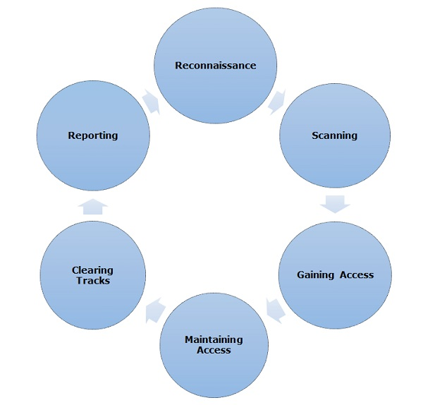

# CEH Process
The processes are not standard. You can adopt a set of different processes and tools according to your techniques that you are comfortable with. The entire process can be categorized into the following six phases.

## Reconnaisance
Reconnaissance is the phase where the attacker gathers information about a target using active or passive means. The tools that are widely used in this process are NMAP, Hping, Maltego, and Google Dorks.

Information Gathering and getting to know the target systems is the first process in ethical hacking. Reconnaissance is a set of processes and techniques (Footprinting, Scanning & Enumeration) used to covertly discover and collect information about a target system.

During reconnaissance, an ethical hacker attempts to gather as much information about a target system as possible, following the seven steps listed below −

* Gather initial information
* Determine the network range
* Identify active machines
* Discover open ports and access points
* Fingerprint the operating system
* Uncover services on ports
* Map the network

Reconnaissance takes place in two parts − Active Reconnaissance and Passive Reconnaissance.

#### Active Reconnaissance
In this process, you will directly interact with the computer system to gain information. This information can be relevant and accurate. But there is a risk of getting detected if you are planning active reconnaissance without permission. If you are detected, then system admin can take severe action against you and trail your subsequent activities.

#### Passive Reconnaissance
In this process, you will not be directly connected to a computer system. This process is used to gather essential information without ever interacting with the target systems.

## Scanning
In this process, the attacker begins to actively probe a target machine or network for vulnerabilities that can be exploited. The tools used in this process are Nessus, Nexpose, and NMAP.

Footprinting is a part of reconnaissance process which is used for gathering possible information about a target computer system or network. Footprinting could be both passive and active. Reviewing a company’s website is an example of passive footprinting, whereas attempting to gain access to sensitive information through social engineering is an example of active information gathering.

Footprinting is basically the first step where hacker gathers as much information as possible to find ways to intrude into a target system or at least decide what type of attacks will be more suitable for the target.

During this phase, a hacker can collect the following information −

* Domain name
* IP Addresses
* Namespaces
* Employee information
* Phone numbers
* E-mails
* Job Information

In the following section, we will discuss how to extsract the basic and easily accessible information about any computer system or network that is linked to the Internet.

#### Domain Name Information

*[Whois Database](http://www.whois.com/whois)

website to get detailed information about a domain name information including its owner, its registrar, date of registration, expiry, name server, owner's contact information, etc.

It's always recommended to keep your domain name profile a private one which should hide the above-mentioned information from potential hackers.

#### Finding IP Address
You can use ping command at your prompt. This command is available on Windows as well as on Linux OS. Following is the example to find out the IP address of tutorialspoint.com

#### Finding Hosting Company
Once you have the website address, you can get further detail by using ip2location.com website. Following is the example to find out the details of an IP address −

* [Ip2location](https://lite.ip2location.com/database/ip-country)

Here the ISP row gives you the detail about the hosting company because IP addresses are usually provided by hosting companies only.

If a computer system or network is linked with the Internet directly, then you cannot hide the IP address and the related information such as the hosting company, its location, ISP, etc. If you have a server containing very sensitive data, then it is recommended to keep it behind a secure proxy so that hackers cannot get the exact details of your actual server. This way, it will be difficult for any potential hacker to reach your server directly.

Another effective way of hiding your system IP and ultimately all the associated information is to go through a Virtual Private Network (VPN). If you configure a VPN, then the whole traffic routes through the VPN network, so your true IP address assigned by your ISP is always hidden.

#### IP Address Ranges
Small sites may have a single IP address associated with them, but larger websites usually have multiple IP addresses serving different domains and sub-domains.

You can obtain a range of IP addresses assigned to a particular company using American Registry for Internet Numbers (ARIN).

#### Arin
You can enter company name in the highlighted search box to find out a list of all the assigned IP addresses to that company.

### History of the Website
It is very easy to get a complete history of any website using www.archive.org.

* Archive
You can enter a domain name in the search box to find out how the website was looking at a given point of time and what were the pages available on the website on different dates.

Archive Record

Though there are some advantages of keeping your website in an archive database, but if you do not like anybody to see how your website progressed through different stages, then you can request archive.org to delete the history of your website.

## Fingerprinting & Scanning

The term OS fingerprinting in Ethical Hacking refers to any method used to determine what operating system is running on a remote computer. This could be −

* `Active Fingerprinting` − Active fingerprinting is accomplished by sending specially crafted packets to a target machine and then noting down its response and analyzing the gathered information to determine the target OS. In the following section, we have given an example to explain how you can use NMAP tool to detect the OS of a target domain.

* `Passive Fingerprinting` − Passive fingerprinting is based on sniffer traces from the remote system. Based on the sniffer traces (such as Wireshark) of the packets, you can determine the operating system of the remote host.

We have the following four important elements that we will look at to determine the operating system −

* TTL − What the operating system sets the Time-To-Live on the outbound packet.
* Window Size − What the operating system sets the Window Size at.
* DF − Does the operating system set the Don't Fragment bit.
* TOS − Does the operating system set the Type of Service, and if so, at what.

By analyzing these factors of a packet, you may be able to determine the remote operating system. This system is not 100% accurate, and works better for some operating systems than others.

#### Basic Steps
Before attacking a system, it is required that you know what operating system is hosting a website. Once a target OS is known, then it becomes easy to determine which vulnerabilities might be present to exploit the target system.

#### Port Scanning
We have just seen information given by nmap command. This command lists down all the open ports on a given server.

#### Ping Sweep
A ping sweep is a network scanning technique that you can use to determine which IP address from a range of IP addresses map to live hosts. Ping Sweep is also known as ICMP sweep.

You can use fping command for ping sweep. This command is a ping-like program which uses the Internet Control Message Protocol (ICMP) echo request to determine if a host is up.

fping is different from ping in that you can specify any number of hosts on the command line, or specify a file containing the lists of hosts to ping. If a host does not respond within a certain time limit and/or retry limit, it will be considered unreachable.

To disable ping sweeps on a network, you can block ICMP ECHO requests from outside sources. This can be done using the following command which will create a firewall rule in iptable.

$iptables -A OUTPUT -p icmp --icmp-type echo-request -j DROP

#### DNS Enumeration
Domain Name Server (DNS) is like a map or an address book. In fact, it is like a distributed database which is used to translate an IP address 192.111.1.120 to a name www.example.com and vice versa.

DNS enumeration is the process of locating all the DNS servers and their corresponding records for an organization. The idea is to gather as much interesting details as possible about your target before initiating an attack.

You can use nslookup command available on Linux to get DNS and host-related information. In addition, you can use the following DNSenum script to get detailed information about a domain −

DNS Enumeration does not have a quick fix and it is really beyond the scope of this tutorial. Preventing DNS Enumeration is a big challenge.

If your DNS is not configured in a secure way, it is possible that lots of sensitive information about the network and organization can go outside and an untrusted Internet user can perform a DNS zone transfer.

## Gaining Access
In this process, the vulnerability is located and you attempt to exploit it in order to enter into the system. The primary tool that is used in this process is Metasploit.

## Maintaining Access
It is the process where the hacker has already gained access into a system. After gaining access, the hacker installs some backdoors in order to enter into the system when he needs access in this owned system in future. Metasploit is the preferred tool in this process.

## Clearing Tracks
This process is actually an unethical activity. It has to do with the deletion of logs of all the activities that take place during the hacking process.

## Reporting
Reporting is the last step of finishing the ethical hacking process. Here the Ethical Hacker compiles a report with his findings and the job that was done such as the tools used, the success rate, vulnerabilities found, and the exploit processes.
